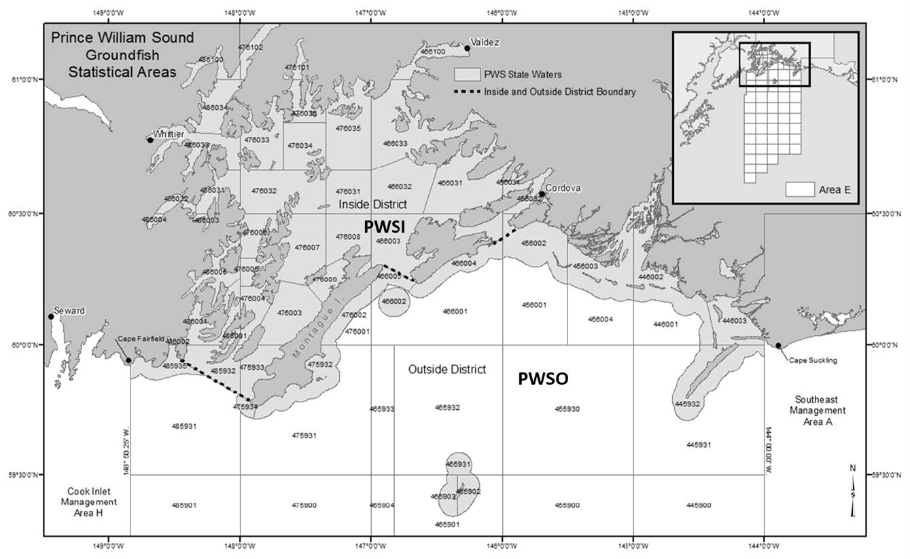

```{r setup, include=FALSE}
knitr::opts_chunk$set(echo = TRUE)

getwd()
file.exists("../scripts/bayes_data_param_load.R")
knitr::opts_chunk$set(echo = FALSE, message = FALSE, warning = FALSE)

library(ggplot2)
library(tidyverse)
library(wesanderson)
library(ggpubr)
library(knitr)
library(kableExtra)
library(here)
library(htmltools) 
library(coda)
library(jagsUI)
library(stringr)
library(readxl)
library(openxlsx2)
library(scales)
library(xlsx)
library(writexl)

source("../scripts/mkdwn_functions.R", echo = FALSE)
#source("./scripts/bayes_data_param_load", echo = FALSE)
start_yr <- 1977
end_yr <- 2024
REP_YR <- 2024 #for Howard estimates
#list2env(readinData(start_yr = start_yr,
#                  end_yr = end_yr),
#         .GlobalEnv)

list2env(readinData_alt(spl_knts = 7,
                    start_yr = start_yr,
                    end_yr = end_yr,
                    SE06 = "exclude"), #SE06 = "exclude"
         .GlobalEnv)

mod<-"LB_fit_3pH"

intdat <- "yes"

#res <- "Gen4int_indcomp_swhsR_FULL_pHB4pars_re0full_altwt_2xcvSEo_thru2024_2e+06_SE06ex_2026-01-02"
res <- "Gen4int_indcomp_swhsR_FULL_pHB4pars_re0full_altwt_2xcvSEo_thru2024_5e+05_SE06ex_2026-01-05"

postH <- readRDS(paste0("..\\output\\bayes_posts\\",res,".rds"))

rhat <- get_Rhat(postH, cutoff = 1.11)

summary_table <- postH$summary %>%
  as.data.frame() %>%
  tibble::rownames_to_column(var = "Parameter") %>%
  select(Parameter, mean, sd, `2.5%`, `50%`, `97.5%`) %>%
  rename(
    Lower_CI = `2.5%`,
    Median = `50%`,
    Upper_CI = `97.5%`
  ) %>% 
  filter(str_detect(Parameter, "^tau_comp\\[") |
         str_detect(Parameter, "^tau_pH\\[") |
          str_detect(Parameter, "^mu_beta0_pelagic\\[")|
           str_detect(Parameter, "^tau_beta0_pelagic\\[")|
           str_detect(Parameter, "^mu_beta0_yellow\\[")|
           str_detect(Parameter, "^tau_beta0_yellow\\[")|
           str_detect(Parameter, "^mu_beta0_black\\[")|
           str_detect(Parameter, "^tau_beta0_black\\[")|
           str_detect(Parameter, "^mu_beta0_yellow_x\\[")|
           str_detect(Parameter, "^tau_beta0_yellow_x\\[")|
           str_detect(Parameter, "^mu_bc_H\\[")|
           str_detect(Parameter, "^tau_bc_H\\[")|
           str_detect(Parameter, "^mu_bc_R\\[")|
           str_detect(Parameter, "^tau_bc_R\\[")|
           str_detect(Parameter, "^bc_R_offset\\[")|
           str_detect(Parameter, "^beta0_pH\\[")|
           str_detect(Parameter, "^beta1_pH\\[")|
           str_detect(Parameter, "^beta2_pH\\[")|
           str_detect(Parameter, "^beta3_pH\\[")|
           str_detect(Parameter, "^beta0_pelagic\\[")|
           str_detect(Parameter, "^beta1_pelagic\\[")|
           str_detect(Parameter, "^beta2_pelagic\\[")|
           str_detect(Parameter, "^beta3_pelagic\\[")|
           str_detect(Parameter, "^beta0_yellow\\[")|
           str_detect(Parameter, "^beta1_yellow\\[")|
           str_detect(Parameter, "^beta2_yellow\\[")|
           str_detect(Parameter, "^beta3_yellow\\[")|
           str_detect(Parameter, "^beta0_black\\[")|
           str_detect(Parameter, "^beta2_black\\[")|
           str_detect(Parameter, "^beta3_black\\[")|
           str_detect(Parameter, "^beta4_black\\[")|
           str_detect(Parameter, "^beta0_dsr\\[")|
           str_detect(Parameter, "^beta1_dsr\\[")|
           str_detect(Parameter, "^beta2_dsr\\[")|
           str_detect(Parameter, "^beta3_dsr\\[")|
           str_detect(Parameter, "^beta4_dsr\\[")|
           str_detect(Parameter, "^beta0_slope\\[")|
           str_detect(Parameter, "^beta1_slope\\[")|
           str_detect(Parameter, "^beta2_slope\\[")|
           str_detect(Parameter, "^beta3_slope\\[")|
           str_detect(Parameter, "^beta4_slope\\[")|
           str_detect(Parameter, "^sigma_H\\[")|
           str_detect(Parameter, "^beta_H\\[")|
           str_detect(Parameter, "^beta0_H\\[")|
           str_detect(Parameter, "^lambda_H\\[")|
           str_detect(Parameter, "^mu_lambda_H\\[")|
           str_detect(Parameter, "^sigma_lambda_H\\["))

Fig_N <- 0
Tab_N <- 0
App_N <- 0

southeast <- c("CSEO","EWYKT","NSEI","NSEO","SSEI","SSEO")
central <- c("CI","NG","PWSI","PWSO")
kodiak <- c("BSAI","SOKO2SAP","WKMA","afognak","eastside","northeast")
reg2 <- c(central,kodiak)

#-------------------------------------------------------------------------------
# Some universal plot settings:
baseTXT <- 17 # base text size
legTXT <- 12 #legend text size
axTXT <- 16 # axis tic label text size
axTiTXT <- 17 # axis title text size
barwidth <- 1 #bar width on bar graphs
pointSIZE <- 2.5
################################################################################
# Separate out everything for plotting:
################################################################################

# All rockfish Harvests --------------------------------------------------------:
tot_how <- readxl::read_excel(paste0("..\\output\\harvest_estimates_Howard_thru",REP_YR,".xlsx"),
                              sheet = "BRF harvest",
                              range = "A1:N412") %>%
  #read.csv(paste0("..\\output\\harvest_estimates_Howard_thru",REP_YR,".csv")) %>%
  clean_names() %>% filter(year <= end_yr) %>%
  mutate(tot_rf = log_rfharv + priv_rfharv) %>%
  select(region,year,area = rpt_area, gui_tot = log_rfharv,pri_tot=priv_rfharv,var = var_priv_rfharv, tot_rf) 

tot_how %>% select(-var) %>%
  pivot_longer(cols = c("gui_tot","pri_tot","tot_rf"),
               names_to = "user",
               values_to = "H_how") %>%
  mutate(user = ifelse(user == "gui_tot","guided",
                       ifelse(user == "pri_tot","unguided","All"))) %>%
  filter(!is.na(area)) -> tot_how

as.data.frame(
  rbind(t(postH$q50$H_ayg),
        t(postH$q50$H_ayu),
        t(postH$q50$H_ay))) %>%
  setNames(nm = unique(H_ayg$area)) %>%
  mutate(year = rep(start_yr:end_yr, times = 3),
         user = rep(c("guided", "unguided", "All"), each = Y)) %>%
  pivot_longer(!c(year,user), names_to = "area", values_to = "H") %>%
  mutate(area = factor(area, unique(H_ayg$area), ordered = TRUE)) %>%
  left_join(as.data.frame(
    rbind(t(postH$q2.5$H_ayg),
          t(postH$q2.5$H_ayu),
          t(postH$q2.5$H_ay))) %>%
      setNames(nm = unique(H_ayg$area)) %>%
      mutate(year = rep(start_yr:end_yr, times = 3),
             user = rep(c("guided", "unguided", "All"), each = Y)) %>%
      pivot_longer(!c(year,user), names_to = "area", values_to = "H_lo95") %>%
      mutate(area = factor(area, unique(H_ayg$area), ordered = TRUE)),
    by = c("year","user","area")) %>%
  left_join(as.data.frame(
    rbind(t(postH$q97.5$H_ayg),
          t(postH$q97.5$H_ayu),
          t(postH$q97.5$H_ay))) %>%
      setNames(nm = unique(H_ayg$area)) %>%
      mutate(year = rep(start_yr:end_yr, times = 3),
             user = rep(c("guided", "unguided", "All"), each = Y)) %>%
      pivot_longer(!c(year,user), names_to = "area", values_to = "H_hi95") %>%
      mutate(area = factor(area, unique(H_ayg$area), ordered = TRUE)),
    by = c("year","user","area")) %>%
  left_join(as.data.frame(
    rbind(t(postH$sd$H_ayg),
          t(postH$sd$H_ayu),
          t(postH$sd$H_ay))) %>%
      setNames(nm = unique(H_ayg$area)) %>%
      mutate(year = rep(start_yr:end_yr, times = 3),
             user = rep(c("guided", "unguided", "All"), each = Y)) %>%
      pivot_longer(!c(year,user), names_to = "area", values_to = "sd_H") %>%
      mutate(area = factor(area, unique(H_ayg$area), ordered = TRUE)),
    by = c("year","user","area")) %>%
  mutate(area = toupper(as.character(area))) %>% #filter(!is.na(area)) %>%
#  mutate(area = factor(area, unique(H_ayg$area), ordered = TRUE)) %>%
  left_join(tot_how, by = c("year","user","area")) -> rf_plotdat

options(scipen = 999)

rf_plotdat %>%
            mutate(region = ifelse(area %in% southeast,"Southeast",
                                   ifelse(area %in% central,"Southcentral","Kodiak")),
                   area = factor(area, toupper(unique(H_ayg$area)), ordered = TRUE)) %>%
            arrange(area,user,year) %>% 
            mutate(H = round(H,0),
                   H_lo95 = round(H_lo95,0),
                   H_hi95 = round(H_hi95),
                   sd_H = round(sd_H,3)) %>%
            select(region,area,year,user,Harvest = H, sd_H, H_lo95,H_hi95) -> TotH_wb

#-------------------------------------------------------------------------------
# All rockfish releases: 

tot_howR <- readxl::read_excel(paste0("..\\output\\release_estimates_Howard_thru",REP_YR,".xlsx"),
                              sheet = "BRF release",
                              range = "A1:N400") %>%
  #read.csv(paste0("..\\output\\harvest_estimates_Howard_thru",REP_YR,".csv")) %>%
  clean_names() %>% filter(year <= end_yr) %>%
  mutate(tot_rf = log_rfrel + priv_rfrel) %>%
  select(region,year,area = rpt_area, gui_tot = log_rfrel,pri_tot=priv_rfrel,var = var_priv_rfrel, tot_rf) 

tot_howR %>% select(-var) %>%
  pivot_longer(cols = c("gui_tot","pri_tot","tot_rf"),
               names_to = "user",
               values_to = "R_how") %>%
  mutate(user = ifelse(user == "gui_tot","guided",
                       ifelse(user == "pri_tot","unguided","All"))) %>%
  filter(!is.na(area)) -> tot_howR

as.data.frame(
  rbind(t(postH$q50$R_ayg),
        t(postH$q50$R_ayu),
        t(postH$q50$R_ay))) %>%
  setNames(nm = unique(R_ayg$area)) %>%
  mutate(year = rep(start_yr:end_yr, times = 3),
         user = rep(c("guided", "unguided", "All"), each = Y)) %>%
  pivot_longer(!c(year,user), names_to = "area", values_to = "R") %>%
  mutate(area = factor(area, unique(H_ayg$area), ordered = TRUE)) %>%
  left_join(as.data.frame(
    rbind(t(postH$q2.5$R_ayg),
          t(postH$q2.5$R_ayu),
          t(postH$q2.5$R_ay))) %>%
      setNames(nm = unique(R_ayg$area)) %>%
      mutate(year = rep(start_yr:end_yr, times = 3),
             user = rep(c("guided", "unguided", "All"), each = Y)) %>%
      pivot_longer(!c(year,user), names_to = "area", values_to = "R_lo95") %>%
      mutate(area = factor(area, unique(H_ayg$area), ordered = TRUE)),
    by = c("year","user","area")) %>%
  left_join(as.data.frame(
    rbind(t(postH$q97.5$R_ayg),
          t(postH$q97.5$R_ayu),
          t(postH$q97.5$R_ay))) %>%
      setNames(nm = unique(H_ayg$area)) %>%
      mutate(year = rep(start_yr:end_yr, times = 3),
             user = rep(c("guided", "unguided", "All"), each = Y)) %>%
      pivot_longer(!c(year,user), names_to = "area", values_to = "R_hi95") %>%
      mutate(area = factor(area, unique(H_ayg$area), ordered = TRUE)),
    by = c("year","user","area")) %>%
  left_join(as.data.frame(
    rbind(t(postH$sd$R_ayg),
          t(postH$sd$R_ayu),
          t(postH$sd$R_ay))) %>%
      setNames(nm = unique(H_ayg$area)) %>%
      mutate(year = rep(start_yr:end_yr, times = 3),
             user = rep(c("guided", "unguided", "All"), each = Y)) %>%
      pivot_longer(!c(year,user), names_to = "area", values_to = "sd_R") %>%
      mutate(area = factor(area, unique(H_ayg$area), ordered = TRUE)),
    by = c("year","user","area")) %>%
  mutate(area = toupper(as.character(area))) %>% #filter(!is.na(area)) %>%
#  mutate(area = factor(area, unique(H_ayg$area), ordered = TRUE)) %>%
  left_join(tot_howR, by = c("year","user","area")) -> rf_plotdat2

rf_plotdat2 %>% 
            mutate(region = ifelse(area %in% southeast,"Southeast",
                                   ifelse(area %in% central,"Southcentral","Kodiak")),
                   area = factor(area, toupper(unique(H_ayg$area)), ordered = TRUE)) %>%
            arrange(area,user,year) %>% 
            mutate(R = round(R,0),
                   R_lo95 = round(R_lo95,0),
                   R_hi95 = round(R_hi95),
                   sd_R = round(sd_R,3)) %>%
            select(region,area,year,user,Releases = R, sd_R,R_lo95,R_hi95) -> TotR_wb

#-------------------------------------------------------------------------------
# Black Rockfish Harvests:
brf_how <- read.csv(paste0("..\\output\\BRF_harv_Howard_thru",REP_YR,".csv")) %>%
  clean_names() %>%
  select(region,year,area = rpt_area, gui_brf, var_gui_brf, priv_brf, var_priv_brf,
         tot_brf = total_br_fharv, var_tot_brf = var_total_br_fharv) 

brf_how %>% select(-c("var_gui_brf","var_priv_brf","var_tot_brf")) %>%
  pivot_longer(cols = c("gui_brf","priv_brf","tot_brf"),
               names_to = "user",
               values_to = "H_how") %>%
  mutate(user = ifelse(user == "gui_brf","guided",
                       ifelse(user == "priv_brf","unguided","All"))) %>%
  left_join(brf_how %>% select(-c("gui_brf","priv_brf","tot_brf")) %>%
              pivot_longer(cols = c("var_gui_brf","var_priv_brf","var_tot_brf"),
                           names_to = "user",
                           values_to = "var_H_how") %>%
              mutate(user = ifelse(user == "var_gui_brf","guided",
                                   ifelse(user == "var_priv_brf","unguided","All"))),
            by = c("region","year","area","user")) %>%
  mutate(se_H_how = sqrt(var_H_how),
         lo95_H_how = ifelse(H_how - 1.96 * se_H_how < 0,0,
                             H_how - 1.96 * se_H_how),
         hi95_H_how = H_how + 1.96 * se_H_how) -> brf_how


as.data.frame(
  rbind(t(postH$q50$Hb_ayg),
        t(postH$q50$Hb_ayu),
        t(postH$q50$Hb_ay))) %>%
  setNames(nm = unique(H_ayg$area)) %>%
  mutate(year = rep(start_yr:end_yr, times = 3),
         user = rep(c("guided", "unguided", "All"), each = Y)) %>%
  pivot_longer(!c(year,user), names_to = "area", values_to = "H") %>%
  mutate(area = factor(area, unique(H_ayg$area), ordered = TRUE)) %>%
  left_join(as.data.frame(
    rbind(t(postH$q2.5$Hb_ayg),
          t(postH$q2.5$Hb_ayu),
          t(postH$q2.5$Hb_ay))) %>%
      setNames(nm = unique(H_ayg$area)) %>%
      mutate(year = rep(start_yr:end_yr, times = 3),
             user = rep(c("guided", "unguided", "All"), each = Y)) %>%
      pivot_longer(!c(year,user), names_to = "area", values_to = "H_lo95") %>%
      mutate(area = factor(area, unique(H_ayg$area), ordered = TRUE)),
    by = c("year","user","area")) %>%
  left_join(as.data.frame(
    rbind(t(postH$q97.5$Hb_ayg),
          t(postH$q97.5$Hb_ayu),
          t(postH$q97.5$Hb_ay))) %>%
      setNames(nm = unique(H_ayg$area)) %>%
      mutate(year = rep(start_yr:end_yr, times = 3),
             user = rep(c("guided", "unguided", "All"), each = Y)) %>%
      pivot_longer(!c(year,user), names_to = "area", values_to = "H_hi95") %>%
      mutate(area = factor(area, unique(H_ayg$area), ordered = TRUE)),
    by = c("year","user","area")) %>%
  left_join(as.data.frame(
    rbind(t(postH$sd$Hb_ayg),
          t(postH$sd$Hb_ayu),
          t(postH$sd$Hb_ay))) %>%
      setNames(nm = unique(H_ayg$area)) %>%
      mutate(year = rep(start_yr:end_yr, times = 3),
             user = rep(c("guided", "unguided", "All"), each = Y)) %>%
      pivot_longer(!c(year,user), names_to = "area", values_to = "sd_H") %>%
      mutate(area = factor(area, unique(H_ayg$area), ordered = TRUE)),
    by = c("year","user","area")) %>%
  mutate(area = toupper(area)) %>%
  left_join(brf_how, by = c("year","user","area")) -> brf_plotdat

brf_plotdat %>% 
            mutate(region = ifelse(area %in% southeast,"Southeast",
                                   ifelse(area %in% central,"Southcentral","Kodiak")),
                   area = factor(area, toupper(unique(H_ayg$area)), ordered = TRUE)) %>%
            arrange(area,user,year) %>%
            mutate(H = round(H,0),
                   H_lo95 = round(H_lo95,0),
                   H_hi95 = round(H_hi95),
                   sd_H = round(sd_H,3)) %>%
            select(region,area,year,user,Harvests = H, sd_H,H_lo95,H_hi95) ->brfH_wb

#-------------------------------------------------------------------------------
# Black rockfish releases: 

brf_howR <- read.csv(paste0("..\\output\\BRF_rel_Howard_thru",REP_YR,".csv")) %>%
  clean_names() %>%
  select(region,year,area = rpt_area, gui_brf, var_gui_brf, priv_brf, var_priv_brf,
         tot_brf = total_br_frel, var_tot_brf = var_total_br_frel) %>% unique() #note some duplicate BSAI and SOKO2SAPs

brf_howR %>% select(-c("var_gui_brf","var_priv_brf","var_tot_brf")) %>%
  pivot_longer(cols = c("gui_brf","priv_brf","tot_brf"),
               names_to = "user",
               values_to = "R_how") %>%
  mutate(user = ifelse(user == "gui_brf","guided",
                       ifelse(user == "priv_brf","unguided","All"))) %>%
  left_join(brf_howR %>% select(-c("gui_brf","priv_brf","tot_brf")) %>%
              pivot_longer(cols = c("var_gui_brf","var_priv_brf","var_tot_brf"),
                           names_to = "user",
                           values_to = "var_R_how") %>%
              mutate(user = ifelse(user == "var_gui_brf","guided",
                                   ifelse(user == "var_priv_brf","unguided","All"))),
            by = c("region","year","area","user")) %>%
  mutate(se_R_how = sqrt(var_R_how),
         lo95_R_how = ifelse(R_how - 1.96 * se_R_how < 0,0,
                             R_how - 1.96 * se_R_how),
         hi95_R_how = R_how + 1.96 * se_R_how) -> brf_howR

as.data.frame(
  rbind(t(postH$q50$Rb_ayg),
        t(postH$q50$Rb_ayu),
        t(postH$q50$Rb_ay))) %>%
  setNames(nm = unique(H_ayg$area)) %>%
  mutate(year = rep(start_yr:end_yr, times = 3),
         user = rep(c("guided", "unguided", "All"), each = Y)) %>%
  pivot_longer(!c(year,user), names_to = "area", values_to = "R") %>%
  mutate(area = factor(area, unique(H_ayg$area), ordered = TRUE)) %>%
  left_join(as.data.frame(
    rbind(t(postH$q2.5$Rb_ayg),
          t(postH$q2.5$Rb_ayu),
          t(postH$q2.5$Rb_ay))) %>%
      setNames(nm = unique(H_ayg$area)) %>%
      mutate(year = rep(start_yr:end_yr, times = 3),
             user = rep(c("guided", "unguided", "All"), each = Y)) %>%
      pivot_longer(!c(year,user), names_to = "area", values_to = "R_lo95") %>%
      mutate(area = factor(area, unique(H_ayg$area), ordered = TRUE)),
    by = c("year","user","area")) %>%
  left_join(as.data.frame(
    rbind(t(postH$q97.5$Rb_ayg),
          t(postH$q97.5$Rb_ayu),
          t(postH$q97.5$Rb_ay))) %>%
      setNames(nm = unique(H_ayg$area)) %>%
      mutate(year = rep(start_yr:end_yr, times = 3),
             user = rep(c("guided", "unguided", "All"), each = Y)) %>%
      pivot_longer(!c(year,user), names_to = "area", values_to = "R_hi95") %>%
      mutate(area = factor(area, unique(H_ayg$area), ordered = TRUE)),
    by = c("year","user","area")) %>%
  left_join(as.data.frame(
    rbind(t(postH$sd$Rb_ayg),
          t(postH$sd$Rb_ayu),
          t(postH$sd$Rb_ay))) %>%
      setNames(nm = unique(H_ayg$area)) %>%
      mutate(year = rep(start_yr:end_yr, times = 3),
             user = rep(c("guided", "unguided", "All"), each = Y)) %>%
      pivot_longer(!c(year,user), names_to = "area", values_to = "sd_R") %>%
      mutate(area = factor(area, unique(H_ayg$area), ordered = TRUE)),
    by = c("year","user","area")) %>%
  mutate(area = toupper(area)) %>%
  left_join(brf_howR, by = c("year","user","area")) %>%
  mutate(area = factor(area, toupper(unique(R_ayg$area)), ordered = TRUE)) -> brf_rel

as.data.frame(
  rbind(t(postH$q50$Rb_ayg),
        t(postH$q50$Rb_ayu),
        t(postH$q50$Rb_ay))) %>%
  setNames(nm = unique(H_ayg$area)) %>%
  mutate(year = rep(start_yr:end_yr, times = 3),
         user = rep(c("guided", "unguided", "All"), each = Y)) %>%
  pivot_longer(!c(year,user), names_to = "area", values_to = "R") %>%
  mutate(area = factor(area, unique(H_ayg$area), ordered = TRUE)) %>%
  left_join(as.data.frame(
    rbind(t(postH$q2.5$Rb_ayg),
          t(postH$q2.5$Rb_ayu),
          t(postH$q2.5$Rb_ay))) %>%
      setNames(nm = unique(H_ayg$area)) %>%
      mutate(year = rep(start_yr:end_yr, times = 3),
             user = rep(c("guided", "unguided", "All"), each = Y)) %>%
      pivot_longer(!c(year,user), names_to = "area", values_to = "R_lo95") %>%
      mutate(area = factor(area, unique(H_ayg$area), ordered = TRUE)),
    by = c("year","user","area")) %>%
  left_join(as.data.frame(
    rbind(t(postH$q97.5$Rb_ayg),
          t(postH$q97.5$Rb_ayu),
          t(postH$q97.5$Rb_ay))) %>%
      setNames(nm = unique(H_ayg$area)) %>%
      mutate(year = rep(start_yr:end_yr, times = 3),
             user = rep(c("guided", "unguided", "All"), each = Y)) %>%
      pivot_longer(!c(year,user), names_to = "area", values_to = "R_hi95") %>%
      mutate(area = factor(area, unique(H_ayg$area), ordered = TRUE)),
    by = c("year","user","area")) %>%
  mutate(area = toupper(area)) %>%
  mutate(category = "Total released") -> brf_releases
  
as.data.frame(
  rbind(t(postH$q50$Rb_ayg_mort),
        t(postH$q50$Rb_ayu_mort),
        t(postH$q50$Rb_ay_mort))) %>%
  setNames(nm = unique(H_ayg$area)) %>%
  mutate(year = rep(start_yr:end_yr, times = 3),
         user = rep(c("guided", "unguided", "All"), each = Y)) %>%
  pivot_longer(!c(year,user), names_to = "area", values_to = "R") %>%
  mutate(area = factor(area, unique(H_ayg$area), ordered = TRUE)) %>%
  left_join(as.data.frame(
    rbind(t(postH$q2.5$Rb_ayg_mort),
          t(postH$q2.5$Rb_ayu_mort),
          t(postH$q2.5$Rb_ay_mort))) %>%
      setNames(nm = unique(H_ayg$area)) %>%
      mutate(year = rep(start_yr:end_yr, times = 3),
             user = rep(c("guided", "unguided", "All"), each = Y)) %>%
      pivot_longer(!c(year,user), names_to = "area", values_to = "R_lo95") %>%
      mutate(area = factor(area, unique(H_ayg$area), ordered = TRUE)),
    by = c("year","user","area")) %>%
  left_join(as.data.frame(
    rbind(t(postH$q97.5$Rb_ayg_mort),
          t(postH$q97.5$Rb_ayu_mort),
          t(postH$q97.5$Rb_ay_mort))) %>%
      setNames(nm = unique(H_ayg$area)) %>%
      mutate(year = rep(start_yr:end_yr, times = 3),
             user = rep(c("guided", "unguided", "All"), each = Y)) %>%
      pivot_longer(!c(year,user), names_to = "area", values_to = "R_hi95") %>%
      mutate(area = factor(area, unique(H_ayg$area), ordered = TRUE)),
    by = c("year","user","area")) %>%
  left_join(as.data.frame(
    rbind(t(postH$sd$Rb_ayg_mort),
          t(postH$sd$Rb_ayu_mort),
          t(postH$sd$Rb_ay_mort))) %>%
      setNames(nm = unique(H_ayg$area)) %>%
      mutate(year = rep(start_yr:end_yr, times = 3),
             user = rep(c("guided", "unguided", "All"), each = Y)) %>%
      pivot_longer(!c(year,user), names_to = "area", values_to = "sd_Rmort") %>%
      mutate(area = factor(area, unique(H_ayg$area), ordered = TRUE)),
    by = c("year","user","area")) %>%
  mutate(area = toupper(area)) %>%
  mutate(category = "Est. mortality") -> brf_r_mort

brf_rel %>% full_join(brf_r_mort %>% filter(category == "Est. mortality") %>%
                        select(year,area,user,
                               Release_morts = R, sd_Rmort, RM_lo95 = R_lo95, RM_hi95 = R_hi95),
                      by = c("year","user","area")) %>%
  mutate(region = ifelse(area %in% southeast,"Southeast",
                                   ifelse(area %in% central,"Southcentral","Kodiak")),
                   area = factor(area, toupper(unique(H_ayg$area)), ordered = TRUE)) %>%
  arrange(area,user,year) %>%
            mutate(R = round(R,0),
                   Release_morts = round(Release_morts,0),
                   RM_lo95 = round(RM_lo95,0),
                   RM_hi95 = round(RM_hi95,0),
                   R_lo95 = round(R_lo95,0),
                   R_hi95 = round(R_hi95),
                   sd_R = round(sd_R,3),
                   sd_RM = round(sd_Rmort,3)) %>%
            select(region,area,year,user,Releases = R, sd_R, R_lo95,R_hi95,Release_morts, sd_RM, RM_lo95,RM_hi95) -> brfR_wb

#-------------------------------------------------------------------------------
# Yelloweye Harvests:

ye_how <- read.csv(paste0("..\\output\\YE_harv_Howard_thru",REP_YR,".csv")) %>%
  clean_names() %>%
  select(region,year,area = rpt_area, gui_ye, var_gui_ye, priv_ye, var_priv_ye,
         tot_ye = total_y_eharv, var_tot_ye = var_total_y_eharv) 

ye_how %>% select(-c("var_gui_ye","var_priv_ye","var_tot_ye")) %>%
  pivot_longer(cols = c("gui_ye","priv_ye","tot_ye"),
               names_to = "user",
               values_to = "H_how") %>%
  mutate(user = ifelse(user == "gui_ye","guided",
                       ifelse(user == "priv_ye","unguided","All"))) %>%
  left_join(ye_how %>% select(-c("gui_ye","priv_ye","tot_ye")) %>%
              pivot_longer(cols = c("var_gui_ye","var_priv_ye","var_tot_ye"),
                           names_to = "user",
                           values_to = "var_H_how") %>%
              mutate(user = ifelse(user == "var_gui_ye","guided",
                                   ifelse(user == "var_priv_ye","unguided","All"))),
            by = c("region","year","area","user")) %>%
  mutate(se_H_how = sqrt(var_H_how),
         lo95_H_how = ifelse(H_how - 1.96 * se_H_how < 0,0,
                             H_how - 1.96 * se_H_how),
         hi95_H_how = H_how + 1.96 * se_H_how) -> ye_how

as.data.frame(
  rbind(t(postH$q50$Hy_ayg),
        t(postH$q50$Hy_ayu),
        t(postH$q50$Hy_ay))) %>%
  setNames(nm = unique(H_ayg$area)) %>%
  mutate(year = rep(start_yr:end_yr, times = 3),
         user = rep(c("guided", "unguided", "All"), each = Y)) %>%
  pivot_longer(!c(year,user), names_to = "area", values_to = "H") %>%
  mutate(area = factor(area, unique(H_ayg$area), ordered = TRUE)) %>%
  left_join(as.data.frame(
    rbind(t(postH$q2.5$Hy_ayg),
          t(postH$q2.5$Hy_ayu),
          t(postH$q2.5$Hy_ay))) %>%
      setNames(nm = unique(H_ayg$area)) %>%
      mutate(year = rep(start_yr:end_yr, times = 3),
             user = rep(c("guided", "unguided", "All"), each = Y)) %>%
      pivot_longer(!c(year,user), names_to = "area", values_to = "H_lo95") %>%
      mutate(area = factor(area, unique(H_ayg$area), ordered = TRUE)),
    by = c("year","user","area")) %>%
  left_join(as.data.frame(
    rbind(t(postH$q97.5$Hy_ayg),
          t(postH$q97.5$Hy_ayu),
          t(postH$q97.5$Hy_ay))) %>%
      setNames(nm = unique(H_ayg$area)) %>%
      mutate(year = rep(start_yr:end_yr, times = 3),
             user = rep(c("guided", "unguided", "All"), each = Y)) %>%
      pivot_longer(!c(year,user), names_to = "area", values_to = "H_hi95") %>%
      mutate(area = factor(area, unique(H_ayg$area), ordered = TRUE)),
    by = c("year","user","area")) %>%
  left_join(as.data.frame(
    rbind(t(postH$sd$Hy_ayg),
          t(postH$sd$Hy_ayu),
          t(postH$sd$Hy_ay))) %>%
      setNames(nm = unique(H_ayg$area)) %>%
      mutate(year = rep(start_yr:end_yr, times = 3),
             user = rep(c("guided", "unguided", "All"), each = Y)) %>%
      pivot_longer(!c(year,user), names_to = "area", values_to = "sd_H") %>%
      mutate(area = factor(area, unique(H_ayg$area), ordered = TRUE)),
    by = c("year","user","area")) %>%
  mutate(area = toupper(area)) %>%
  left_join(ye_how, by = c("year","user","area")) %>%
  mutate(area = toupper(area)) %>%
  mutate(area = factor(area, toupper(unique(H_ayg$area)), ordered = TRUE)) -> YE_harv
  
YE_harv %>% 
            mutate(region = ifelse(area %in% southeast,"Southeast",
                                   ifelse(area %in% central,"Southcentral","Kodiak")),
                   area = factor(area, toupper(unique(H_ayg$area)), ordered = TRUE)) %>%
            arrange(area,user,year) %>%
            mutate(H = round(H,0),
                   H_lo95 = round(H_lo95,0),
                   H_hi95 = round(H_hi95),
                   sd_H = round(sd_H,3)) %>%
            select(region,area,year,user,Harvests = H, sd_H, H_lo95,H_hi95) -> yeH_wb

#YE_harv %>% filter(area %in% southeast & year > 2000)
#YE_harv %>% filter(area == "AFOGNAK" & year > 2000)
```

```{r}

#-------------------------------------------------------------------------------
# Yelloweye releases: 
ye_howR <- read.csv(paste0("..\\output\\YE_rel_Howard_thru",REP_YR,".csv")) %>%
  clean_names() %>%
  select(region,year,area = rpt_area, gui_ye, var_gui_ye, priv_ye, var_priv_ye,
         tot_ye = total_y_erel, var_tot_ye = var_total_y_erel) %>% unique()

ye_howR %>% select(-c("var_gui_ye","var_priv_ye","var_tot_ye")) %>%
  pivot_longer(cols = c("gui_ye","priv_ye","tot_ye"),
               names_to = "user",
               values_to = "R_how") %>%
  mutate(user = ifelse(user == "gui_ye","guided",
                       ifelse(user == "priv_ye","unguided","All"))) %>%
  left_join(ye_howR %>% select(-c("gui_ye","priv_ye","tot_ye")) %>%
              pivot_longer(cols = c("var_gui_ye","var_priv_ye","var_tot_ye"),
                           names_to = "user",
                           values_to = "var_R_how") %>%
              mutate(user = ifelse(user == "var_gui_ye","guided",
                                   ifelse(user == "var_priv_ye","unguided","All"))),
            by = c("region","year","area","user")) %>%
  mutate(se_R_how = sqrt(var_R_how),
         lo95_R_how = ifelse(R_how - 1.96 * se_R_how < 0,0,
                             R_how - 1.96 * se_R_how),
         hi95_R_how = R_how + 1.96 * se_R_how) -> ye_howR

as.data.frame(
  rbind(t(postH$q50$Ry_ayg),
        t(postH$q50$Ry_ayu),
        t(postH$q50$Ry_ay))) %>%
  setNames(nm = unique(H_ayg$area)) %>%
  mutate(year = rep(start_yr:end_yr, times = 3),
         user = rep(c("guided", "unguided", "All"), each = Y)) %>%
  pivot_longer(!c(year,user), names_to = "area", values_to = "R") %>%
  mutate(area = factor(area, unique(H_ayg$area), ordered = TRUE)) %>%
  left_join(as.data.frame(
    rbind(t(postH$q2.5$Ry_ayg),
          t(postH$q2.5$Ry_ayu),
          t(postH$q2.5$Ry_ay))) %>%
      setNames(nm = unique(H_ayg$area)) %>%
      mutate(year = rep(start_yr:end_yr, times = 3),
             user = rep(c("guided", "unguided", "All"), each = Y)) %>%
      pivot_longer(!c(year,user), names_to = "area", values_to = "R_lo95") %>%
      mutate(area = factor(area, unique(H_ayg$area), ordered = TRUE)),
    by = c("year","user","area")) %>%
  left_join(as.data.frame(
    rbind(t(postH$q97.5$Ry_ayg),
          t(postH$q97.5$Ry_ayu),
          t(postH$q97.5$Ry_ay))) %>%
      setNames(nm = unique(H_ayg$area)) %>%
      mutate(year = rep(start_yr:end_yr, times = 3),
             user = rep(c("guided", "unguided", "All"), each = Y)) %>%
      pivot_longer(!c(year,user), names_to = "area", values_to = "R_hi95") %>%
      mutate(area = factor(area, unique(H_ayg$area), ordered = TRUE)),
    by = c("year","user","area")) %>%
  left_join(as.data.frame(
    rbind(t(postH$sd$Ry_ayg),
          t(postH$sd$Ry_ayu),
          t(postH$sd$Ry_ay))) %>%
      setNames(nm = unique(H_ayg$area)) %>%
      mutate(year = rep(start_yr:end_yr, times = 3),
             user = rep(c("guided", "unguided", "All"), each = Y)) %>%
      pivot_longer(!c(year,user), names_to = "area", values_to = "sd_R") %>%
      mutate(area = factor(area, unique(H_ayg$area), ordered = TRUE)),
    by = c("year","user","area")) %>%
  left_join(ye_how, by = c("year","user","area")) %>%
  mutate(area = toupper(area)) %>%
  mutate(area = factor(area, toupper(unique(H_ayg$area)), ordered = TRUE),
         category = "Total released") ->ye_releases

as.data.frame(
  rbind(t(postH$q50$Ry_ayg_mort),
        t(postH$q50$Ry_ayu_mort),
        t(postH$q50$Ry_ay_mort))) %>%
  setNames(nm = unique(H_ayg$area)) %>%
  mutate(year = rep(start_yr:end_yr, times = 3),
         user = rep(c("guided", "unguided", "All"), each = Y)) %>%
  pivot_longer(!c(year,user), names_to = "area", values_to = "R") %>%
  mutate(area = factor(area, unique(H_ayg$area), ordered = TRUE)) %>%
  left_join(as.data.frame(
    rbind(t(postH$q2.5$Ry_ayg_mort),
          t(postH$q2.5$Ry_ayu_mort),
          t(postH$q2.5$Ry_ay_mort))) %>%
      setNames(nm = unique(H_ayg$area)) %>%
      mutate(year = rep(start_yr:end_yr, times = 3),
             user = rep(c("guided", "unguided", "All"), each = Y)) %>%
      pivot_longer(!c(year,user), names_to = "area", values_to = "R_lo95") %>%
      mutate(area = factor(area, unique(H_ayg$area), ordered = TRUE)),
    by = c("year","user","area")) %>%
  left_join(as.data.frame(
    rbind(t(postH$q97.5$Ry_ayg_mort),
          t(postH$q97.5$Ry_ayu_mort),
          t(postH$q97.5$Ry_ay_mort))) %>%
      setNames(nm = unique(H_ayg$area)) %>%
      mutate(year = rep(start_yr:end_yr, times = 3),
             user = rep(c("guided", "unguided", "All"), each = Y)) %>%
      pivot_longer(!c(year,user), names_to = "area", values_to = "R_hi95") %>%
      mutate(area = factor(area, unique(H_ayg$area), ordered = TRUE)),
    by = c("year","user","area")) %>%
  left_join(as.data.frame(
    rbind(t(postH$sd$Ry_ayg_mort),
          t(postH$sd$Ry_ayu_mort),
          t(postH$sd$Ry_ay_mort))) %>%
      setNames(nm = unique(H_ayg$area)) %>%
      mutate(year = rep(start_yr:end_yr, times = 3),
             user = rep(c("guided", "unguided", "All"), each = Y)) %>%
      pivot_longer(!c(year,user), names_to = "area", values_to = "sd_Rmort") %>%
      mutate(area = factor(area, unique(H_ayg$area), ordered = TRUE)),
    by = c("year","user","area")) %>%
  left_join(ye_how, by = c("year","user","area")) %>%
  mutate(area = toupper(area)) %>%
  mutate(area = factor(area, toupper(unique(H_ayg$area)), ordered = TRUE),
         category = "Est. mortality") ->ye_rmort
  
ye_releases %>% full_join(ye_rmort %>% filter(category == "Est. mortality") %>%
                        select(year,area,user,sd_Rmort,
                               Release_morts = R, RM_lo95 = R_lo95, RM_hi95 = R_hi95),
                      by = c("year","user","area")) %>%
  mutate(region = ifelse(area %in% southeast,"Southeast",
                                   ifelse(area %in% central,"Southcentral","Kodiak")),
                   area = factor(area, toupper(unique(H_ayg$area)), ordered = TRUE)) %>%
  arrange(area,user,year) %>%
            mutate(R = round(R,0),
                   Release_morts = round(Release_morts,0),
                   RM_lo95 = round(RM_lo95,0),
                   RM_hi95 = round(RM_hi95,0),
                   R_lo95 = round(R_lo95,0),
                   R_hi95 = round(R_hi95,0),
                   sd_R = round(sd_R,3),
                   sd_RM = round(sd_Rmort,3)) %>%
            select(region,area,year,user,Releases = R, sd_R, R_lo95,R_hi95,Release_morts, sd_RM, RM_lo95,RM_hi95) -> yeR_wb

#-------------------------------------------------------------------------------
# DSR Harvests!
dsr_how <- read.csv(paste0("..\\output\\DSR_harv_Howard_thru",REP_YR,".csv")) %>%
  clean_names() %>%
  select(region,year,area = rpt_area, gui_dsr, var_gui_dsr, priv_dsr, var_priv_dsr,
         tot_dsr = total_ds_rharv, var_tot_dsr = var_total_ds_rharv) 

dsr_how %>% select(-c("var_gui_dsr","var_priv_dsr","var_tot_dsr")) %>%
  pivot_longer(cols = c("gui_dsr","priv_dsr","tot_dsr"),
               names_to = "user",
               values_to = "H_how") %>%
  mutate(user = ifelse(user == "gui_dsr","guided",
                       ifelse(user == "priv_dsr","unguided","All"))) %>%
  left_join(dsr_how %>% select(-c("gui_dsr","priv_dsr","tot_dsr")) %>%
              pivot_longer(cols = c("var_gui_dsr","var_priv_dsr","var_tot_dsr"),
                           names_to = "user",
                           values_to = "var_H_how") %>%
              mutate(user = ifelse(user == "var_gui_dsr","guided",
                                   ifelse(user == "var_priv_dsr","unguided","All"))),
            by = c("region","year","area","user")) %>%
  mutate(se_H_how = sqrt(var_H_how),
         lo95_H_how = ifelse(H_how - 1.96 * se_H_how < 0,0,
                             H_how - 1.96 * se_H_how),
         hi95_H_how = H_how + 1.96 * se_H_how) %>%
  left_join(ye_how %>% select(region,area,year,user,ye_how = H_how),
            by = c("region","area","user","year")) %>%
  mutate(H_how = H_how - ye_how)-> dsr_how

as.data.frame(
  #  rbind(t(postH$q50$Hdnye_ayg),
#        t(postH$q50$Hdnye_ayu),
#        t(postH$q50$Hdnye_ay))) %>%
  rbind(t(postH$q50$Hd_ayg),
        t(postH$q50$Hd_ayu),
        t(postH$q50$Hd_ay))) %>%
  setNames(nm = unique(H_ayg$area)) %>%
  mutate(year = rep(start_yr:end_yr, times = 3),
         user = rep(c("guided", "unguided", "All"), each = Y)) %>%
  pivot_longer(!c(year,user), names_to = "area", values_to = "H") %>%
  mutate(area = factor(area, unique(H_ayg$area), ordered = TRUE)) %>%
  left_join(as.data.frame(
   #    rbind(t(postH$q2.5$Hdnye_ayg),
#          t(postH$q2.5$Hdnye_ayu),
#          t(postH$q2.5$Hdnye_ay))) %>%
    rbind(t(postH$q2.5$Hd_ayg),
          t(postH$q2.5$Hd_ayu),
          t(postH$q2.5$Hd_ay))) %>%
      setNames(nm = unique(H_ayg$area)) %>%
      mutate(year = rep(start_yr:end_yr, times = 3),
             user = rep(c("guided", "unguided", "All"), each = Y)) %>%
      pivot_longer(!c(year,user), names_to = "area", values_to = "H_lo95") %>%
      mutate(area = factor(area, unique(H_ayg$area), ordered = TRUE)),
    by = c("year","user","area")) %>%
  left_join(as.data.frame(
     #  rbind(t(postH$q97.5$Hdnye_ayg),
  #        t(postH$q97.5$Hdnye_ayu),
  #        t(postH$q97.5$Hdnye_ay))) %>%
    rbind(t(postH$q97.5$Hd_ayg),
          t(postH$q97.5$Hd_ayu),
          t(postH$q97.5$Hd_ay))) %>%
      setNames(nm = unique(H_ayg$area)) %>%
      mutate(year = rep(start_yr:end_yr, times = 3),
             user = rep(c("guided", "unguided", "All"), each = Y)) %>%
      pivot_longer(!c(year,user), names_to = "area", values_to = "H_hi95") %>%
      mutate(area = factor(area, unique(H_ayg$area), ordered = TRUE)),
    by = c("year","user","area")) %>%
  left_join(as.data.frame(
     #rbind(t(postH$sd$Hdnye_ayg),
    #      t(postH$sd$Hdnye_ayu),
    #      t(postH$sd$Hdnye_ay))) %>%
    rbind(t(postH$sd$Hd_ayg),
          t(postH$sd$Hd_ayu),
          t(postH$sd$Hd_ay))) %>%
      setNames(nm = unique(H_ayg$area)) %>%
      mutate(year = rep(start_yr:end_yr, times = 3),
             user = rep(c("guided", "unguided", "All"), each = Y)) %>%
      pivot_longer(!c(year,user), names_to = "area", values_to = "sd_H") %>%
      mutate(area = factor(area, unique(H_ayg$area), ordered = TRUE)),
    by = c("year","user","area")) %>%
  mutate(area = toupper(area)) %>%
  left_join(dsr_how, by = c("year","user","area")) %>%
  mutate(area = factor(area, toupper(unique(H_ayg$area)), ordered = TRUE)) %>%
  filter(area %in% southeast) ->DSR_harv
  
DSR_harv %>% 
            mutate(region = ifelse(area %in% southeast,"Southeast",
                                   ifelse(area %in% central,"Southcentral","Kodiak")),
                   area = factor(area, toupper(unique(H_ayg$area)), ordered = TRUE)) %>%
            arrange(area,user,year) %>%
            mutate(H = round(H,0),
                   H_lo95 = round(H_lo95,0),
                   H_hi95 = round(H_hi95),
                   sd_H = round(sd_H,3)) %>%
            select(region,area,year,user,Harvests = H, sd_H, H_lo95,H_hi95)-> dsrH_wb

#-------------------------------------------------------------------------------
# DSR Releases: 
dsr_howR <- read.csv(paste0("..\\output\\DSR_rel_Howard_thru",REP_YR,".csv")) %>%
  clean_names() %>%
  select(region,year,area = rpt_area, gui_dsr, var_gui_dsr, priv_dsr, var_priv_dsr,
         tot_dsr = total_ds_rrel, var_tot_dsr = var_total_ds_rrel) %>% unique()

dsr_howR %>% select(-c("var_gui_dsr","var_priv_dsr","var_tot_dsr")) %>%
  pivot_longer(cols = c("gui_dsr","priv_dsr","tot_dsr"),
               names_to = "user",
               values_to = "R_how") %>%
  mutate(user = ifelse(user == "gui_dsr","guided",
                       ifelse(user == "priv_dsr","unguided","All"))) %>%
  left_join(dsr_howR %>% select(-c("gui_dsr","priv_dsr","tot_dsr")) %>%
              pivot_longer(cols = c("var_gui_dsr","var_priv_dsr","var_tot_dsr"),
                           names_to = "user",
                           values_to = "var_R_how") %>%
              mutate(user = ifelse(user == "var_gui_dsr","guided",
                                   ifelse(user == "var_priv_dsr","unguided","All"))),
            by = c("region","year","area","user")) %>%
  mutate(se_R_how = sqrt(var_R_how),
         lo95_R_how = ifelse(R_how - 1.96 * se_R_how < 0,0,
                             R_how - 1.96 * se_R_how),
         hi95_R_how = R_how + 1.96 * se_R_how) %>%
  left_join(ye_howR %>% select(region,area,year,user,ye_how = R_how),
            by = c("region","area","user","year")) %>%
  mutate(R_how = R_how - ye_how)-> dsr_howR

#ye_howR %>% filter(area == "PWSI") %>% arrange(user,year) %>% print(n = 80)

as.data.frame(
 # rbind(t(postH$q50$Rdnye_ayg),
#        t(postH$q50$Rdnye_ayu),
#        t(postH$q50$Rdnye_ay))) %>%
  rbind(t(postH$q50$Rd_ayg),
        t(postH$q50$Rd_ayu),
        t(postH$q50$Rd_ay))) %>%
  setNames(nm = unique(H_ayg$area)) %>%
  mutate(year = rep(start_yr:end_yr, times = 3),
         user = rep(c("guided", "unguided", "All"), each = Y)) %>%
  pivot_longer(!c(year,user), names_to = "area", values_to = "R") %>%
  mutate(area = factor(area, unique(H_ayg$area), ordered = TRUE)) %>%
  left_join(as.data.frame(
    #rbind(t(postH$q2.5$Rdnye_ayg),
    #      t(postH$q2.5$Rdnye_ayu),
    #      t(postH$q2.5$Rdnye_ay))) %>%
    rbind(t(postH$q2.5$Rd_ayg),
          t(postH$q2.5$Rd_ayu),
          t(postH$q2.5$Rd_ay))) %>%
      setNames(nm = unique(H_ayg$area)) %>%
      mutate(year = rep(start_yr:end_yr, times = 3),
             user = rep(c("guided", "unguided", "All"), each = Y)) %>%
      pivot_longer(!c(year,user), names_to = "area", values_to = "R_lo95") %>%
      mutate(area = factor(area, unique(H_ayg$area), ordered = TRUE)),
    by = c("year","user","area")) %>%
  left_join(as.data.frame(
    #rbind(t(postH$q97.5$Rdnye_ayg),
    #      t(postH$q97.5$Rdnye_ayu),
    #      t(postH$q97.5$Rdnye_ay))) %>%
    rbind(t(postH$q97.5$Rd_ayg),
          t(postH$q97.5$Rd_ayu),
          t(postH$q97.5$Rd_ay))) %>%
      setNames(nm = unique(H_ayg$area)) %>%
      mutate(year = rep(start_yr:end_yr, times = 3),
             user = rep(c("guided", "unguided", "All"), each = Y)) %>%
      pivot_longer(!c(year,user), names_to = "area", values_to = "R_hi95") %>%
      mutate(area = factor(area, unique(H_ayg$area), ordered = TRUE)),
    by = c("year","user","area")) %>%
  left_join(as.data.frame(
    #rbind(t(postH$sd$Rdnye_ayg),
    #      t(postH$sd$Rdnye_ayu),
    #      t(postH$sd$Rdnye_ay))) %>%
    rbind(t(postH$sd$Rd_ayg),
          t(postH$sd$Rd_ayu),
          t(postH$sd$Rd_ay))) %>%
      setNames(nm = unique(H_ayg$area)) %>%
      mutate(year = rep(start_yr:end_yr, times = 3),
             user = rep(c("guided", "unguided", "All"), each = Y)) %>%
      pivot_longer(!c(year,user), names_to = "area", values_to = "sd_R") %>%
      mutate(area = factor(area, unique(H_ayg$area), ordered = TRUE)),
    by = c("year","user","area")) %>%
  mutate(area = toupper(area)) %>%
  left_join(dsr_howR, by = c("year","user","area")) %>%
  mutate(area = factor(area, toupper(unique(H_ayg$area)), ordered = TRUE)) %>%
  filter(area %in% southeast) -> DSR_rel

as.data.frame(
  #rbind(t(postH$q50$Rdnye_ayg_mort),
  #      t(postH$q50$Rdnye_ayu_mort),
  #      t(postH$q50$Rdnye_ay_mort))) %>%
  rbind(t(postH$q50$Rd_ayg_mort),
        t(postH$q50$Rd_ayu_mort),
        t(postH$q50$Rd_ay_mort))) %>%
  setNames(nm = unique(H_ayg$area)) %>%
  mutate(year = rep(start_yr:end_yr, times = 3),
         user = rep(c("guided", "unguided", "All"), each = Y)) %>%
  pivot_longer(!c(year,user), names_to = "area", values_to = "R") %>%
  mutate(area = factor(area, unique(H_ayg$area), ordered = TRUE)) %>%
  left_join(as.data.frame(
    #rbind(t(postH$q2.5$Rdnye_ayg_mort),
    #      t(postH$q2.5$Rdnye_ayu_mort),
    #      t(postH$q2.5$Rdnye_ay_mort))) %>%
    rbind(t(postH$q2.5$Rd_ayg_mort),
          t(postH$q2.5$Rd_ayu_mort),
          t(postH$q2.5$Rd_ay_mort))) %>%
      setNames(nm = unique(H_ayg$area)) %>%
      mutate(year = rep(start_yr:end_yr, times = 3),
             user = rep(c("guided", "unguided", "All"), each = Y)) %>%
      pivot_longer(!c(year,user), names_to = "area", values_to = "R_lo95") %>%
      mutate(area = factor(area, unique(H_ayg$area), ordered = TRUE)),
    by = c("year","user","area")) %>%
  left_join(as.data.frame(
    #rbind(t(postH$q97.5$Rdnye_ayg_mort),
    #      t(postH$q97.5$Rdnye_ayu_mort),
    #      t(postH$q97.5$Rdnye_ay_mort))) %>%
    rbind(t(postH$q97.5$Rd_ayg_mort),
          t(postH$q97.5$Rd_ayu_mort),
          t(postH$q97.5$Rd_ay_mort))) %>%
      setNames(nm = unique(H_ayg$area)) %>%
      mutate(year = rep(start_yr:end_yr, times = 3),
             user = rep(c("guided", "unguided", "All"), each = Y)) %>%
      pivot_longer(!c(year,user), names_to = "area", values_to = "R_hi95") %>%
      mutate(area = factor(area, unique(H_ayg$area), ordered = TRUE)),
    by = c("year","user","area")) %>%
  left_join(as.data.frame(
    #rbind(t(postH$sd$Rdnye_ayg_mort),
    #      t(postH$sd$Rdnye_ayu_mort),
    #      t(postH$sd$Rdnye_ay_mort))) %>%
    rbind(t(postH$sd$Rd_ayg_mort),
          t(postH$sd$Rd_ayu_mort),
          t(postH$sd$Rd_ay_mort))) %>%
      setNames(nm = unique(H_ayg$area)) %>%
      mutate(year = rep(start_yr:end_yr, times = 3),
             user = rep(c("guided", "unguided", "All"), each = Y)) %>%
      pivot_longer(!c(year,user), names_to = "area", values_to = "sd_Rmort") %>%
      mutate(area = factor(area, unique(H_ayg$area), ordered = TRUE)),
    by = c("year","user","area")) %>%
  mutate(area = toupper(area)) %>%
  left_join(dsr_howR, by = c("year","user","area")) %>%
  mutate(area = factor(area, toupper(unique(H_ayg$area)), ordered = TRUE)) %>%
  filter(area %in% southeast) -> DSR_rmort
  
DSR_rel %>% full_join(DSR_rmort %>% #filter(category == "Est. mortality") %>%
                        select(year,area,user, sd_Rmort,
                               Release_morts = R, RM_lo95 = R_lo95, RM_hi95 = R_hi95),
                      by = c("year","user","area")) %>%
  mutate(region = ifelse(area %in% southeast,"Southeast",
                                   ifelse(area %in% central,"Southcentral","Kodiak")),
                   area = factor(area, toupper(unique(H_ayg$area)), ordered = TRUE)) %>%
  arrange(area,user,year) %>%
            mutate(R = round(R,0),
                   Release_morts = round(Release_morts,0),
                   RM_lo95 = round(RM_lo95,0),
                   RM_hi95 = round(RM_hi95,0),
                   R_lo95 = round(R_lo95,0),
                   R_hi95 = round(R_hi95),
                   sd_R = round(sd_R,3),
                   sd_RM = round(sd_Rmort,3)) %>%
            select(region,area,year,user,Releases = R, sd_R, R_lo95,R_hi95,Release_morts, sd_RM, RM_lo95,RM_hi95) -> dsrR_wb

#------------------------------------------------------------------------------
# Slope Harvests: 
slope_how <- read.csv(paste0("..\\output\\SLO_harv_Howard_thru",REP_YR,".csv")) %>%
  clean_names() %>%
  select(region,year,area = rpt_area, gui_slope, var_gui_slope, priv_slope, var_priv_slope,
         tot_slope = total_slopeharv, var_tot_slope = var_total_slopeharv) 

slope_how %>% select(-c("var_gui_slope","var_priv_slope","var_tot_slope")) %>%
  pivot_longer(cols = c("gui_slope","priv_slope","tot_slope"),
               names_to = "user",
               values_to = "H_how") %>%
  mutate(user = ifelse(user == "gui_slope","guided",
                       ifelse(user == "priv_slope","unguided","All"))) %>%
  left_join(slope_how %>% select(-c("gui_slope","priv_slope","tot_slope")) %>%
              pivot_longer(cols = c("var_gui_slope","var_priv_slope","var_tot_slope"),
                           names_to = "user",
                           values_to = "var_H_how") %>%
              mutate(user = ifelse(user == "var_gui_slope","guided",
                                   ifelse(user == "var_priv_slope","unguided","All"))),
            by = c("region","year","area","user")) %>%
  mutate(se_H_how = sqrt(var_H_how),
         lo95_H_how = ifelse(H_how - 1.96 * se_H_how < 0,0,
                             H_how - 1.96 * se_H_how),
         hi95_H_how = H_how + 1.96 * se_H_how) -> slope_how

as.data.frame(
  rbind(t(postH$q50$Hs_ayg),
        t(postH$q50$Hs_ayu),
        t(postH$q50$Hs_ay))) %>%
  setNames(nm = unique(H_ayg$area)) %>%
  mutate(year = rep(start_yr:end_yr, times = 3),
         user = rep(c("guided", "unguided", "All"), each = Y)) %>%
  pivot_longer(!c(year,user), names_to = "area", values_to = "H") %>%
  mutate(area = factor(area, unique(H_ayg$area), ordered = TRUE)) %>%
  left_join(as.data.frame(
    rbind(t(postH$q2.5$Hs_ayg),
          t(postH$q2.5$Hs_ayu),
          t(postH$q2.5$Hs_ay))) %>%
      setNames(nm = unique(H_ayg$area)) %>%
      mutate(year = rep(start_yr:end_yr, times = 3),
             user = rep(c("guided", "unguided", "All"), each = Y)) %>%
      pivot_longer(!c(year,user), names_to = "area", values_to = "H_lo95") %>%
      mutate(area = factor(area, unique(H_ayg$area), ordered = TRUE)),
    by = c("year","user","area")) %>%
  left_join(as.data.frame(
    rbind(t(postH$q97.5$Hs_ayg),
          t(postH$q97.5$Hs_ayu),
          t(postH$q97.5$Hs_ay))) %>%
      setNames(nm = unique(H_ayg$area)) %>%
      mutate(year = rep(start_yr:end_yr, times = 3),
             user = rep(c("guided", "unguided", "All"), each = Y)) %>%
      pivot_longer(!c(year,user), names_to = "area", values_to = "H_hi95") %>%
      mutate(area = factor(area, unique(H_ayg$area), ordered = TRUE)),
    by = c("year","user","area")) %>%
  left_join(as.data.frame(
    rbind(t(postH$sd$Hs_ayg),
          t(postH$sd$Hs_ayu),
          t(postH$sd$Hs_ay))) %>%
      setNames(nm = unique(H_ayg$area)) %>%
      mutate(year = rep(start_yr:end_yr, times = 3),
             user = rep(c("guided", "unguided", "All"), each = Y)) %>%
      pivot_longer(!c(year,user), names_to = "area", values_to = "sd_H") %>%
      mutate(area = factor(area, unique(H_ayg$area), ordered = TRUE)),
    by = c("year","user","area")) %>%
  mutate(area = toupper(area)) %>%
  left_join(slope_how, by = c("year","user","area")) %>%
  mutate(area = factor(area, toupper(unique(H_ayg$area)), ordered = TRUE)) %>%
  filter(area %in% southeast)-> slope_harv
  
slope_harv %>% 
            mutate(region = ifelse(area %in% southeast,"Southeast",
                                   ifelse(area %in% central,"Southcentral","Kodiak")),
                   area = factor(area, toupper(unique(H_ayg$area)), ordered = TRUE)) %>%
            arrange(area,user,year) %>%
            mutate(H = round(H,0),
                   H_lo95 = round(H_lo95,0),
                   H_hi95 = round(H_hi95),
                   sd_H = round(sd_H,3)) %>%
            select(region,area,year,user,Harvests = H, sd_H, H_lo95,H_hi95) -> slopeH_wb

#-------------------------------------------------------------------------------
# Slope releases
slope_howR <- read.csv(paste0("..\\output\\SLO_rel_Howard_thru",REP_YR,".csv")) %>%
  clean_names() %>%
  select(region,year,area = rpt_area, gui_slope, var_gui_slope, priv_slope, var_priv_slope,
         tot_slope = total_sloperel, var_tot_slope = var_total_sloperel) %>% unique()

slope_howR %>% select(-c("var_gui_slope","var_priv_slope","var_tot_slope")) %>%
  pivot_longer(cols = c("gui_slope","priv_slope","tot_slope"),
               names_to = "user",
               values_to = "R_how") %>%
  mutate(user = ifelse(user == "gui_slope","guided",
                       ifelse(user == "priv_slope","unguided","All"))) %>%
  left_join(slope_howR %>% select(-c("gui_slope","priv_slope","tot_slope")) %>%
              pivot_longer(cols = c("var_gui_slope","var_priv_slope","var_tot_slope"),
                           names_to = "user",
                           values_to = "var_R_how") %>%
              mutate(user = ifelse(user == "var_gui_slope","guided",
                                   ifelse(user == "var_priv_slope","unguided","All"))),
            by = c("region","year","area","user")) %>%
  mutate(se_R_how = sqrt(var_R_how),
         lo95_R_how = ifelse(R_how - 1.96 * se_R_how < 0,0,
                             R_how - 1.96 * se_R_how),
         hi95_R_how = R_how + 1.96 * se_R_how) -> slope_howR

as.data.frame(
  rbind(t(postH$q50$Rs_ayg),
        t(postH$q50$Rs_ayu),
        t(postH$q50$Rs_ay))) %>%
  setNames(nm = unique(H_ayg$area)) %>%
  mutate(year = rep(start_yr:end_yr, times = 3),
         user = rep(c("guided", "unguided", "All"), each = Y)) %>%
  pivot_longer(!c(year,user), names_to = "area", values_to = "R") %>%
  mutate(area = factor(area, unique(H_ayg$area), ordered = TRUE)) %>%
  left_join(as.data.frame(
    rbind(t(postH$q2.5$Rs_ayg),
          t(postH$q2.5$Rs_ayu),
          t(postH$q2.5$Rs_ay))) %>%
      setNames(nm = unique(H_ayg$area)) %>%
      mutate(year = rep(start_yr:end_yr, times = 3),
             user = rep(c("guided", "unguided", "All"), each = Y)) %>%
      pivot_longer(!c(year,user), names_to = "area", values_to = "R_lo95") %>%
      mutate(area = factor(area, unique(H_ayg$area), ordered = TRUE)),
    by = c("year","user","area")) %>%
  left_join(as.data.frame(
    rbind(t(postH$q97.5$Rs_ayg),
          t(postH$q97.5$Rs_ayu),
          t(postH$q97.5$Rs_ay))) %>%
      setNames(nm = unique(H_ayg$area)) %>%
      mutate(year = rep(start_yr:end_yr, times = 3),
             user = rep(c("guided", "unguided", "All"), each = Y)) %>%
      pivot_longer(!c(year,user), names_to = "area", values_to = "R_hi95") %>%
      mutate(area = factor(area, unique(H_ayg$area), ordered = TRUE)),
    by = c("year","user","area")) %>%
  left_join(as.data.frame(
    rbind(t(postH$sd$Rs_ayg),
          t(postH$sd$Rs_ayu),
          t(postH$sd$Rs_ay))) %>%
      setNames(nm = unique(H_ayg$area)) %>%
      mutate(year = rep(start_yr:end_yr, times = 3),
             user = rep(c("guided", "unguided", "All"), each = Y)) %>%
      pivot_longer(!c(year,user), names_to = "area", values_to = "sd_R") %>%
      mutate(area = factor(area, unique(H_ayg$area), ordered = TRUE)),
    by = c("year","user","area")) %>%
  mutate(area = toupper(area)) %>%
  left_join(slope_howR, by = c("year","user","area")) %>%
  mutate(area = factor(area, toupper(unique(H_ayg$area)), ordered = TRUE)) %>%
  filter(area %in% southeast) -> slope_rel

as.data.frame(
  rbind(t(postH$q50$Rs_ayg_mort),
        t(postH$q50$Rs_ayu_mort),
        t(postH$q50$Rs_ay_mort))) %>%
  setNames(nm = unique(H_ayg$area)) %>%
  mutate(year = rep(start_yr:end_yr, times = 3),
         user = rep(c("guided", "unguided", "All"), each = Y)) %>%
  pivot_longer(!c(year,user), names_to = "area", values_to = "R") %>%
  mutate(area = factor(area, unique(H_ayg$area), ordered = TRUE)) %>%
  left_join(as.data.frame(
    rbind(t(postH$q2.5$Rs_ayg_mort),
          t(postH$q2.5$Rs_ayu_mort),
          t(postH$q2.5$Rs_ay_mort))) %>%
      setNames(nm = unique(H_ayg$area)) %>%
      mutate(year = rep(start_yr:end_yr, times = 3),
             user = rep(c("guided", "unguided", "All"), each = Y)) %>%
      pivot_longer(!c(year,user), names_to = "area", values_to = "R_lo95") %>%
      mutate(area = factor(area, unique(H_ayg$area), ordered = TRUE)),
    by = c("year","user","area")) %>%
  left_join(as.data.frame(
    rbind(t(postH$q97.5$Rs_ayg_mort),
          t(postH$q97.5$Rs_ayu_mort),
          t(postH$q97.5$Rs_ay_mort))) %>%
      setNames(nm = unique(H_ayg$area)) %>%
      mutate(year = rep(start_yr:end_yr, times = 3),
             user = rep(c("guided", "unguided", "All"), each = Y)) %>%
      pivot_longer(!c(year,user), names_to = "area", values_to = "R_hi95") %>%
      mutate(area = factor(area, unique(H_ayg$area), ordered = TRUE)),
    by = c("year","user","area")) %>%
  left_join(as.data.frame(
    rbind(t(postH$sd$Rs_ayg_mort),
          t(postH$sd$Rs_ayu_mort),
          t(postH$sd$Rs_ay_mort))) %>%
      setNames(nm = unique(H_ayg$area)) %>%
      mutate(year = rep(start_yr:end_yr, times = 3),
             user = rep(c("guided", "unguided", "All"), each = Y)) %>%
      pivot_longer(!c(year,user), names_to = "area", values_to = "sd_Rmort") %>%
      mutate(area = factor(area, unique(H_ayg$area), ordered = TRUE)),
    by = c("year","user","area")) %>%
  mutate(area = toupper(area)) %>%
  left_join(slope_howR, by = c("year","user","area")) %>%
  mutate(area = factor(area, toupper(unique(H_ayg$area)), ordered = TRUE),
         category = "Est. mortality") %>%
  filter(area %in% southeast) -> slope_rmort
  
slope_rel %>% full_join(slope_rmort %>% filter(category == "Est. mortality") %>%
                        select(year,area,user, sd_Rmort,
                               Release_morts = R, RM_lo95 = R_lo95, RM_hi95 = R_hi95),
                      by = c("year","user","area")) %>%
  mutate(region = ifelse(area %in% southeast,"Southeast",
                                   ifelse(area %in% central,"Southcentral","Kodiak")),
                   area = factor(area, toupper(unique(H_ayg$area)), ordered = TRUE)) %>%
  arrange(area,user,year) %>%
            mutate(R = round(R,0),
                   Release_morts = round(Release_morts,0),
                   RM_lo95 = round(RM_lo95,0),
                   RM_hi95 = round(RM_hi95,0),
                   R_lo95 = round(R_lo95,0),
                   R_hi95 = round(R_hi95),
                   sd_R = round(sd_R,3),
                   sd_RM = round(sd_Rmort,3)) %>%
            select(region,area,year,user,Releases = R,sd_R, R_lo95,R_hi95,Release_morts, sd_RM,RM_lo95,RM_hi95) -> slopeR_wb

#-------------------------------------------------------------------------------
# Biomass and mortality conversions:
#-------------------------------------------------------------------------------

#-------------------------------------------------------------------------------
# Black rockfish removals:
as.data.frame(
  rbind(t(postH$q50$Bb_ayg),
        t(postH$q50$Bb_ayu),
        t(postH$q50$Bb_ay))) %>%
  setNames(nm = unique(H_ayg$area)) %>%
  mutate(year = rep(start_yr:end_yr, times = 3),
         user = rep(c("guided", "unguided", "All"), each = Y)) %>%
  pivot_longer(!c(year,user), names_to = "area", values_to = "B") %>%
  mutate(area = factor(area, unique(H_ayg$area), ordered = TRUE)) %>%
  left_join(as.data.frame(
    rbind(t(postH$q2.5$Bb_ayg),
          t(postH$q2.5$Bb_ayu),
          t(postH$q2.5$Bb_ay))) %>%
      setNames(nm = unique(H_ayg$area)) %>%
      mutate(year = rep(start_yr:end_yr, times = 3),
             user = rep(c("guided", "unguided", "All"), each = Y)) %>%
      pivot_longer(!c(year,user), names_to = "area", values_to = "B_lo95") %>%
      mutate(area = factor(area, unique(H_ayg$area), ordered = TRUE)),
    by = c("year","user","area")) %>%
  left_join(as.data.frame(
    rbind(t(postH$q97.5$Bb_ayg),
          t(postH$q97.5$Bb_ayu),
          t(postH$q97.5$Bb_ay))) %>%
      setNames(nm = unique(H_ayg$area)) %>%
      mutate(year = rep(start_yr:end_yr, times = 3),
             user = rep(c("guided", "unguided", "All"), each = Y)) %>%
      pivot_longer(!c(year,user), names_to = "area", values_to = "B_hi95") %>%
      mutate(area = factor(area, unique(H_ayg$area), ordered = TRUE)),
    by = c("year","user","area")) %>%
  left_join(as.data.frame(
    rbind(t(postH$sd$Bb_ayg),
          t(postH$sd$Bb_ayu),
          t(postH$sd$Bb_ay))) %>%
      setNames(nm = unique(H_ayg$area)) %>%
      mutate(year = rep(start_yr:end_yr, times = 3),
             user = rep(c("guided", "unguided", "All"), each = Y)) %>%
      pivot_longer(!c(year,user), names_to = "area", values_to = "sd_B") %>%
      mutate(area = factor(area, unique(H_ayg$area), ordered = TRUE)),
    by = c("year","user","area")) %>%
  mutate(area = toupper(area)) %>%
  mutate(area = factor(area, toupper(unique(H_ayg$area)), ordered = TRUE),
         category = "Total released") ->brf_removals

brf_removals %>% 
            mutate(region = ifelse(area %in% southeast,"Southeast",
                                   ifelse(area %in% central,"Southcentral","Kodiak")),
                   area = factor(area, toupper(unique(H_ayg$area)), ordered = TRUE)) %>%
            arrange(area,user,year) %>%
            mutate(Mort_lbs = round(B,2),
                   M_lo95 = round(B_lo95,2),
                   M_hi95 = round(B_hi95,2),
                   sd_M = round(sd_B,3)) %>%
            select(region,area,year,user,Mort_lbs,sd_M, M_lo95,M_hi95) -> brf_m

#-------------------------------------------------------------------------------
# Yelloweye: 

as.data.frame(
  rbind(t(postH$q50$By_ayg),
        t(postH$q50$By_ayu),
        t(postH$q50$By_ay))) %>%
  setNames(nm = unique(H_ayg$area)) %>%
  mutate(year = rep(start_yr:end_yr, times = 3),
         user = rep(c("guided", "unguided", "All"), each = Y)) %>%
  pivot_longer(!c(year,user), names_to = "area", values_to = "B") %>%
  mutate(area = factor(area, unique(H_ayg$area), ordered = TRUE)) %>%
  left_join(as.data.frame(
    rbind(t(postH$q2.5$By_ayg),
          t(postH$q2.5$By_ayu),
          t(postH$q2.5$By_ay))) %>%
      setNames(nm = unique(H_ayg$area)) %>%
      mutate(year = rep(start_yr:end_yr, times = 3),
             user = rep(c("guided", "unguided", "All"), each = Y)) %>%
      pivot_longer(!c(year,user), names_to = "area", values_to = "B_lo95") %>%
      mutate(area = factor(area, unique(H_ayg$area), ordered = TRUE)),
    by = c("year","user","area")) %>%
  left_join(as.data.frame(
    rbind(t(postH$q97.5$By_ayg),
          t(postH$q97.5$By_ayu),
          t(postH$q97.5$By_ay))) %>%
      setNames(nm = unique(H_ayg$area)) %>%
      mutate(year = rep(start_yr:end_yr, times = 3),
             user = rep(c("guided", "unguided", "All"), each = Y)) %>%
      pivot_longer(!c(year,user), names_to = "area", values_to = "B_hi95") %>%
      mutate(area = factor(area, unique(H_ayg$area), ordered = TRUE)),
    by = c("year","user","area")) %>%
  left_join(as.data.frame(
    rbind(t(postH$sd$By_ayg),
          t(postH$sd$By_ayu),
          t(postH$sd$By_ay))) %>%
      setNames(nm = unique(H_ayg$area)) %>%
      mutate(year = rep(start_yr:end_yr, times = 3),
             user = rep(c("guided", "unguided", "All"), each = Y)) %>%
      pivot_longer(!c(year,user), names_to = "area", values_to = "sd_B") %>%
      mutate(area = factor(area, unique(H_ayg$area), ordered = TRUE)),
    by = c("year","user","area")) %>%
  mutate(area = toupper(area)) %>%
  mutate(area = factor(area, toupper(unique(H_ayg$area)), ordered = TRUE),
         category = "Total released") ->ye_removals

ye_removals %>% 
            mutate(region = ifelse(area %in% southeast,"Southeast",
                                   ifelse(area %in% central,"Southcentral","Kodiak")),
                   area = factor(area, toupper(unique(H_ayg$area)), ordered = TRUE)) %>%
            arrange(area,user,year) %>%
            mutate(Mort_lbs = round(B,2),
                   M_lo95 = round(B_lo95,2),
                   M_hi95 = round(B_hi95,2),
                   sd_M = round(sd_B,3)) %>%
            select(region,area,year,user,Mort_lbs, sd_M, M_lo95,M_hi95) -> ye_m

#-------------------------------------------------------------------------------
# Pelagics: 
as.data.frame(
  rbind(t(postH$q50$Bp_ayg),
        t(postH$q50$Bp_ayu),
        t(postH$q50$Bp_ay))) %>%
  setNames(nm = unique(H_ayg$area)) %>%
  mutate(year = rep(start_yr:end_yr, times = 3),
         user = rep(c("guided", "unguided", "All"), each = Y)) %>%
  pivot_longer(!c(year,user), names_to = "area", values_to = "B") %>%
  mutate(area = factor(area, unique(H_ayg$area), ordered = TRUE)) %>%
  left_join(as.data.frame(
    rbind(t(postH$q2.5$Bp_ayg),
          t(postH$q2.5$Bp_ayu),
          t(postH$q2.5$Bp_ay))) %>%
      setNames(nm = unique(H_ayg$area)) %>%
      mutate(year = rep(start_yr:end_yr, times = 3),
             user = rep(c("guided", "unguided", "All"), each = Y)) %>%
      pivot_longer(!c(year,user), names_to = "area", values_to = "B_lo95") %>%
      mutate(area = factor(area, unique(H_ayg$area), ordered = TRUE)),
    by = c("year","user","area")) %>%
  left_join(as.data.frame(
    rbind(t(postH$q97.5$Bp_ayg),
          t(postH$q97.5$Bp_ayu),
          t(postH$q97.5$Bp_ay))) %>%
      setNames(nm = unique(H_ayg$area)) %>%
      mutate(year = rep(start_yr:end_yr, times = 3),
             user = rep(c("guided", "unguided", "All"), each = Y)) %>%
      pivot_longer(!c(year,user), names_to = "area", values_to = "B_hi95") %>%
      mutate(area = factor(area, unique(H_ayg$area), ordered = TRUE)),
    by = c("year","user","area")) %>%
  left_join(as.data.frame(
    rbind(t(postH$sd$Bp_ayg),
          t(postH$sd$Bp_ayu),
          t(postH$sd$Bp_ay))) %>%
      setNames(nm = unique(H_ayg$area)) %>%
      mutate(year = rep(start_yr:end_yr, times = 3),
             user = rep(c("guided", "unguided", "All"), each = Y)) %>%
      pivot_longer(!c(year,user), names_to = "area", values_to = "sd_B") %>%
      mutate(area = factor(area, unique(H_ayg$area), ordered = TRUE)),
    by = c("year","user","area")) %>%
  mutate(area = toupper(area)) %>%
  mutate(area = factor(area, toupper(unique(H_ayg$area)), ordered = TRUE),
         category = "Total released") %>%
  filter(area %in% southeast) ->pel_removals

pel_removals %>% 
            mutate(region = ifelse(area %in% southeast,"Southeast",
                                   ifelse(area %in% central,"Southcentral","Kodiak")),
                   area = factor(area, toupper(unique(H_ayg$area)), ordered = TRUE)) %>%
            arrange(area,user,year) %>%
            mutate(Mort_lbs = round(B,2),
                   M_lo95 = round(B_lo95,2),
                   M_hi95 = round(B_hi95,2),
                   sd_M = round(sd_B,3)) %>%
            select(region,area,year,user,Mort_lbs,sd_M, M_lo95,M_hi95) -> pel_m

#Also need to get pelagic harvests and releases to be complete:
as.data.frame(
  rbind(t(postH$mean$Hp_ayg),
        t(postH$mean$Hp_ayu),
        t(postH$mean$Hp_ay))) %>%
  setNames(nm = unique(H_ayg$area)) %>%
  mutate(year = rep(start_yr:end_yr, times = 3),
         user = rep(c("guided", "unguided", "All"), each = Y)) %>%
  pivot_longer(!c(year,user), names_to = "area", values_to = "H") %>%
  mutate(area = factor(area, unique(H_ayg$area), ordered = TRUE)) %>%
  left_join(as.data.frame(
    rbind(t(postH$q2.5$Hp_ayg),
          t(postH$q2.5$Hp_ayu),
          t(postH$q2.5$Hp_ay))) %>%
      setNames(nm = unique(H_ayg$area)) %>%
      mutate(year = rep(start_yr:end_yr, times = 3),
             user = rep(c("guided", "unguided", "All"), each = Y)) %>%
      pivot_longer(!c(year,user), names_to = "area", values_to = "H_lo95") %>%
      mutate(area = factor(area, unique(H_ayg$area), ordered = TRUE)),
    by = c("year","user","area")) %>%
  left_join(as.data.frame(
    rbind(t(postH$q97.5$Hp_ayg),
          t(postH$q97.5$Hp_ayu),
          t(postH$q97.5$Hp_ay))) %>%
      setNames(nm = unique(H_ayg$area)) %>%
      mutate(year = rep(start_yr:end_yr, times = 3),
             user = rep(c("guided", "unguided", "All"), each = Y)) %>%
      pivot_longer(!c(year,user), names_to = "area", values_to = "H_hi95") %>%
      mutate(area = factor(area, unique(H_ayg$area), ordered = TRUE)),
    by = c("year","user","area")) %>%
  left_join(as.data.frame(
    rbind(t(postH$sd$Hp_ayg),
          t(postH$sd$Hp_ayu),
          t(postH$sd$Hp_ay))) %>%
      setNames(nm = unique(H_ayg$area)) %>%
      mutate(year = rep(start_yr:end_yr, times = 3),
             user = rep(c("guided", "unguided", "All"), each = Y)) %>%
      pivot_longer(!c(year,user), names_to = "area", values_to = "sd_H") %>%
      mutate(area = factor(area, unique(H_ayg$area), ordered = TRUE)),
    by = c("year","user","area")) %>%
  mutate(area = toupper(area)) %>%
  #left_join(slope_how, by = c("year","user","area")) %>%
  mutate(area = factor(area, toupper(unique(H_ayg$area)), ordered = TRUE)) %>%
  filter(area %in% southeast)-> pel_harv
  
pel_harv %>% 
            mutate(region = ifelse(area %in% southeast,"Southeast",
                                   ifelse(area %in% central,"Southcentral","Kodiak")),
                   area = factor(area, toupper(unique(H_ayg$area)), ordered = TRUE)) %>%
            arrange(area,user,year) %>%
            mutate(H = round(H,0),
                   H_lo95 = round(H_lo95,0),
                   H_hi95 = round(H_hi95),
                   sd_H = round(sd_H,3)) %>%
            select(region,area,year,user,Harvests = H, H_lo95,H_hi95) -> pelH_wb

as.data.frame(
  rbind(t(postH$q50$Rp_ayg),
        t(postH$q50$Rp_ayu),
        t(postH$q50$Rp_ay))) %>%
  setNames(nm = unique(H_ayg$area)) %>%
  mutate(year = rep(start_yr:end_yr, times = 3),
         user = rep(c("guided", "unguided", "All"), each = Y)) %>%
  pivot_longer(!c(year,user), names_to = "area", values_to = "R") %>%
  mutate(area = factor(area, unique(H_ayg$area), ordered = TRUE)) %>%
  left_join(as.data.frame(
    rbind(t(postH$q2.5$Rp_ayg),
          t(postH$q2.5$Rp_ayu),
          t(postH$q2.5$Rp_ay))) %>%
      setNames(nm = unique(H_ayg$area)) %>%
      mutate(year = rep(start_yr:end_yr, times = 3),
             user = rep(c("guided", "unguided", "All"), each = Y)) %>%
      pivot_longer(!c(year,user), names_to = "area", values_to = "R_lo95") %>%
      mutate(area = factor(area, unique(H_ayg$area), ordered = TRUE)),
    by = c("year","user","area")) %>%
  left_join(as.data.frame(
    rbind(t(postH$q97.5$Rp_ayg),
          t(postH$q97.5$Rp_ayu),
          t(postH$q97.5$Rp_ay))) %>%
      setNames(nm = unique(H_ayg$area)) %>%
      mutate(year = rep(start_yr:end_yr, times = 3),
             user = rep(c("guided", "unguided", "All"), each = Y)) %>%
      pivot_longer(!c(year,user), names_to = "area", values_to = "R_hi95") %>%
      mutate(area = factor(area, unique(H_ayg$area), ordered = TRUE)),
    by = c("year","user","area")) %>%
  left_join(as.data.frame(
    rbind(t(postH$sd$Rp_ayg),
          t(postH$sd$Rp_ayu),
          t(postH$sd$Rp_ay))) %>%
      setNames(nm = unique(H_ayg$area)) %>%
      mutate(year = rep(start_yr:end_yr, times = 3),
             user = rep(c("guided", "unguided", "All"), each = Y)) %>%
      pivot_longer(!c(year,user), names_to = "area", values_to = "sd_R") %>%
      mutate(area = factor(area, unique(H_ayg$area), ordered = TRUE)),
    by = c("year","user","area")) %>%
  mutate(area = toupper(area)) %>%
  #left_join(slope_howR, by = c("year","user","area")) %>%
  mutate(area = factor(area, toupper(unique(H_ayg$area)), ordered = TRUE)) %>%
  filter(area %in% southeast) -> pel_rel

as.data.frame(
  rbind(t(postH$q50$Rp_ayg_mort),
        t(postH$q50$Rp_ayu_mort),
        t(postH$q50$Rp_ay_mort))) %>%
  setNames(nm = unique(H_ayg$area)) %>%
  mutate(year = rep(start_yr:end_yr, times = 3),
         user = rep(c("guided", "unguided", "All"), each = Y)) %>%
  pivot_longer(!c(year,user), names_to = "area", values_to = "R") %>%
  mutate(area = factor(area, unique(H_ayg$area), ordered = TRUE)) %>%
  left_join(as.data.frame(
    rbind(t(postH$q2.5$Rp_ayg_mort),
          t(postH$q2.5$Rp_ayu_mort),
          t(postH$q2.5$Rp_ay_mort))) %>%
      setNames(nm = unique(H_ayg$area)) %>%
      mutate(year = rep(start_yr:end_yr, times = 3),
             user = rep(c("guided", "unguided", "All"), each = Y)) %>%
      pivot_longer(!c(year,user), names_to = "area", values_to = "R_lo95") %>%
      mutate(area = factor(area, unique(H_ayg$area), ordered = TRUE)),
    by = c("year","user","area")) %>%
  left_join(as.data.frame(
    rbind(t(postH$q97.5$Rp_ayg_mort),
          t(postH$q97.5$Rp_ayu_mort),
          t(postH$q97.5$Rp_ay_mort))) %>%
      setNames(nm = unique(H_ayg$area)) %>%
      mutate(year = rep(start_yr:end_yr, times = 3),
             user = rep(c("guided", "unguided", "All"), each = Y)) %>%
      pivot_longer(!c(year,user), names_to = "area", values_to = "R_hi95") %>%
      mutate(area = factor(area, unique(H_ayg$area), ordered = TRUE)),
    by = c("year","user","area")) %>%
  left_join(as.data.frame(
    rbind(t(postH$sd$Rp_ayg_mort),
          t(postH$sd$Rp_ayu_mort),
          t(postH$sd$Rp_ay_mort))) %>%
      setNames(nm = unique(H_ayg$area)) %>%
      mutate(year = rep(start_yr:end_yr, times = 3),
             user = rep(c("guided", "unguided", "All"), each = Y)) %>%
      pivot_longer(!c(year,user), names_to = "area", values_to = "sd_RM") %>%
      mutate(area = factor(area, unique(H_ayg$area), ordered = TRUE)),
    by = c("year","user","area")) %>%
  mutate(area = toupper(area)) %>%
 #left_join(p_howR, by = c("year","user","area")) %>%
  mutate(area = factor(area, toupper(unique(H_ayg$area)), ordered = TRUE),
         category = "Est. mortality") %>%
  filter(area %in% southeast) -> pel_rmort
  
pel_rel %>% full_join(pel_rmort %>% filter(category == "Est. mortality") %>%
                        select(year,area,user,sd_RM,
                               Release_morts = R, RM_lo95 = R_lo95, RM_hi95 = R_hi95),
                      by = c("year","user","area")) %>%
  mutate(region = ifelse(area %in% southeast,"Southeast",
                                   ifelse(area %in% central,"Southcentral","Kodiak")),
                   area = factor(area, toupper(unique(H_ayg$area)), ordered = TRUE)) %>%
  arrange(area,user,year) %>%
            mutate(R = round(R,0),
                   Release_morts = round(Release_morts,0),
                   RM_lo95 = round(RM_lo95,0),
                   RM_hi95 = round(RM_hi95,0),
                   R_lo95 = round(R_lo95,0),
                   R_hi95 = round(R_hi95),
                   sd_R = round(sd_R,3),
                   sd_RM = round(sd_RM,3)) %>%
            select(region,area,year,user,Releases = R, sd_R, R_lo95,R_hi95,Release_morts, sd_RM, RM_lo95,RM_hi95) -> pelR_wb

#-------------------------------------------------------------------------------
# DSR removals: 

as.data.frame(
  rbind(t(postH$q50$Bdnye_ayg),
        t(postH$q50$Bdnye_ayu),
        t(postH$q50$Bdnye_ay))) %>%
  setNames(nm = unique(H_ayg$area)) %>%
  mutate(year = rep(start_yr:end_yr, times = 3),
         user = rep(c("guided", "unguided", "All"), each = Y)) %>%
  pivot_longer(!c(year,user), names_to = "area", values_to = "B") %>%
  mutate(area = factor(area, unique(H_ayg$area), ordered = TRUE)) %>%
  left_join(as.data.frame(
    rbind(t(postH$q2.5$Bdnye_ayg),
          t(postH$q2.5$Bdnye_ayu),
          t(postH$q2.5$Bdnye_ay))) %>%
      setNames(nm = unique(H_ayg$area)) %>%
      mutate(year = rep(start_yr:end_yr, times = 3),
             user = rep(c("guided", "unguided", "All"), each = Y)) %>%
      pivot_longer(!c(year,user), names_to = "area", values_to = "B_lo95") %>%
      mutate(area = factor(area, unique(H_ayg$area), ordered = TRUE)),
    by = c("year","user","area")) %>%
  left_join(as.data.frame(
    rbind(t(postH$q97.5$Bdnye_ayg),
          t(postH$q97.5$Bdnye_ayu),
          t(postH$q97.5$Bdnye_ay))) %>%
      setNames(nm = unique(H_ayg$area)) %>%
      mutate(year = rep(start_yr:end_yr, times = 3),
             user = rep(c("guided", "unguided", "All"), each = Y)) %>%
      pivot_longer(!c(year,user), names_to = "area", values_to = "B_hi95") %>%
      mutate(area = factor(area, unique(H_ayg$area), ordered = TRUE)),
    by = c("year","user","area")) %>%
  left_join(as.data.frame(
    rbind(t(postH$sd$Bdnye_ayg),
          t(postH$sd$Bdnye_ayu),
          t(postH$sd$Bdnye_ay))) %>%
      setNames(nm = unique(H_ayg$area)) %>%
      mutate(year = rep(start_yr:end_yr, times = 3),
             user = rep(c("guided", "unguided", "All"), each = Y)) %>%
      pivot_longer(!c(year,user), names_to = "area", values_to = "sd_B") %>%
      mutate(area = factor(area, unique(H_ayg$area), ordered = TRUE)),
    by = c("year","user","area")) %>%
  mutate(area = toupper(area)) %>%
  mutate(area = factor(area, toupper(unique(H_ayg$area)), ordered = TRUE),
         category = "Total released") %>%
  filter(area %in% southeast) ->dsrlessye_removals

dsrlessye_removals %>% 
            mutate(region = ifelse(area %in% southeast,"Southeast",
                                   ifelse(area %in% central,"Southcentral","Kodiak")),
                   area = factor(area, toupper(unique(H_ayg$area)), ordered = TRUE)) %>%
            arrange(area,user,year) %>%
            mutate(Mort_lbs = round(B,2),
                   M_lo95 = round(B_lo95,2),
                   M_hi95 = round(B_hi95,2),
                   sd_M = round(sd_B,3)) %>%
            select(region,area,year,user,Mort_lbs, sd_M, M_lo95,M_hi95) -> dsr_m

#-------------------------------------------------------------------------------
# Slope morts

as.data.frame(
  rbind(t(postH$q50$Bs_ayg),
        t(postH$q50$Bs_ayu),
        t(postH$q50$Bs_ay))) %>%
  setNames(nm = unique(H_ayg$area)) %>%
  mutate(year = rep(start_yr:end_yr, times = 3),
         user = rep(c("guided", "unguided", "All"), each = Y)) %>%
  pivot_longer(!c(year,user), names_to = "area", values_to = "B") %>%
  mutate(area = factor(area, unique(H_ayg$area), ordered = TRUE)) %>%
  left_join(as.data.frame(
    rbind(t(postH$q2.5$Bs_ayg),
          t(postH$q2.5$Bs_ayu),
          t(postH$q2.5$Bs_ay))) %>%
      setNames(nm = unique(H_ayg$area)) %>%
      mutate(year = rep(start_yr:end_yr, times = 3),
             user = rep(c("guided", "unguided", "All"), each = Y)) %>%
      pivot_longer(!c(year,user), names_to = "area", values_to = "B_lo95") %>%
      mutate(area = factor(area, unique(H_ayg$area), ordered = TRUE)),
    by = c("year","user","area")) %>%
  left_join(as.data.frame(
    rbind(t(postH$q97.5$Bs_ayg),
          t(postH$q97.5$Bs_ayu),
          t(postH$q97.5$Bs_ay))) %>%
      setNames(nm = unique(H_ayg$area)) %>%
      mutate(year = rep(start_yr:end_yr, times = 3),
             user = rep(c("guided", "unguided", "All"), each = Y)) %>%
      pivot_longer(!c(year,user), names_to = "area", values_to = "B_hi95") %>%
      mutate(area = factor(area, unique(H_ayg$area), ordered = TRUE)),
    by = c("year","user","area")) %>%
  left_join(as.data.frame(
    rbind(t(postH$sd$Bs_ayg),
          t(postH$sd$Bs_ayu),
          t(postH$sd$Bs_ay))) %>%
      setNames(nm = unique(H_ayg$area)) %>%
      mutate(year = rep(start_yr:end_yr, times = 3),
             user = rep(c("guided", "unguided", "All"), each = Y)) %>%
      pivot_longer(!c(year,user), names_to = "area", values_to = "sd_B") %>%
      mutate(area = factor(area, unique(H_ayg$area), ordered = TRUE)),
    by = c("year","user","area")) %>%
  mutate(area = toupper(area)) %>%
  mutate(area = factor(area, toupper(unique(H_ayg$area)), ordered = TRUE),
         category = "Total released") %>%
  filter(area %in% southeast) -> slope_removals

slope_removals %>% 
            mutate(region = ifelse(area %in% southeast,"Southeast",
                                   ifelse(area %in% central,"Southcentral","Kodiak")),
                   area = factor(area, toupper(unique(H_ayg$area)), ordered = TRUE)) %>%
            arrange(area,user,year) %>%
            mutate(Mort_lbs = round(B,2),
                   M_lo95 = round(B_lo95,2),
                   M_hi95 = round(B_hi95,2),
                   sd_M = round(sd_B,3)) %>%
            select(region,area,year,user,Mort_lbs, sd_M, M_lo95,M_hi95) -> slope_m

#----------------------------------------------------------------------------
# MAking greek characters:
library(officer)
library(flextable)

make_param_label <- function(code) {
  greek_map <- list("m" = "μ", "s" = "σ", "b" = "β", "l" = "λ")

  greek <- greek_map[[substr(code, 1, 1)]]
  subscript <- substr(code, 2, nchar(code))

  if (is.null(greek)) {
    # fallback: just return code as-is
    return(as_paragraph(as_chunk(code)))
  }

  as_paragraph(
    as_chunk(greek),
    as_chunk(subscript, props = fp_text(vertical.align = "subscript"))
  )
}


```
<br>
<br>
<br>
<br>
<br>

# Figures

<div style="text-align:left; width: 70%; margin: auto;"> </div>
\newpage

```{r, fig.width = 10, fig.height = 8, fig.cap = paste0("**Figure ",Fig_N,".** Cook Inlet rockfish commercial fishery management units: North Gulf District (NG) and Cook Inlet District (CI)."), echo = FALSE}
knitr::include_graphics("../figures/CING_CFMUs.png")
Fig_N <- Fig_N+1
```
<div style="text-align:left; width: 70%; margin: auto;"> </div>
\newpage

```{r, fig.width = 10, fig.height = 8, fig.cap = paste0("**Figure ",Fig_N,".** Prince William Sound rockfish commercial fishery management units: Prince William Sound Inside District (PWSI) and Prince William Sound Outside District (PWSO)."), echo = FALSE}

Fig_N <- Fig_N+1
```
<div style="text-align:left; width: 70%; margin: auto;"> </div>
\newpage

```{r, fig.width = 10, fig.height = 8, fig.cap = paste0("**Figure ",Fig_N,".** Southeast Alaska rockfish commercial fishery management units: Icy Bay Subdistrict (IBS), East Yakutat Section (EYKT), Northern Southeast Outside Section (NSEO), Central Southeast Outside Section (CSEO), Southern Southeast Outside Section (SSEO), Northern Southeast Inside Subdistrict (NSEI), and Southern Southeast Inside Subdistrict (SSEI)."), echo = FALSE}
knitr::include_graphics("../figures/SE_CFMUs.png")
Fig_N <- Fig_N+1
```
<div style="text-align:left; width: 70%; margin: auto;"> </div>
\newpage

```{r, fig.width = 10, fig.height = 8, fig.cap = paste0("**Figure ",Fig_N,".** Kodiak, Chignik, and the South Alaska Peninsula (SAKPEN) rockfish commercial fishery management units. The Bering Sea–Aleutian Islands Area includes all waters west of the South Alaska Peninsula Area border at Scotch Cap Light, and north into the Bering Sea. Kodiak management units include Afognak, Northeast, Eastside, Southeast, Southwest, Westside, and Mainland Districts."), echo = FALSE}
knitr::include_graphics("../figures/KOD_CFMUs.png")
Fig_N <- Fig_N+1
```
<div style="text-align:left; width: 70%; margin: auto;"> </div>
\newpage

```{r, fig.width = 11.5, fig.height = 5, fig.cap = paste0("**Figure ",Fig_N,".**- Data sources for estimating rockfish harvests and releases in ADF&G commercial fisheries management units. Note that initial rockfish harvest estimates were not differentiated into species assemblage or species until 1998 when logbooks began differentiating by pelagic and non-pelagic. Logbooks began to collect data on yelloweye beginning in 2006. Port sampling programs to gather data on species composition of harvests began in 1996 in Southcentral and Kodiak and in 2006 in Southeast.")}

data_source_order <- c(
  "SWHS total rf harvests",
  "SWHS total rf releases",
  "SWHS rf harvest by user group",
  "SWHS rf releases by user group",
  "Logbook total rf charter harvests",
  "Logbook pelagic charter harvests",
  "Logbook yelloweye charter harvests",
  "Logbook total rf charter releases",
  "Logbook pelagic charter releases",
  "Logbook yelloweye charter releases",
  "Central and Kodiak species composition data",
  "Central and Kodiak interview release data",
  "Southeast species composition data",
  "Southeast interview release data"
)

rbind(cbind(year = as.numeric(unique(Hhat_ay$year)),
      data = rep("SWHS total rf harvests",length(unique(Hhat_ay$year)))),
      
      cbind(year = as.numeric(unique(Rhat_ay$year)),
      data = rep("SWHS total rf releases",length(unique(Rhat_ay$year)))),
      
      cbind(year = as.numeric(unique(Hhat_ayu$year)),
      data = rep("SWHS rf harvest by user group",length(unique(Hhat_ayu$year)))),
      
      cbind(year = as.numeric(unique(Rhat_ayu$year)),
      data = rep("SWHS rf releases by user group",length(unique(Rhat_ayu$year)))),
      #Logbook
      cbind(year = as.numeric(unique(H_ayg$year)),
      data = rep("Logbook total rf charter harvests",length(unique(H_ayg$year)))),
      
      cbind(year = as.numeric(unique(H_ayg$year[!is.na(H_ayg$Hp)])),
      data = rep("Logbook pelagic charter harvests",length(unique(H_ayg$year[!is.na(H_ayg$Hp)])))),
      
      cbind(year = as.numeric(unique(H_ayg$year[!is.na(H_ayg$Hye)])),
      data = rep("Logbook yelloweye charter harvests",length(unique(H_ayg$year[!is.na(H_ayg$Hye)])))),
      
      cbind(year = as.numeric(unique(R_ayg$year)),
      data = rep("Logbook total rf charter releases",length(unique(R_ayg$year)))),
      
      cbind(year = as.numeric(unique(R_ayg$year[!is.na(R_ayg$Rp)])),
      data = rep("Logbook pelagic charter releases",length(unique(R_ayg$year[!is.na(R_ayg$Rp)])))),
      
      cbind(year = as.numeric(unique(R_ayg$year[!is.na(R_ayg$Rye)])),
      data = rep("Logbook yelloweye charter releases",length(unique(R_ayg$year[!is.na(R_ayg$Rye)])))),
      
      #comp & interviews
      cbind(year = as.numeric(unique(comp$year[comp$region != "Southeast"])),
      data = rep("Central and Kodiak species composition data",length(unique(comp$year[comp$region != "Southeast"])))),
      
      cbind(year = as.numeric(unique(int$year[int$region != "Southeast"])),
      data = rep("Central and Kodiak interview release data",length(unique(comp$year[comp$region != "Southeast"])))),
      
      #cbind(year = as.numeric(unique(comp$year[comp$region != "Southeast" & !is.na("yellow")])),
      #data = rep("Central and Kodiak interview release data",length(unique(comp$year[comp$region != "Southeast"])))),
      
      cbind(year = as.numeric(unique(comp$year[comp$region == "Southeast"])),
      data = rep("Southeast species composition data",length(unique(comp$year[comp$region == "Southeast"])))),
      
      #cbind(year = as.numeric(unique(comp$year[comp$region == "Southeast" & !is.na("yellow")])),
      #data = rep("Southeast species composition data",length(unique(comp$year[comp$region == "Southeast"]))))
      
      cbind(year = as.numeric(unique(int$year[int$region == "Southeast"])),
      data = rep("Southeast interview release data",length(unique(comp$year[comp$region == "Southeast"]))))
      
      ) %>% 
  data.frame() -> data_available
  
  ggplot(data = data_available,
         aes(x = as.numeric(year), y = factor(data, levels = rev(data_source_order)))) + 
  geom_point(size = 4, shape = 21, fill = "darkgrey") + 
  theme_bw(base_size = baseTXT) +
  theme (axis.text.x = element_text(angle = 45, vjust = 1, hjust=1),
    axis.text.y = element_text(size = 12)) +
  scale_x_continuous(
    breaks = seq(start_yr, end_yr, by = 2) # Adjust for every other year
  ) +
  labs(y = "Data Sources", x = "Year")

  
  
Fig_N <- Fig_N+1
```
<div style="text-align:left; width: 70%; margin: auto;"> </div>
\newpage

```{r, fig.width = 11.5, fig.height = 8, fig.cap = paste0("**Figure ",Fig_N,".**- SWHS harvest (left) and release (right) estimates from guided trips (x-axis) versus repoted harvests from charter logbooks (y-axis).")}
pal <- wes_palette(name = "Zissou1Continuous", type = "continuous", n = 16)

left_join(H_ayg, Hhat_ay, by = c("area", "year", "region")) %>%
  mutate(area = toupper(area),
         area = factor(area, toupper(unique(H_ayg$area)), ordered = TRUE)) %>%
  ggplot(aes(H_lb, Hhat, color = area)) +
  geom_abline() +
  geom_point() +
  stat_smooth(method = "lm", formula = y ~ x) +
  scale_color_manual(values = pal) +
  facet_grid(region ~ ., scales = "free") + theme_bw(base_size = baseTXT) +
  theme(plot.margin = margin(t = 20, r = 5, b = 5, l = 5)) +
  labs(x="Logbook harvests", y = "SWHS estimates") -> Hcomp

left_join(Chat_ayu %>% filter(user == "guided"), 
          Hhat_ayu %>% filter(user == "guided"),
          by = c("area", "year", "region")) %>%
  select(year, area, region, gChat = Chat, gHhat = Hhat) %>%
  mutate(gRhat = gChat -gHhat) %>%
  select(year,area,region,Rhat = gRhat) %>%
  left_join(R_ayg %>% select(year,area,region,R),
            by = c('area',"year","region")) %>%
  mutate(area = toupper(area),,
         area = factor(area, toupper(unique(H_ayg$area)), ordered = TRUE)) %>%
  ggplot(aes(R, Rhat, color = area)) +
  geom_abline() +
  geom_point() +
  stat_smooth(method = "lm", formula = y ~ x) +
  scale_color_manual(values = pal) +
  facet_grid(region ~ ., scales = "free") + theme_bw(base_size = baseTXT) +
  theme(plot.margin = margin(t = 20, r = 5, b = 5, l = 5)) +
  labs(x="Logbook releases", y = "") -> Ccomp

ggarrange(Hcomp,Ccomp,
          labels = c("Harvests","Releases"),
          ncol=2, common.legend = TRUE, label.y = 1.01, legend = "bottom")

ggsave("../figures/bayes_model/raw_bias.png") 
Fig_N <- Fig_N+1
```
<div style="text-align:left; width: 70%; margin: auto;"> </div>
\newpage

```{r, fig.width = 10, fig.height = 8, fig.cap = paste0("**Figure ",Fig_N,".** Schematic illustrating the difference processes used by Howard et al. (2020) and the Bayesian model to estimate releases of rockfish by unguided anglers in Alaska waters. The Howard methods assume that the ratio of unguided:guided releases for all rockfish in the SWHS apply equally to all rockfish species and complexes. The Bayesian approach estimates retention probabilities separately by species assemblage based on the retention probabilities of anglers evident in the logbook data, portside interview data, and bias corrected SWHS data with an informative prior derived from the SWHS data informing the model on the relative retention probability of a generic rockfish landed by guided and unguided anglers."), echo = FALSE}
knitr::include_graphics("../figures/release_methods_fig.png")
Fig_N <- Fig_N+1
```
<div style="text-align:left; width: 70%; margin: auto;"> </div>
\newpage

```{r, fig.width = 10, fig.height = 8, fig.cap = paste0("**Figure ",Fig_N,".** Release mortality rates for 16 commercial fisheries management units used to calculate the number of released rockfish assumed to have died. The change in mortality rates in 2013 reflect the deep water release (DWR) requirements that were adopted in that year."), echo = FALSE}
#knitr::include_graphics("../figures/rel_mort.png")
#print("Don't forget to put this figure back in!!!!")
wt_rm <- readRDS("..//data//bayes_dat//wt_rm_dat.rds") %>%
    mutate(assemblage = factor(assemblage, 
                               levels = c("black","yelloweye","pelnbrf","dsrlessye","slope"))) %>%
    arrange(assemblage, user,region, area, year) 

wt_rm <- wt_rm %>% filter(year >= start_yr & year <= end_yr)
 
wt_rm <- wt_rm %>%
    mutate(across(where(is.numeric), ~ ifelse(is.nan(.), NA, .)))

pal <- c("darkgrey","black")

wt_rm %>%
  mutate(Species = ifelse(assemblage %in% c("dsrlessye","yelloweye","slope"),"Demersal shelf (yelloweye) and slope",
                             ifelse(assemblage %in% c("pelnbrf","black"),"Pelagics (black)",assemblage)),
         area = factor(area, unique(H_ayg$area), ordered = TRUE)) %>%
  mutate(Species = str_wrap(Species, width = 21),
         User = user) %>%
  ggplot(aes(x = year, y = r_mort, col = Species, shape = User)) +
  facet_wrap(~area) +
  scale_fill_manual(values = pal) +
  scale_color_manual(values = pal) +
  geom_line(aes(linetype = User),size = 0.8) + #geom_point() +
  theme_bw(base_size = baseTXT) +
  theme (axis.text.x = element_text(angle = 45, vjust = 1, hjust=1)) +
  labs(y = "Release Mortality", x = "Year") +
  guides(linetype = guide_legend(nrow = 2))

Fig_N <- Fig_N+1
```
<div style="text-align:left; width: 70%; margin: auto;"> </div>
\newpage


```{r, fig.width = 10, fig.height = 10, fig.cap = paste0("**Figure ",Fig_N,".**- Residuals from SWHS harvests for 16 commercial fisheries management units 1977-2024 showing the difference between model estimates with the bias correction removed and observed values in the SWHS. The CV of the SWHS data is indicated by the grey scale.")}
pal <- wes_palette(name = "Zissou1Continuous", type = "continuous")

as.data.frame(
  t(log(postH$mean$H_ay) + postH$mean$logbc_H) - t(log(jags_dat$Hhat_ay))) %>%
  setNames(nm = unique(H_ayg$area)) %>%
  mutate(year = start_yr:end_yr) %>%
  pivot_longer(!year, names_to = "area", values_to = "H_res") %>%
  mutate(area = factor(area, unique(H_ayg$area), ordered = TRUE)) %>%
  left_join(as.data.frame(t(jags_dat$cvHhat_ay)) %>% setNames(nm = unique(H_ayg$area)) %>%
              mutate(year = start_yr:end_yr) %>%
              pivot_longer(!year, names_to = "area", values_to = "cv") %>%
              mutate(area = factor(area, unique(H_ayg$area), ordered = TRUE)),
            by = c("year","area")) -> swhs_Hres
swhs_Hres %>% ggplot(aes(x = year, y = H_res)) +
  #scale_color_gradientn(colours = pal) +
  scale_color_distiller(type = "seq",
                        direction = -1,
                        palette = "Greys") +
  geom_point(aes(color = cv)) +
  geom_hline(aes(yintercept = 0)) +
  facet_wrap(. ~ area, scales = "free_y") + theme_bw(base_size = baseTXT)+
  theme (axis.text.x = element_text(angle = 45, vjust = 1, hjust=1),
         legend.position = "bottom",
         legend.title = element_text(size = axTiTXT),  # Adjust legend title size
          legend.text = element_text(size = axTXT)) +
  labs(y = "SWHS harvest residuals", x = "Year")
Fig_N <- Fig_N+1
```
<div style="text-align:left; width: 70%; margin: auto;"> </div>
\newpage

```{r, fig.width = 10, fig.height = 10, fig.cap = paste0("**Figure ",Fig_N,".**- Residual of SWHS releases for 16 commercial fisheries management units 1977-2024 showing the difference between model estimates with the bias correction removed and observed values in the SWHS. The CV of the SWHS data is indicated by the grey scale.")}
pal <- wes_palette(name = "Zissou1Continuous", type = "continuous")

  as.data.frame(
  #t(log(postH$mean$C_ay) + postH$mean$logbc_C) - t(log(jags_dat$Chat_ay_pH))) %>%
  t(log(postH$mean$R_ay) + postH$mean$logbc_R) - t(log(jags_dat$Rhat_ay))) %>%
  setNames(nm = unique(H_ayg$area)) %>%
  mutate(year = start_yr:end_yr) %>%
  pivot_longer(!year, names_to = "area", values_to = "R_res") %>%
  mutate(area = factor(area, unique(H_ayg$area), ordered = TRUE)) %>%
  left_join(as.data.frame(t(jags_dat$cvRhat_ay)) %>% setNames(nm = unique(H_ayg$area)) %>%
              mutate(year = start_yr:end_yr) %>%
              pivot_longer(!year, names_to = "area", values_to = "cv") %>%
              mutate(area = factor(area, unique(H_ayg$area), ordered = TRUE)),
            by = c("year","area"))-> swhs_Rres

swhs_Rres %>%  
  filter(cv < 25) %>%
  ggplot(aes(x = year, y = R_res)) +
  #scale_color_gradientn(colours = pal) + 
  scale_color_distiller(type = "seq",
                        direction = -1,
                        palette = "Greys") +
  geom_point(aes(color = cv)) +
  geom_hline(aes(yintercept = 0)) +
  facet_wrap(. ~ area, scales = "free_y") + theme_bw(base_size = baseTXT)+
  theme (axis.text.x = element_text(angle = 45, vjust = 1, hjust=1),
         legend.position = "bottom",
         legend.title = element_text(size = axTiTXT),  # Adjust legend title size
          legend.text = element_text(size = axTXT)) +
  labs(y = "SWHS release residuals", x = "Year")

Fig_N <- Fig_N+1
```
<div style="text-align:left; width: 70%; margin: auto;"> </div>
\newpage


```{r, fig.width = 10, fig.height = 9, fig.cap = paste0("**Figure ",Fig_N,".**- Residuals from logbook harvests and releases for 16 commercial fisheries management units 1977-2024 with residuals shown proportional to the magnitude of the harvest and release data.")}
as.data.frame(
  t(postH$mean$H_ayg) - t(jags_dat$Hlb_ayg)) %>%
  setNames(nm = unique(H_ayg$area)) %>%
  mutate(year = start_yr:end_yr) %>%
  pivot_longer(!year, names_to = "area", values_to = "res") %>%
  mutate(area = factor(area, unique(H_ayg$area), ordered = TRUE),
         data = "harvests") %>% 
  full_join(as.data.frame(
    t(jags_dat$Hlb_ayg)) %>%
    setNames(nm = unique(H_ayg$area)) %>%
    mutate(year = start_yr:end_yr) %>%
    pivot_longer(!year, names_to = "area", values_to = "dat") %>%
    mutate(area = factor(area, unique(H_ayg$area), ordered = TRUE),
          data = "harvests"),
    by = c("area","year","data")) %>%
  mutate(res2 = res / dat) %>%
  
  rbind(as.data.frame(
    t(postH$mean$R_ayg) - t(jags_dat$Rlb_ayg)) %>%
    setNames(nm = unique(R_ayg$area)) %>%
    mutate(year = start_yr:end_yr) %>%
    pivot_longer(!year, names_to = "area", values_to = "res") %>%
    mutate(area = factor(area, unique(R_ayg$area), ordered = TRUE),
           data = "releases") %>% 
  full_join(as.data.frame(
    t(jags_dat$Rlb_ayg)) %>%
    setNames(nm = unique(H_ayg$area)) %>%
    mutate(year = start_yr:end_yr) %>%
    pivot_longer(!year, names_to = "area", values_to = "dat") %>%
    mutate(area = factor(area, unique(H_ayg$area), ordered = TRUE),
          data = "releases"),
    by = c("area","year","data")) %>%
    mutate(res2 = res / dat)) %>%
  
  ggplot(aes(x = year, y = res2, shape = data, col = data)) +
  geom_point() +
  geom_hline(aes(yintercept = 0)) +
  facet_wrap(. ~ area, scales = "free_y") + theme_bw(base_size = baseTXT)+
  theme (axis.text.x = element_text(angle = 45, vjust = 1, hjust=1),
         legend.position = "bottom",
         legend.title = element_text(size = axTiTXT),  # Adjust legend title size
          legend.text = element_text(size = axTXT)) +
  labs(y = "Logbook residuals", x = "Year") +
  scale_colour_grey(start = 0, end = .5)

Fig_N <- Fig_N+1
```
<div style="text-align:left; width: 70%; margin: auto;"> </div>
\newpage

```{r, fig.width = 10, fig.height = 7, fig.cap = paste0("**Figure ",Fig_N,".**- Annual estimates of SWHS bias in harvests and releases for 16 commercial fishing management units, 1977-2024. Note that a bias < 1 indicates that the SWHS *underestimates* the true value and bias > 1 indicates the survey *overestimates* the true value.")}

mu_bc_H <- data.frame(area = unique(H_ayg$area), mu_bc = apply(exp(postH$sims.list$mu_bc_H), 2, mean))

mu_bc_R <- data.frame(area = unique(H_ayg$area), mu_bc = apply(exp(postH$sims.list$mu_bc_R), 2, mean))

bc_mod <- 
  apply(exp(postH$sims.list$logbc_H), c(2, 3), mean) %>%
  t() %>%
  as.data.frame() %>%
  setNames(nm = unique(H_ayg$area)) %>%
  mutate(year = unique(Hhat_ay$year),
         source = "model") %>%
  pivot_longer(-c(year, source), names_to = "area", values_to = "bc") %>%
  mutate(data = "H") %>%
  rbind(apply(exp(postH$sims.list$logbc_R), c(2, 3), mean) %>%
          t() %>%
          as.data.frame() %>%
          setNames(nm = unique(H_ayg$area)) %>%
          mutate(year = unique(Hhat_ay$year),
                 source = "model") %>%
          pivot_longer(-c(year, source), names_to = "area", values_to = "bc") %>%
          mutate(data = "R"))

bc_mod2 <- 
  #apply(exp(postH$sims.list$logbc_H), c(2, 3), mean) %>%
  exp(postH$q50$logbc_H) %>%
  t() %>%
  as.data.frame() %>%
  setNames(nm = unique(H_ayg$area)) %>%
  mutate(year = unique(Hhat_ay$year),
         source = "model") %>%
  pivot_longer(-c(year, source), names_to = "area", values_to = "bc") %>%
  mutate(data = "H") %>%
  rbind(exp(postH$q50$logbc_R) %>%
          t() %>%
          as.data.frame() %>%
          setNames(nm = unique(H_ayg$area)) %>%
          mutate(year = unique(Hhat_ay$year),
                 source = "model") %>%
          pivot_longer(-c(year, source), names_to = "area", values_to = "bc") %>%
          mutate(data = "R")) %>%
  left_join(exp(postH$q2.5$logbc_H) %>%
    t() %>%
    as.data.frame() %>%
    setNames(nm = unique(H_ayg$area)) %>%
    mutate(year = unique(Hhat_ay$year),
          source = "model") %>%
    pivot_longer(-c(year, source), names_to = "area", values_to = "bc_lo95") %>%
    mutate(data = "H") %>%
    rbind(exp(postH$q2.5$logbc_R) %>%
          t() %>%
          as.data.frame() %>%
          setNames(nm = unique(H_ayg$area)) %>%
          mutate(year = unique(Hhat_ay$year),
                 source = "model") %>%
          pivot_longer(-c(year, source), names_to = "area", values_to = "bc_lo95") %>%
          mutate(data = "R")),
            by = c("year","area","data","source")) %>%
  left_join(exp(postH$q97.5$logbc_H) %>%
    t() %>%
    as.data.frame() %>%
    setNames(nm = unique(H_ayg$area)) %>%
    mutate(year = unique(Hhat_ay$year),
          source = "model") %>%
    pivot_longer(-c(year, source), names_to = "area", values_to = "bc_hi95") %>%
    mutate(data = "H") %>%
    rbind(exp(postH$q97.5$logbc_R) %>%
          t() %>%
          as.data.frame() %>%
          setNames(nm = unique(H_ayg$area)) %>%
          mutate(year = unique(Hhat_ay$year),
                 source = "model") %>%
          pivot_longer(-c(year, source), names_to = "area", values_to = "bc_hi95") %>%
          mutate(data = "R")),
            by = c("year","area","data","source"))

bc_obs <- 
  (jags_dat$Hhat_ayg/jags_dat$Hlb_ayg)[,35:Y] %>%
  t() %>%
  as.data.frame() %>%
  setNames(nm = unique(H_ayg$area)) %>%
  mutate(year = unique(Hhat_ayu$year[Hhat_ayu$year <= end_yr]),
         source = "observed LB") %>%
  pivot_longer(-c(year, source), names_to = "area", values_to = "bc") %>%
  mutate(data = "H") %>% 
  rbind((jags_dat$Rhat_ayg/jags_dat$Rlb_ayg)[,35:Y] %>%
  #rbind((jags_dat$Chat_ayg/(jags_dat$Rlb_ayg + jags_dat$Hlb_ayg))[,35:Y] %>%
          t() %>%
          as.data.frame() %>%
          setNames(nm = unique(H_ayg$area)) %>%
          mutate(year = unique(Hhat_ayu$year[Hhat_ayu$year <= end_yr]),
                 source = "observed LB") %>%
          pivot_longer(-c(year, source), names_to = "area", values_to = "bc") %>%
          mutate(data = "R")) %>%
  mutate(bc_lo95 = NA,
         bc_hi95 = NA) 

#jags_dat$inth_pel / jags_dat$intc_pel
#jags_dat$intp_area
#jags_dat$intp_user
#jags_dat$intp_year

#(jags_dat$Rhat_ayu/(jags_dat$Hhat_ayu + jags_dat$Hhat_ayu * ))[,35:Y] %>%
  #rbind((jags_dat$Chat_ayg/(jags_dat$Rlb_ayg + jags_dat$Hlb_ayg))[,35:Y] %>%
 #         t() %>%
 #         as.data.frame() %>%
#          setNames(nm = unique(H_ayg$area)) %>%
#          mutate(year = unique(Hhat_ayu$year[Hhat_ayu$year <= end_yr]),
#                 source = "observed interview") %>%
#          pivot_longer(-c(year, source), names_to = "area", values_to = "bc") %>%
#          mutate(data = "R")

rbind(bc_mod2, bc_obs) %>%
  filter(data == "H") %>%
  mutate(area = factor(area, unique(H_ayg$area), ordered = TRUE)) %>%
  ggplot(aes(x = year, y = bc, color = source)) +
  geom_ribbon(aes(ymin = bc_lo95, ymax = bc_hi95, fill = source), 
              alpha = 0.2, color = NA) +
  geom_point() +
  geom_line() +
  #coord_cartesian(ylim = c(0, 5)) +
  geom_hline(aes(yintercept = mu_bc), data = mu_bc_H) +
  facet_wrap(. ~ area, scale = "free") + theme_bw(base_size = baseTXT)+
  theme (axis.text.x = element_text(angle = 45, vjust = 1, hjust=1),
         legend.position = "bottom",
         plot.margin = margin(t = 20, r = 5, b = 5, l = 5),
         legend.title = element_text(size = axTiTXT),  # Adjust legend title size
          legend.text = element_text(size = axTXT)) +
  scale_colour_grey(start = 0.6, end = 0) + scale_fill_grey(start = 0.6, end = 0) +
  labs(y = "Harvest Bias", x = "Year")-> Hbias

rbind(bc_mod2, bc_obs) %>%
  filter(data == "R") %>%
  mutate(area = factor(area, unique(H_ayg$area), ordered = TRUE)) %>%
  ggplot(aes(x = year, y = bc, color = source)) +
  geom_ribbon(aes(ymin = bc_lo95, ymax = bc_hi95, fill = source), 
              alpha = 0.2, color = NA) +
  geom_point() +
  geom_line() +
  #coord_cartesian(ylim = c(0, 8)) +
  geom_hline(aes(yintercept = mu_bc), data = mu_bc_R) +
  facet_wrap(. ~ area, scale = "free") + theme_bw(base_size = baseTXT)+
  theme (axis.text.x = element_text(angle = 45, vjust = 1, hjust=1),
         legend.position = "bottom",
         plot.margin = margin(t = 20, r = 5, b = 5, l = 5),
         legend.title = element_text(size = axTiTXT),  # Adjust legend title size
          legend.text = element_text(size = axTXT)) +
  scale_colour_grey(start = 0.6, end = 0) + scale_fill_grey(start = 0.6, end = 0) +
  labs(y = "Release Bias", x = "Year")-> Rbias

#ggarrange(Hbias,Rbias,
#          labels = c("Harvests","Releases"),
#          ncol=2, common.legend = TRUE, label.y = 1.01, legend = "bottom")

#Fig_N <- Fig_N+1
```
<div style="text-align:left; width: 70%; margin: auto;"> </div>


```{r, fig.width = 10, fig.height = 10, fig.cap = paste0("**Figure ",Fig_N ,".**- Annual estimates of SWHS bias in harvests for 16 commercial fishing managment units, 1977-2024. Note that a bias < 1 indicates that the SWHS *underestimates* the true value and bias > 1 indicates the survey *overestimates* the true value.")}
Hbias

Fig_N <- Fig_N+1
```
<div style="text-align:left; width: 70%; margin: auto;"> </div>
\newpage

```{r, fig.width = 10, fig.height = 10, fig.cap = paste0("**Figure ",Fig_N ,".**- Annual estimates of SWHS bias in releases for 16 commercial fishing manamgent units, 1977-2024. Note that a bias < 1 indicates that the SWHS *underestimates* the true value and bias > 1 indicates the survey *overestimates* the true value.")}
Rbias

Fig_N <- Fig_N+1
```
<div style="text-align:left; width: 70%; margin: auto;"> </div>
\newpage


```{r, fig.width = 10, fig.height = 8, fig.cap = paste0("**Figure ",Fig_N ,".**- Mean SWHS bias for harvests and catches for 16 commercial fisheries management units. Note that a bias < 1 indicates that the SWHS *underestimates* the true value and bias > 1 indicates the survey *overestimates* the true value.")}
if (mod %in% c("LB_fit","LB_hyb_2b","LB_hyb_2b_hb2","LB_fit_hb2","LB_hyb_hb2","LB_fit_hb2","LB_cens_hb2","LB_fit_5pH","LB_fit_5pH_infPr","LB_hyb_5pH_infPr","LB_fit_3pH","LB_hyb_3pH")) { #2 bias
  exp(postH$sims.list$mu_bc_H) %>%
  as.data.frame() %>%
  setNames(nm = unique(H_ayg$area)) %>%
  pivot_longer(cols = where(is.numeric), names_to = "area", values_to = "bc") %>%
  mutate(area = factor(area, unique(H_ayg$area), ordered = TRUE),
         data = "H") %>% #-> grr#%>%
  rbind(exp(postH$sims.list$mu_bc_R) %>%
          as.data.frame() %>%
          setNames(nm = unique(H_ayg$area)) %>%
          pivot_longer(cols = where(is.numeric), names_to = "area", values_to = "bc") %>%
          mutate(area = factor(area, unique(H_ayg$area), ordered = TRUE),
                 data = "R")) -> bias

bias %>% data.frame() %>% filter(bc < 50) %>%
  ggplot(aes(x = bc, col = data, fill = data)) +
  geom_histogram(binwidth = .05, alpha = 0.2, position = "identity") +
  coord_cartesian(xlim = c(0, 5)) +
  geom_vline(aes(xintercept = 1)) +
  facet_wrap(.~area) + theme_bw(base_size = baseTXT)+
  labs(y = "Count", x = "Bias correction") +
  scale_colour_grey(start = 0, end = 0.6) + scale_fill_grey(start = 0, end = 0.6)

} else { #1 bias with offset
exp(postH$sims.list$mu_bc_H) %>%
  as.data.frame() %>%
  setNames(nm = unique(H_ayg$area)) %>%
  pivot_longer(cols = where(is.numeric), names_to = "area", values_to = "bc") %>%
  mutate(area = factor(area, unique(H_ayg$area), ordered = TRUE),
         data = "H") %>% #-> grr#%>%
  rbind(exp(postH$sims.list$mu_bc_H * postH$sims.list$bc_R_offset) %>%
          as.data.frame() %>%
          setNames(nm = unique(H_ayg$area)) %>%
          pivot_longer(cols = where(is.numeric), names_to = "area", values_to = "bc") %>%
          mutate(area = factor(area, unique(H_ayg$area), ordered = TRUE),
                 data = "R")) %>%
  rbind((postH$sims.list$bc_R_offset) %>%
          as.data.frame() %>%
          setNames(nm = unique(H_ayg$area)) %>%
          pivot_longer(cols = where(is.numeric), names_to = "area", values_to = "bc") %>%
          mutate(area = factor(area, unique(H_ayg$area), ordered = TRUE),
                 data = "R_offset")) -> bias

bias %>% filter(bc < 6 & data != "C_offset") %>%
  ggplot(aes(x = bc, col = data, fill = data)) +
  geom_histogram(binwidth = .05, alpha = 0.2, position = "identity") +
  coord_cartesian(xlim = c(0, 3)) +
  geom_vline(aes(xintercept = 1)) +
  facet_wrap(.~area) + theme_bw(base_size = baseTXT)+
  theme(legend.position = "top",
         legend.title = element_text(size = axTiTXT),  # Adjust legend title size
          legend.text = element_text(size = axTXT)) +
  labs(y = "Count", x = "Bias correction") +
  scale_colour_grey(start = 0, end = 0.6) + scale_fill_grey(start = 0, end = 0.6)
}

Fig_N <- Fig_N+1
```
<div style="text-align:left; width: 70%; margin: auto;"> </div>
\newpage

```{r, fig.width = 10, fig.height = 10, fig.cap = paste0("**Figure ",Fig_N,".**- Annual proportion of pelagic rockfish catch that was harvested by guided and unguided anglers in 16 commercial fishing management units, 1977-2024 as estimated by the model (line) and evident in the logbook (solid circles) and portside interview data (triangles). The shaded areas represent the 95% credibility intervals of the Bayesian model estimates.")}
pal <- wes_palette(name = "Moonrise2", n=3)

pHpel_mod <- 
  rbind(postH$mean$pH[,,1,1] %>% t(),
        postH$mean$pH[,,2,1] %>% t()) %>%
  as.data.frame() %>%
  setNames(nm = unique(H_ayg$area)) %>%
  mutate(year = rep(unique(Hhat_ay$year), times = 2),
         user = rep(c("charter", "private"), each = length(unique(Hhat_ay$year))),
         source = "model") %>%
  pivot_longer(-c(year, user,source), names_to = "area", values_to = "pH")  %>%
  mutate(area = factor(area, unique(H_ayg$area), ordered = TRUE)) %>%
  left_join(rbind(postH$q2.5$pH[,,1,1] %>% t(),
                  postH$q2.5$pH[,,2,1] %>% t()) %>%
              as.data.frame() %>%
              setNames(nm = unique(H_ayg$area)) %>%
              mutate(year = rep(unique(Hhat_ay$year), times = 2),
                     user = rep(c("charter", "private"), each = length(unique(Hhat_ay$year))),
                     source = "model") %>%
              pivot_longer(-c(year, user,source), names_to = "area", values_to = "p_lo95")  %>%
              mutate(area = factor(area, unique(H_ayg$area), ordered = TRUE)),
            by = c("year","area","user","source")) %>%
  left_join(rbind(postH$q97.5$pH[,,1,1] %>% t(),
                  postH$q97.5$pH[,,2,1] %>% t()) %>%
              as.data.frame() %>%
              setNames(nm = unique(H_ayg$area)) %>%
              mutate(year = rep(unique(Hhat_ay$year), times = 2),
                     user = rep(c("charter", "private"), each = length(unique(Hhat_ay$year))),
                     source = "model") %>%
              pivot_longer(-c(year, user,source), names_to = "area", values_to = "p_hi95")  %>%
              mutate(area = factor(area, unique(H_ayg$area), ordered = TRUE)),
            by = c("year","area","user","source"))
pHpel_obs <- 
  as.data.frame(
    rbind(t(jags_dat$Hhat_ayg/(jags_dat$Rhat_ayg + jags_dat$Hhat_ayg)),
          t(jags_dat$Hhat_ayu/(jags_dat$Rhat_ayu + jags_dat$Hhat_ayu)),
          t(jags_dat$Hhat_ay/(jags_dat$Rhat_ay + jags_dat$Hhat_ay)))) %>%
  setNames(nm = unique(H_ayg$area)) %>%
  mutate(year = rep(unique(Hhat_ay$year), times = 3),
         user = rep(c("charter", "private","all"), each = length(unique(Hhat_ay$year))),
         source = "SWHS (all RF)") %>%
  pivot_longer(-c(year, user,source), names_to = "area", values_to = "pH") %>%
  mutate(area = factor(area, unique(H_ayg$area), ordered = TRUE),
         p_lo95 = NA, p_hi95 = NA)  %>% 
  rbind(t(jags_dat$Hlbp_ayg/(jags_dat$Rlbp_ayg + jags_dat$Hlbp_ayg)) %>%
          data.frame() %>%
          setNames(nm = unique(H_ayg$area)) %>%
          mutate(year = rep(unique(Hhat_ay$year), times = 1),
                 user = rep(c("charter"), each = length(unique(Hhat_ay$year))),
                 source = "Logbook") %>%
          pivot_longer(-c(year, user,source), names_to = "area", values_to = "pH") %>%
          mutate(area = factor(area, unique(H_ayg$area), ordered = TRUE),
                 p_lo95 = NA, p_hi95 = NA))

if (intdat == "yes"){
  z <- 1.96
  pHpel_obs %>% rbind(int %>%
                        mutate(year = year_n + 1976, #1995,
                               area = unique(H_ayg$area)[area_n],
                               user = ifelse(user_n == 0, "charter", "private"),
                               source = ifelse(source == 1, "sample", "logbook"),
                               pH = inth_pel / intc_pel,
                               p_lo95 = (pH + z^2/(2*(intc_pel)) - 
                                           z * sqrt((pH*(1 - pH) + z^2/(4*(intc_pel))) / (intc_pel))) /
                                 (1 + z^2/(intc_pel)),
                               p_hi95 = (pH + z^2/(2*(intc_pel)) + 
                                           z * sqrt((pH*(1 - pH) + z^2/(4*(intc_pel))) / (intc_pel))) /
                                 (1 + z^2/(intc_pel)),
                               area = factor(area, unique(H_ayg$area), ordered = TRUE)) %>%
                        select(year, area, user, source, pH,p_lo95,p_hi95) %>%
                        mutate(source = "Portside interviews") %>%
                        filter(!is.na(pH))) -> pHpel_obs
}

#beta4_pH <- postH$q50$beta4_pH[,1] %>%t() %>% as.data.frame() %>%
#  setNames(nm = unique(H_ayg$area)) %>%
           #   mutate(y = seq(1,end_yr-start_yr+1,1)) %>%
#                     #user = rep(c("charter", "private"), each = length(unique(Hhat_ay$year)))) %>%
#              pivot_longer(-c(y), names_to = "area", values_to = "beta4")  %>%
#              mutate(area = factor(area, unique(H_ayg$area), ordered = TRUE))

rbind(beta0_pH <- postH$q50$beta0_pH[,1],
      beta1_pH <- postH$q50$beta1_pH[,1],
      beta2_pH <- postH$q50$beta2_pH[,1],
      beta3_pH <- postH$q50$beta3_pH[,1],
      beta4_pH <- postH$q50$beta4_pH[,1]) %>% t() %>%
  data.frame() %>%
  mutate(area = unique(H_ayg$area),
         species = "pelagic") %>%
  rename(beta0 = X1, beta1=X2, beta2=X3, beta3=X4, beta4 = X5) %>%
  
  right_join(expand.grid(y = seq(1,end_yr-start_yr+1,1), u = c(1, 2), 
                         area = factor(comp$area, unique(H_ayg$area), ordered = TRUE)),
             by = "area") %>%
  
  mutate(logit_pH = beta0 +
           beta1 / (1 + exp(-beta2 * (y - beta3))) *
           (1 + (u - 1) * (beta4 - 1)),
         pH = logit_to_prob(logit_pH),
         year = y + 1976,
         user = ifelse(u == 1, "charter","private")) %>% 
  filter(!is.na(pH))-> pHpel_trend

#unique(pHpel_obs$source)

pHpel_obs %>% filter(user != "all" & source != "SWHS (all RF)") %>%
  ggplot(aes(x = year, y = pH, color = user)) +
  scale_fill_manual(values = pal) +
  scale_color_manual(values = pal) +
  geom_ribbon(data = pHpel_mod, aes(ymin = p_lo95, ymax = p_hi95, fill = user), 
              alpha = 0.2, color = NA) +
  geom_point(aes(shape = source, fill = user, alpha = source),size = pointSIZE) +
  geom_line(data = pHpel_mod, aes(color = user)) +
  coord_cartesian(ylim = c(0, 1)) +
  facet_wrap(. ~ area) +
  #scale_shape_manual(values = c(19, 1)) + 
  theme_bw(base_size = baseTXT)+
  theme (axis.text.x = element_text(angle = 45, vjust = 1, hjust=1),
         legend.position = "bottom",
         legend.title = element_text(size = axTiTXT),  # Adjust legend title size
          legend.text = element_text(size = axTXT)) +
  labs(y = "Proportion of pelagic catches that were harvested", x = "Year") +
  scale_shape_manual(values = c(19, 24)) +
  #scale_alpha_manual(values = c('Logbook (DSR & Slope)' = 0.1, 'Portside interviews' = 0.7)) +
  scale_alpha_manual(values = c('Logbook' = 1, 'Portside interviews' = 0.35))
  

Fig_N <- Fig_N+1
``` 
<div style="text-align:left; width: 70%; margin: auto;"> </div>
\newpage

```{r, fig.width = 10, fig.height = 10, fig.cap = paste0("**Figure ",Fig_N,".**- Annual proportion of yelloweye rockfish catch that was harvested by guided and unguided anglers in 16 commercial fishing management units, 1977-2024 as estimated by the model (line) and evident in the logbook (solid circles) and portside interview data (triangles). The shaded areas represent the 95% credibility intervals of the Bayesian model estimates.")}
#pal <- wes_palette(name = "FantasticFox1", n=3)[c(1,5)]

pHye_mod <- 
  rbind(postH$mean$pH[,,1,2] %>% t(),
        postH$mean$pH[,,2,2] %>% t()) %>%
  as.data.frame() %>%
  setNames(nm = unique(H_ayg$area)) %>%
  mutate(year = rep(unique(Hhat_ay$year), times = 2),
         user = rep(c("charter", "private"), each = length(unique(Hhat_ay$year))),
         source = "model") %>%
  pivot_longer(-c(year, user,source), names_to = "area", values_to = "pH")  %>%
  mutate(area = factor(area, unique(H_ayg$area), ordered = TRUE)) %>%
  left_join(rbind(postH$q2.5$pH[,,1,2] %>% t(),
                  postH$q2.5$pH[,,2,2] %>% t()) %>%
              as.data.frame() %>%
              setNames(nm = unique(H_ayg$area)) %>%
              mutate(year = rep(unique(Hhat_ay$year), times = 2),
                     user = rep(c("charter", "private"), each = length(unique(Hhat_ay$year))),
                     source = "model") %>%
              pivot_longer(-c(year, user,source), names_to = "area", values_to = "p_lo95")  %>%
              mutate(area = factor(area, unique(H_ayg$area), ordered = TRUE)),
            by = c("year","area","user","source")) %>%
  left_join(rbind(postH$q97.5$pH[,,1,2] %>% t(),
                  postH$q97.5$pH[,,2,2] %>% t()) %>%
              as.data.frame() %>%
              setNames(nm = unique(H_ayg$area)) %>%
              mutate(year = rep(unique(Hhat_ay$year), times = 2),
                     user = rep(c("charter", "private"), each = length(unique(Hhat_ay$year))),
                     source = "model") %>%
              pivot_longer(-c(year, user,source), names_to = "area", values_to = "p_hi95")  %>%
              mutate(area = factor(area, unique(H_ayg$area), ordered = TRUE)),
            by = c("year","area","user","source"))

pHye_obs <- 
  as.data.frame(
    rbind(t(jags_dat$Hhat_ayg/(jags_dat$Rhat_ayg + jags_dat$Hhat_ayg)),
          t(jags_dat$Hhat_ayu/(jags_dat$Rhat_ayu + jags_dat$Hhat_ayu)),
          t(jags_dat$Hhat_ay/(jags_dat$Rhat_ay + jags_dat$Hhat_ay)))) %>%
  setNames(nm = unique(H_ayg$area)) %>%
  mutate(year = rep(unique(Hhat_ay$year), times = 3),
         user = rep(c("charter", "private","all"), each = length(unique(Hhat_ay$year))),
         source = "SWHS (all RF)") %>%
  pivot_longer(-c(year, user,source), names_to = "area", values_to = "pH") %>%
  mutate(area = factor(area, unique(H_ayg$area), ordered = TRUE),
         p_lo95 = NA, p_hi95 = NA)  %>% 
  rbind(t(jags_dat$Hlby_ayg/(jags_dat$Rlby_ayg + jags_dat$Hlby_ayg)) %>%
          data.frame() %>%
          setNames(nm = unique(H_ayg$area)) %>%
          mutate(year = rep(unique(Hhat_ay$year), times = 1),
                 user = rep(c("charter"), each = length(unique(Hhat_ay$year))),
                 source = "Logbook") %>%
          pivot_longer(-c(year, user,source), names_to = "area", values_to = "pH") %>%
          mutate(area = factor(area, unique(H_ayg$area), ordered = TRUE),
                 p_lo95 = NA, p_hi95 = NA))

if (intdat == "yes"){
  z <- 1.96
  pHye_obs %>% rbind(int %>%
                        mutate(year = year_n + 1976, #1995,
                               area = unique(H_ayg$area)[area_n],
                               user = ifelse(user_n == 0, "charter", "private"),
                               source = ifelse(source == 1, "sample", "logbook"),
                               pH = inth_yellow / intc_yellow,
                               p_lo95 = (pH + z^2/(2*(intc_yellow)) - 
                                           z * sqrt((pH*(1 - pH) + z^2/(4*(intc_yellow))) / (intc_yellow))) /
                                 (1 + z^2/(intc_yellow)),
                               p_hi95 = (pH + z^2/(2*(intc_yellow)) + 
                                           z * sqrt((pH*(1 - pH) + z^2/(4*(intc_yellow))) / (intc_yellow))) /
                                 (1 + z^2/(intc_yellow)),
                               area = factor(area, unique(H_ayg$area), ordered = TRUE)) %>%
                        select(year, area, user, source, pH,p_lo95,p_hi95) %>%
                        mutate(source = "Portside interviews") %>%
                        filter(!is.na(pH))) -> pHye_obs
}

#beta4_pH <- postH$q50$beta4_pH[,,2] %>%t() %>% as.data.frame() %>%
#  setNames(nm = unique(H_ayg$area)) %>%
#              mutate(y = seq(1,end_yr-start_yr+1,1)) %>%
#                     #user = rep(c("charter", "private"), each = length(unique(Hhat_ay$year)))) %>%
#              pivot_longer(-c(y), names_to = "area", values_to = "beta4")  %>%
#              mutate(area = factor(area, unique(H_ayg$area), ordered = TRUE))

  rbind(beta0_pH <- postH$q50$beta0_pH[,2],
      beta1_pH <- postH$q50$beta1_pH[,2],
      beta2_pH <- postH$q50$beta2_pH[,2],
      beta3_pH <- postH$q50$beta3_pH[,2],
      beta4_pH <- postH$q50$beta4_pH[,2]) %>% t() %>%
  data.frame() %>%
  mutate(area = unique(H_ayg$area),
         species = "yelloweye") %>%
  rename(beta0 = X1, beta1=X2, beta2=X3, beta3=X4, beta4 = X5) %>%
  
  right_join(expand.grid(y = seq(1,end_yr-start_yr+1,1), u = c(1, 2), 
                         area = factor(comp$area, unique(H_ayg$area), ordered = TRUE)),
             by = "area") %>%
  
  mutate(logit_pH = beta0 +
           beta1 / (1 + exp(-beta2 * (y - beta3))) *
           (1 + (u - 1) * (beta4 - 1)),
         pH = logit_to_prob(logit_pH),
         year = y + 1976,
         user = ifelse(u == 1, "charter","private")) %>% 
  filter(!is.na(pH))-> pHye_trend


pHye_obs %>% filter(user != "all" & source != "SWHS (all RF)") %>%
  ggplot(aes(x = year, y = pH, color = user)) +
  scale_fill_manual(values = pal) +
  scale_color_manual(values = pal) +
  geom_ribbon(data = pHye_mod, aes(ymin = p_lo95, ymax = p_hi95, fill = user), 
              alpha = 0.2, color = NA) +
  geom_point(aes(shape = source, fill = user, alpha = source), size = pointSIZE) +
  #geom_point(data  = pHye_obs %>% filter(user == "all"), color = "darkgrey", shape = 8, alpha = 0.5) +
  geom_line(data = pHye_mod, aes(color = user)) +
  #geom_line(data = pHye_trend, aes(color = user)) +
  #geom_hline(data = p_pelagic_trend, aes(yintercept = p_pelagic), linetype = 2) +
  coord_cartesian(ylim = c(0, 1)) +
  facet_wrap(. ~ area) +
  theme_bw(base_size = baseTXT)+
  theme (axis.text.x = element_text(angle = 45, vjust = 1, hjust=1),
         legend.position = "bottom",
         legend.title = element_text(size = axTiTXT),  # Adjust legend title size
          legend.text = element_text(size = axTXT)) +
  labs(y = "Proportion of yelloweye catches that were harvested", x = "Year")+
  scale_shape_manual(values = c(19, 24)) +
  scale_alpha_manual(values = c('Logbook' = 1, 'Portside interviews' = 0.35))

Fig_N <- Fig_N+1
``` 
<div style="text-align:left; width: 70%; margin: auto;"> </div>
\newpage

```{r, fig.width = 10, fig.height = 10, fig.cap = paste0("**Figure ",Fig_N,".**- Annual proportion of *other* (non-pelagic, non-yelloweye) rockfish catch that was harvested by guided and unguided anglers in 16 commercial fishing management units, 1977-2024 as estimated by the model (line) and evident in the logbook (solid circles) and portside interview data (triangles). The shaded areas represent the 95% credibility intervals of the Bayesian model estimates. ")}
#pal <- wes_palette(name = "BottleRocket2", n=5)[c(2,4)] #BottleRocket2 2,3 or 2,4 Rushmore1 2,3,4 Darjeeling 1,2,3,4,5 FantasticFox1 3,4,5
#library(paletteer); scale_colour_paletteer_d("nationalparkcolors::Acadia")

pHnpny_mod <- 
  rbind(postH$mean$pH[,,1,3] %>% t(),
        postH$mean$pH[,,2,3] %>% t()) %>%
  as.data.frame() %>%
  setNames(nm = unique(H_ayg$area)) %>%
  mutate(year = rep(unique(Hhat_ay$year), times = 2),
         user = rep(c("charter", "private"), each = length(unique(Hhat_ay$year))),
         source = "model") %>%
  pivot_longer(-c(year, user,source), names_to = "area", values_to = "pH")  %>%
  mutate(area = factor(area, unique(H_ayg$area), ordered = TRUE)) %>%
  left_join(rbind(postH$q2.5$pH[,,1,3] %>% t(),
                  postH$q2.5$pH[,,2,3] %>% t()) %>%
              as.data.frame() %>%
              setNames(nm = unique(H_ayg$area)) %>%
              mutate(year = rep(unique(Hhat_ay$year), times = 2),
                     user = rep(c("charter", "private"), each = length(unique(Hhat_ay$year))),
                     source = "model") %>%
              pivot_longer(-c(year, user,source), names_to = "area", values_to = "p_lo95")  %>%
              mutate(area = factor(area, unique(H_ayg$area), ordered = TRUE)),
            by = c("year","area","user","source")) %>%
  left_join(rbind(postH$q97.5$pH[,,1,3] %>% t(),
                  postH$q97.5$pH[,,2,3] %>% t()) %>%
              as.data.frame() %>%
              setNames(nm = unique(H_ayg$area)) %>%
              mutate(year = rep(unique(Hhat_ay$year), times = 2),
                     user = rep(c("charter", "private"), each = length(unique(Hhat_ay$year))),
                     source = "model") %>%
              pivot_longer(-c(year, user,source), names_to = "area", values_to = "p_hi95")  %>%
              mutate(area = factor(area, unique(H_ayg$area), ordered = TRUE)),
            by = c("year","area","user","source"))

pHnpny_obs <- 
  as.data.frame(
    rbind(t(jags_dat$Hhat_ayg/(jags_dat$Rhat_ayg + jags_dat$Hhat_ayg)),
          t(jags_dat$Hhat_ayu/(jags_dat$Rhat_ayu + jags_dat$Hhat_ayu)),
          t(jags_dat$Hhat_ay/(jags_dat$Rhat_ay + jags_dat$Hhat_ay)))) %>%
  setNames(nm = unique(H_ayg$area)) %>%
  mutate(year = rep(unique(Hhat_ay$year), times = 3),
         user = rep(c("charter", "private","all"), each = length(unique(Hhat_ay$year))),
         source = "SWHS (all RF)") %>%
  pivot_longer(-c(year, user,source), names_to = "area", values_to = "pH") %>%
  mutate(area = factor(area, unique(H_ayg$area), ordered = TRUE),
         p_lo95 = NA, p_hi95 = NA)  %>% 
  rbind(t((jags_dat$Hlb_ayg - jags_dat$Hlbp_ayg - jags_dat$Hlby_ayg)
          /(jags_dat$Rlb_ayg - jags_dat$Rlbp_ayg - jags_dat$Rlby_ayg + 
              jags_dat$Hlb_ayg - jags_dat$Hlbp_ayg - jags_dat$Hlby_ayg)) %>%
          data.frame() %>%
          setNames(nm = unique(H_ayg$area)) %>%
          mutate(year = rep(unique(Hhat_ay$year), times = 1),
                 user = rep(c("charter"), each = length(unique(Hhat_ay$year))),
                 source = "Logbook") %>%
          pivot_longer(-c(year, user,source), names_to = "area", values_to = "pH") %>%
          mutate(area = factor(area, unique(H_ayg$area), ordered = TRUE),
                 p_lo95 = NA, p_hi95 = NA))

if (intdat == "yes"){
  z <- 1.96
  pHnpny_obs %>% rbind(int %>%
                        mutate(year = year_n + 1976, #1995,
                               area = unique(H_ayg$area)[area_n],
                               user = ifelse(user_n == 0, "charter", "private"),
                               source = ifelse(source == 1, "sample", "logbook"),
                               pH = inth_other / intc_other,
                               p_lo95 = (pH + z^2/(2*(intc_other)) - 
                                           z * sqrt((pH*(1 - pH) + z^2/(4*(intc_other))) / (intc_other))) /
                                 (1 + z^2/(intc_other)),
                               p_hi95 = (pH + z^2/(2*(intc_other)) + 
                                           z * sqrt((pH*(1 - pH) + z^2/(4*(intc_other))) / (intc_other))) /
                                 (1 + z^2/(intc_other)),
                               area = factor(area, unique(H_ayg$area), ordered = TRUE)) %>%
                        select(year, area, user, source, pH,p_lo95,p_hi95) %>%
                        mutate(source = "Portside interviews") %>%
                        filter(!is.na(pH))) -> pHnpny_obs
}

#beta4_pH <- postH$q50$beta4_pH[,,3] %>%t() %>% as.data.frame() %>%
#  setNames(nm = unique(H_ayg$area)) %>%
#              mutate(y = seq(1,end_yr-start_yr+1,1)) %>%
#                     #user = rep(c("charter", "private"), each = length(unique(Hhat_ay$year)))) %>%
#              pivot_longer(-c(y), names_to = "area", values_to = "beta4")  %>%
#              mutate(area = factor(area, unique(H_ayg$area), ordered = TRUE))

 rbind(beta0_pH <- postH$q50$beta0_pH[,3],
      beta1_pH <- postH$q50$beta1_pH[,3],
      beta2_pH <- postH$q50$beta2_pH[,3],
      beta3_pH <- postH$q50$beta3_pH[,3],
      beta4_pH <- postH$q50$beta4_pH[,3]) %>% t() %>%
  data.frame() %>%
  mutate(area = unique(H_ayg$area),
         species = "other") %>%
  rename(beta0 = X1, beta1=X2, beta2=X3, beta3=X4, beta4 = X5) %>%
  
  right_join(expand.grid(y = seq(1,end_yr-start_yr+1,1), u = c(1, 2), 
                         area = factor(comp$area, unique(H_ayg$area), ordered = TRUE)),
             by = "area") %>%
  
  mutate(logit_pH = beta0 +
           beta1 / (1 + exp(-beta2 * (y - beta3))) *
           (1 + (u - 1) * (beta4 - 1)),
         pH = logit_to_prob(logit_pH),
         year = y + 1976,
         user = ifelse(u == 1, "charter","private")) %>% 
  filter(!is.na(pH))-> pHnpny_trend

pHnpny_obs %>% filter(user != "all" & source != "SWHS (all RF)") %>%
  ggplot(aes(x = year, y = pH, color = user)) +
  scale_fill_manual(values = pal) +
  scale_color_manual(values = pal) +
  geom_ribbon(data = pHnpny_mod, aes(ymin = p_lo95, ymax = p_hi95, fill = user), 
              alpha = 0.2, color = NA) +
  geom_point(aes(shape = source, fill = user, alpha = source),size = pointSIZE) +
  #geom_point(data  = pHnpny_obs %>% filter(user == "all"), color = "darkgrey", shape = 8, alpha = 0.5) +
  geom_line(data = pHnpny_mod, aes(color = user)) +
  #geom_line(data = pHye_trend, aes(color = user)) +
  #geom_hline(data = p_pelagic_trend, aes(yintercept = p_pelagic), linetype = 2) +
  coord_cartesian(ylim = c(0, 1)) +
  facet_wrap(. ~ area) +
  theme_bw(base_size = baseTXT)+
  theme (axis.text.x = element_text(angle = 45, vjust = 1, hjust=1),
         legend.position = "bottom",
         legend.title = element_text(size = axTiTXT),  # Adjust legend title size
          legend.text = element_text(size = axTXT)) +
  labs(y = "Proportion of non-pelagic, non-yelloweye catches that were harvested", x = "Year")+
  scale_shape_manual(values = c(19, 24)) +
  scale_alpha_manual(values = c('Logbook' = 1, 'Portside interviews' = 0.35))

Fig_N <- Fig_N+1
``` 
<div style="text-align:left; width: 70%; margin: auto;"> </div>
\newpage

```{r, fig.width = 8, fig.height = 4, fig.cap = paste0("**Figure ",Fig_N,".**- Annual proportion of demersal shelf rockfish catch that was harvested by guided and unguided anglers in 6 Southeast commercial fishing management units, 1977-2024 as estimated by the model (line) and evident in portside interview data (triangles). The shaded areas represent the 95% credibility intervals of the Bayesian model estimates.")}
if (intdat != "yes"){} else {
#if (mod %in% c("LB_fit_3pH","LB_hyb_3pH")){} else {
pHdsr_mod <- 
  rbind(postH$mean$pH[,,1,4] %>% t(),
        postH$mean$pH[,,2,4] %>% t()) %>%
  as.data.frame() %>%
  setNames(nm = unique(H_ayg$area)) %>%
  mutate(year = rep(unique(Hhat_ay$year), times = 2),
         user = rep(c("charter", "private"), each = length(unique(Hhat_ay$year))),
         source = "model") %>%
  pivot_longer(-c(year, user,source), names_to = "area", values_to = "pH")  %>%
  mutate(area = factor(area, unique(H_ayg$area), ordered = TRUE)) %>%
  left_join(rbind(postH$q2.5$pH[,,1,4] %>% t(),
                  postH$q2.5$pH[,,2,4] %>% t()) %>%
              as.data.frame() %>%
              setNames(nm = unique(H_ayg$area)) %>%
              mutate(year = rep(unique(Hhat_ay$year), times = 2),
                     user = rep(c("charter", "private"), each = length(unique(Hhat_ay$year))),
                     source = "model") %>%
              pivot_longer(-c(year, user,source), names_to = "area", values_to = "p_lo95")  %>%
              mutate(area = factor(area, unique(H_ayg$area), ordered = TRUE)),
            by = c("year","area","user","source")) %>%
  left_join(rbind(postH$q97.5$pH[,,1,4] %>% t(),
                  postH$q97.5$pH[,,2,4] %>% t()) %>%
              as.data.frame() %>%
              setNames(nm = unique(H_ayg$area)) %>%
              mutate(year = rep(unique(Hhat_ay$year), times = 2),
                     user = rep(c("charter", "private"), each = length(unique(Hhat_ay$year))),
                     source = "model") %>%
              pivot_longer(-c(year, user,source), names_to = "area", values_to = "p_hi95")  %>%
              mutate(area = factor(area, unique(H_ayg$area), ordered = TRUE)),
            by = c("year","area","user","source")) %>%
  filter(area %in% c("CSEO","EWYKT","NSEI","NSEO","SSEI","SSEO"))

pHdsr_obs <- 
  as.data.frame(
    rbind(t(jags_dat$Hhat_ayg/(jags_dat$Rhat_ayg + jags_dat$Hhat_ayg)),
          t(jags_dat$Hhat_ayu/(jags_dat$Rhat_ayu + jags_dat$Hhat_ayu)),
          t(jags_dat$Hhat_ay/(jags_dat$Rhat_ay + jags_dat$Hhat_ay)))) %>%
  setNames(nm = unique(H_ayg$area)) %>%
  mutate(year = rep(unique(Hhat_ay$year), times = 3),
         user = rep(c("charter", "private","all"), each = length(unique(Hhat_ay$year))),
         source = "SWHS (all RF)") %>%
  pivot_longer(-c(year, user,source), names_to = "area", values_to = "pH") %>%
  mutate(area = factor(area, unique(H_ayg$area), ordered = TRUE),
         p_lo95 = NA, p_hi95 = NA)  %>% 
  rbind(t((jags_dat$Hlbo_ayg)
          /(jags_dat$Rlbo_ayg + 
              jags_dat$Hlbo_ayg)) %>%
          data.frame() %>%
          setNames(nm = unique(H_ayg$area)) %>%
          mutate(year = rep(unique(Hhat_ay$year), times = 1),
                 user = rep(c("charter"), each = length(unique(Hhat_ay$year))),
                 source = "Logbook (DSR & Slope)") %>%
          pivot_longer(-c(year, user,source), names_to = "area", values_to = "pH")%>%
          mutate(area = factor(area, unique(H_ayg$area), ordered = TRUE),
                 p_lo95 = NA, p_hi95 = NA)) %>%
  filter(area %in% c("CSEO","EWYKT","NSEI","NSEO","SSEI","SSEO")) %>%
  rbind(int %>% mutate(year = year_n + 1976, #1995,
                               area = unique(H_ayg$area)[area_n],
                               user = ifelse(user_n == 0, "charter", "private"),
                               source = ifelse(source == 1, "sample", "logbook"),
                               pH = inth_dsr / intc_dsr,
                               p_lo95 = (pH + z^2/(2*(intc_dsr)) - 
                                           z * sqrt((pH*(1 - pH) + z^2/(4*(intc_dsr))) / (intc_dsr))) /
                                 (1 + z^2/(intc_dsr)),
                               p_hi95 = (pH + z^2/(2*(intc_dsr)) + 
                                           z * sqrt((pH*(1 - pH) + z^2/(4*(intc_dsr))) / (intc_dsr))) /
                                 (1 + z^2/(intc_dsr)),
                               area = factor(area, unique(H_ayg$area), ordered = TRUE)) %>%
                        select(year, area, user, source, pH,p_lo95,p_hi95) %>%
                        mutate(source = "Portside interviews") %>%
                        filter(!is.na(pH)))

#beta4_pH <- postH$q50$beta4_pH[,,4] %>%t() %>% as.data.frame() %>%
#  setNames(nm = unique(H_ayg$area)) %>%
#              mutate(y = seq(1,end_yr-start_yr+1,1)) %>%
                     #user = rep(c("charter", "private"), each = length(unique(Hhat_ay$year)))) %>%
#              pivot_longer(-c(y), names_to = "area", values_to = "beta4")  %>%
#              mutate(area = factor(area, unique(H_ayg$area), ordered = TRUE))

rbind(beta0_pH <- postH$q50$beta0_pH[,4],
      beta1_pH <- postH$q50$beta1_pH[,4],
      beta2_pH <- postH$q50$beta2_pH[,4],
      beta3_pH <- postH$q50$beta3_pH[,4],
      beta4_pH <- postH$q50$beta4_pH[,4]) %>% t() %>%
  data.frame() %>%
  mutate(area = unique(H_ayg$area),
         species = "dsr") %>%
  rename(beta0 = X1, beta1=X2, beta2=X3, beta3=X4, beta4 = X5) %>%
  
  right_join(expand.grid(y = seq(1,end_yr-start_yr+1,1), u = c(1, 2), 
                         area = factor(comp$area, unique(H_ayg$area), ordered = TRUE)),
             by = "area") %>%
  
  mutate(logit_pH = beta0 +
           beta1 / (1 + exp(-beta2 * (y - beta3))) *
           (1 + (u - 1) * (beta4 - 1)),
         pH = logit_to_prob(logit_pH),
         year = y + 1976,
         user = ifelse(u == 1, "charter","private")) %>% 
  filter(!is.na(pH))-> pHdsr_trend

pHdsr_obs %>% filter(user != "all" & area %in% c("CSEO","EWYKT","NSEI","NSEO","SSEI","SSEO") &
                       source != "SWHS (all RF)") %>%
  ggplot(aes(x = year, y = pH, color = user, fill = user)) +
  scale_fill_manual(values = pal) +
  scale_color_manual(values = pal) +
  geom_ribbon(data = pHdsr_mod, 
              aes(ymin = p_lo95, ymax = p_hi95, fill = user), 
              alpha = 0.2, color = NA) +
  geom_point(aes(shape = source, alpha = source), size = pointSIZE) +
  geom_line(data = pHdsr_mod, 
            aes(color = user)) +
  #geom_line(data = pHye_trend, aes(color = user)) +
  #geom_hline(data = p_pelagic_trend, aes(yintercept = p_pelagic), linetype = 2) +
  coord_cartesian(ylim = c(0, 1)) +
  facet_wrap(. ~ area) +
  theme_bw(base_size = baseTXT-2)+
  theme (axis.text.x = element_text(angle = 45, vjust = 1, hjust=1)) +
  labs(y = "Proportion of DSR catches harvested", x = "Year")+
  scale_shape_manual(values = c(19, 25)) +
  scale_alpha_manual(values = c('Logbook (DSR & Slope)' = 0.1, 'Portside interviews' = 0.35))
}
Fig_N <- Fig_N+1
``` 
<div style="text-align:left; width: 70%; margin: auto;"> </div>
\newpage

```{r, fig.width = 8, fig.height = 4, fig.cap = paste0("**Figure ",Fig_N,".**- Annual proportion of slope rockfish catch that was harvested by guided and unguided anglers in 6 Southeast commercial fishing management units, 1977-2024 as estimated by the model (line) and evident in portside interview data (triangles). The shaded areas represent the 95% credibility intervals of the Bayesian model estimates.")}
if (intdat != "yes"){} else {
#if (mod %in% c("LB_fit_3pH","LB_hyb_3pH")){} else {
pHslope_mod <- 
  rbind(postH$mean$pH[,,1,5] %>% t(),
        postH$mean$pH[,,2,5] %>% t()) %>%
  as.data.frame() %>%
  setNames(nm = unique(H_ayg$area)) %>%
  mutate(year = rep(unique(Hhat_ay$year), times = 2),
         user = rep(c("charter", "private"), each = length(unique(Hhat_ay$year))),
         source = "model") %>%
  pivot_longer(-c(year, user,source), names_to = "area", values_to = "pH")  %>%
  mutate(area = factor(area, unique(H_ayg$area), ordered = TRUE)) %>%
  left_join(rbind(postH$q2.5$pH[,,1,5] %>% t(),
                  postH$q2.5$pH[,,2,5] %>% t()) %>%
              as.data.frame() %>%
              setNames(nm = unique(H_ayg$area)) %>%
              mutate(year = rep(unique(Hhat_ay$year), times = 2),
                     user = rep(c("charter", "private"), each = length(unique(Hhat_ay$year))),
                     source = "model") %>%
              pivot_longer(-c(year, user,source), names_to = "area", values_to = "p_lo95")  %>%
              mutate(area = factor(area, unique(H_ayg$area), ordered = TRUE)),
            by = c("year","area","user","source")) %>%
  left_join(rbind(postH$q97.5$pH[,,1,5] %>% t(),
                  postH$q97.5$pH[,,2,5] %>% t()) %>%
              as.data.frame() %>%
              setNames(nm = unique(H_ayg$area)) %>%
              mutate(year = rep(unique(Hhat_ay$year), times = 2),
                     user = rep(c("charter", "private"), each = length(unique(Hhat_ay$year))),
                     source = "model") %>%
              pivot_longer(-c(year, user,source), names_to = "area", values_to = "p_hi95")  %>%
              mutate(area = factor(area, unique(H_ayg$area), ordered = TRUE)),
            by = c("year","area","user","source")) %>%
  filter(area %in% c("CSEO","EWYKT","NSEI","NSEO","SSEI","SSEO"))

z<-1.96
pHslope_obs <- 
  as.data.frame(
    rbind(t(jags_dat$Hhat_ayg/(jags_dat$Rhat_ayg + jags_dat$Hhat_ayg)),
          t(jags_dat$Hhat_ayu/(jags_dat$Rhat_ayu + jags_dat$Hhat_ayu)),
          t(jags_dat$Hhat_ay/(jags_dat$Rhat_ay + jags_dat$Hhat_ay)))) %>%
  setNames(nm = unique(H_ayg$area)) %>%
  mutate(year = rep(unique(Hhat_ay$year), times = 3),
         user = rep(c("charter", "private","all"), each = length(unique(Hhat_ay$year))),
         source = "SWHS (all RF)") %>%
  pivot_longer(-c(year, user,source), names_to = "area", values_to = "pH") %>%
  mutate(area = factor(area, unique(H_ayg$area), ordered = TRUE),
         p_lo95 = NA, p_hi95 = NA)  %>% 
  rbind(t((jags_dat$Hlbo_ayg)
          /(jags_dat$Rlbo_ayg + 
              jags_dat$Hlbo_ayg)) %>%
          data.frame() %>%
          setNames(nm = unique(H_ayg$area)) %>%
          mutate(year = rep(unique(Hhat_ay$year), times = 1),
                 user = rep(c("charter"), each = length(unique(Hhat_ay$year))),
                 source = "Logbook (DSR & Slope)") %>%
          pivot_longer(-c(year, user,source), names_to = "area", values_to = "pH") %>%
          mutate(area = factor(area, unique(H_ayg$area), ordered = TRUE),
                 p_lo95 = NA, p_hi95 = NA)) %>%
  filter(area %in% c("CSEO","EWYKT","NSEI","NSEO","SSEI","SSEO")) %>%
  rbind(int %>% mutate(year = year_n + 1976, #1995,
                               area = unique(H_ayg$area)[area_n],
                               user = ifelse(user_n == 0, "charter", "private"),
                               source = ifelse(source == 1, "sample", "logbook"),
                               pH = inth_slope / intc_slope,
                               p_lo95 = (pH + z^2/(2*(intc_slope)) - 
                                           z * sqrt((pH*(1 - pH) + z^2/(4*(intc_slope))) / (intc_slope))) /
                                 (1 + z^2/(intc_slope)),
                               p_hi95 = (pH + z^2/(2*(intc_slope)) + 
                                           z * sqrt((pH*(1 - pH) + z^2/(4*(intc_slope))) / (intc_slope))) /
                                 (1 + z^2/(intc_slope)),
                               area = factor(area, unique(H_ayg$area), ordered = TRUE)) %>%
                        select(year, area, user, source, pH,p_lo95,p_hi95) %>%
                        mutate(source = "Portside interviews") %>%
                        filter(!is.na(pH)))

#beta4_pH <- postH$q50$beta4_pH[,,5] %>%t() %>% as.data.frame() %>%
#  setNames(nm = unique(H_ayg$area)) %>%
#              mutate(y = seq(1,end_yr-start_yr+1,1)) %>%
#                     #user = rep(c("charter", "private"), each = length(unique(Hhat_ay$year)))) %>%
#              pivot_longer(-c(y), names_to = "area", values_to = "beta4")  %>%
#              mutate(area = factor(area, unique(H_ayg$area), ordered = TRUE))

rbind(beta0_pH <- postH$q50$beta0_pH[,5],
      beta1_pH <- postH$q50$beta1_pH[,5],
      beta2_pH <- postH$q50$beta2_pH[,5],
      beta3_pH <- postH$q50$beta3_pH[,5],
      beta4_pH <- postH$q50$beta4_pH[,5]) %>% t() %>%
  data.frame() %>%
  mutate(area = unique(H_ayg$area),
         species = "slope") %>%
  rename(beta0 = X1, beta1=X2, beta2=X3, beta3=X4, beta4 = X5) %>%
  
  right_join(expand.grid(y = seq(1,end_yr-start_yr+1,1), u = c(1, 2), 
                         area = factor(comp$area, unique(H_ayg$area), ordered = TRUE)),
             by = "area") %>%
  
  mutate(logit_pH = beta0 +
           beta1 / (1 + exp(-beta2 * (y - beta3))) *
           (1 + (u - 1) * (beta4 - 1)),
         pH = logit_to_prob(logit_pH),
         year = y + 1976,
         user = ifelse(u == 1, "charter","private")) %>% 
  filter(!is.na(pH))-> pHslope_trend

pHslope_obs %>% filter(user != "all" & area %in% c("CSEO","EWYKT","NSEI","NSEO","SSEI","SSEO") &
                       source != "SWHS (all RF)") %>%
  ggplot(aes(x = year, y = pH, color = user, fill = user)) +
  scale_fill_manual(values = pal) +
  scale_color_manual(values = pal) +
  geom_ribbon(data = pHslope_mod, aes(ymin = p_lo95, ymax = p_hi95, fill = user), 
              alpha = 0.2, color = NA) +
  geom_point(aes(shape = source, alpha = source), size = pointSIZE) +
  #geom_point(data  = pHslope_obs %>% filter(user == "all"), color = "darkgrey", shape = 8, alpha = 0.5) +
  geom_line(data = pHslope_mod, aes(color = user)) +
  #geom_line(data = pHslope_trend, aes(color = user)) +
  coord_cartesian(ylim = c(0, 1)) +
  facet_wrap(. ~ area) +
  #scale_shape_manual(values = c(19, 1)) + 
  theme_bw(base_size = baseTXT-2)+
  theme (axis.text.x = element_text(angle = 45, vjust = 1, hjust=1)) +
  labs(y = "Proportion of slope catches harvested", x = "Year")+
  scale_shape_manual(values = c(19, 25)) +
  scale_alpha_manual(values = c('Logbook (DSR & Slope)' = 0.1, 'Portside interviews' = 0.35))
}

Fig_N <- Fig_N+1
``` 
<div style="text-align:left; width: 70%; margin: auto;"> </div>
\newpage

```{r, fig.width = 10, fig.height = 10, fig.cap = paste0("**Figure ",Fig_N,".**- Annual estimates of the percent of the sport harvest that was pelagic rockfish for guided and unguided anglers in 16 commercial fishery management units, 1977-2024 as estimated by the model (line) and evident in the logbook (solid circles) and portside sampling (triangles). The shaded areas represent the 95% credibility intervals of the Bayesian model estimates.")}
pal <- wes_palette(name = "Moonrise2", n=3)

p_pelagic_mod <- 
  rbind(postH$mean$p_pelagic[,,1] %>% t(),
        postH$mean$p_pelagic[,,2] %>% t()) %>%
  as.data.frame() %>%
  setNames(nm = unique(H_ayg$area)) %>%
  mutate(year = rep(unique(Hhat_ay$year), times = 2),
         user = rep(c("charter", "private"), each = length(unique(Hhat_ay$year)))) %>%
  pivot_longer(-c(year, user), names_to = "area", values_to = "p_pelagic")  %>%
  mutate(area = factor(area, unique(H_ayg$area), ordered = TRUE)) %>%
  left_join(rbind(postH$q2.5$p_pelagic[,,1] %>% t(),
                  postH$q2.5$p_pelagic[,,2] %>% t()) %>%
              as.data.frame() %>%
              setNames(nm = unique(H_ayg$area)) %>%
              mutate(year = rep(unique(Hhat_ay$year), times = 2),
                     user = rep(c("charter", "private"), each = length(unique(Hhat_ay$year)))) %>%
              pivot_longer(-c(year, user), names_to = "area", values_to = "p_lo95")  %>%
              mutate(area = factor(area, unique(H_ayg$area), ordered = TRUE)),
            by = c("year","area","user")) %>%
  left_join(rbind(postH$q97.5$p_pelagic[,,1] %>% t(),
                  postH$q97.5$p_pelagic[,,2] %>% t()) %>%
              as.data.frame() %>%
              setNames(nm = unique(H_ayg$area)) %>%
              mutate(year = rep(unique(Hhat_ay$year), times = 2),
                     user = rep(c("charter", "private"), each = length(unique(Hhat_ay$year)))) %>%
              pivot_longer(-c(year, user), names_to = "area", values_to = "p_hi95")  %>%
              mutate(area = factor(area, unique(H_ayg$area), ordered = TRUE)),
            by = c("year","area","user"))

p_pelagic_obs <-
  comp %>%
  mutate(year = year_n + 1976, #1995,
         area = unique(H_ayg$area)[area_n],
         user = ifelse(user_n == 0, "charter", "private"),
         source = ifelse(source == 1, "sample", "logbook"),
         p_pelagic = pelagic / N,
         area = factor(area, unique(H_ayg$area), ordered = TRUE)) %>%
  select(year, area, user, source, p_pelagic) %>%
  rbind(H_ayg %>% 
          mutate(p_pelagic = Hp / H, 
                 user = "charter", 
                 source = "logbook") %>% 
          select(year, area, user, source, p_pelagic)) %>%
  mutate(p_lo95 = NA, p_hi95 = NA)

rbind(beta0_pelagic <- postH$q50$beta0_pelagic,
      beta1_pelagic <- postH$q50$beta1_pelagic,
      beta2_pelagic <- postH$q50$beta2_pelagic,
      beta3_pelagic <- postH$q50$beta3_pelagic,
      beta4_pelagic <- postH$q50$beta4_pelagic) %>% t() %>%
  data.frame() %>%
  mutate(area = unique(H_ayg$area)) %>%
  rename(beta0 = X1, beta1=X2, beta2=X3, beta3=X4, beta4 = X5) %>%
  right_join(expand.grid(y = seq(1,end_yr-start_yr+1,1), u = c(1, 2), 
                         area = factor(comp$area, unique(H_ayg$area), ordered = TRUE)),
             by = "area") %>%
  mutate(logit_pel = beta0 +
           beta1 / (1 + exp(-beta2 * (y - beta3))) +
           beta4 * (u - 1),
         p_pelagic = logit_to_prob(logit_pel),
         year = y + 1976,
         user = ifelse(u == 1, "charter","private"))-> pel_trend

p_pelagic_obs %>%
  ggplot(aes(x = year, y = p_pelagic, color = user)) +
  scale_fill_manual(values = pal) +
  scale_color_manual(values = pal) +
  geom_ribbon(data = p_pelagic_mod, aes(ymin = p_lo95, ymax = p_hi95, fill = user), 
              alpha = 0.2, color = NA) +
  geom_point(aes(shape = source, alpha = source, fill = user),size = pointSIZE) +
  geom_line(data = p_pelagic_mod, linetype = 1) +
  #geom_hline(data = p_pelagic_trend, aes(yintercept = p_pelagic), linetype = 2) +
  #geom_line(data=pel_trend) +
  coord_cartesian(ylim = c(0, 1)) +
  facet_wrap(. ~ area) + theme_bw(base_size = baseTXT)+
  theme (axis.text.x = element_text(angle = 45, vjust = 1, hjust=1),
         legend.position = "bottom",
         legend.title = element_text(size = axTiTXT),  # Adjust legend title size
          legend.text = element_text(size = axTXT)) +
  labs(y = "Proportion of rockfish that were pelagic", x = "Year") +
  scale_shape_manual(values = c(19, 24)) +
  scale_alpha_manual(values = c('logbook' = 1, 'sample' = 0.35))

Fig_N <- Fig_N+1
``` 
<div style="text-align:left; width: 70%; margin: auto;"> </div>
\newpage

 
```{r, fig.width = 10, fig.height = 10, fig.cap = paste0("**Figure ",Fig_N,".**- Annual estimates of the percent of the sport harvest of pelagic rockfish that were black rockfish for guided and unguided anglers in 16 commercial fishing management units, 1977-2024 as estimated by the model (line) and evident in portside sampling (triangles). The shaded areas represent the 95% credibility intervals of the Bayesian model estimates. Kodiak panels include data from a hydroacoustic survey and the proportion of pelagic rockfish that are black in those areas (navy blue) and the adjusted proportions based on obseved harvests for charter (blue) and private (cyan) users.")}
p_black_mod <- 
  rbind(postH$mean$p_black[,,1] %>% t(),
        postH$mean$p_black[,,2] %>% t()) %>%
  as.data.frame() %>%
  setNames(nm = unique(H_ayg$area)) %>%
  mutate(year = rep(unique(Hhat_ay$year), times = 2),
         user = rep(c("charter", "private"), each = length(unique(Hhat_ay$year))),
         source = "model") %>%
  pivot_longer(-c(year, user, source), names_to = "area", values_to = "p_black")  %>%
  mutate(area = factor(area, unique(H_ayg$area), ordered = TRUE)) %>%
  left_join(rbind(postH$q2.5$p_black[,,1] %>% t(),
                  postH$q2.5$p_black[,,2] %>% t()) %>%
              as.data.frame() %>%
              setNames(nm = unique(H_ayg$area)) %>%
              mutate(year = rep(unique(Hhat_ay$year), times = 2),
                     user = rep(c("charter", "private"), each = length(unique(Hhat_ay$year)))) %>%
              pivot_longer(-c(year, user), names_to = "area", values_to = "p_lo95")  %>%
              mutate(area = factor(area, unique(H_ayg$area), ordered = TRUE)),
            by = c("year","area","user")) %>%
  left_join(rbind(postH$q97.5$p_black[,,1] %>% t(),
                  postH$q97.5$p_black[,,2] %>% t()) %>%
              as.data.frame() %>%
              setNames(nm = unique(H_ayg$area)) %>%
              mutate(year = rep(unique(Hhat_ay$year), times = 2),
                     user = rep(c("charter", "private"), each = length(unique(Hhat_ay$year)))) %>%
              pivot_longer(-c(year, user), names_to = "area", values_to = "p_hi95")  %>%
              mutate(area = factor(area, unique(H_ayg$area), ordered = TRUE)),
            by = c("year","area","user"))

p_black_obs <-
  #jags_dat[grep("comp_", names(jags_dat), value = TRUE)] %>%
  jags_dat[grep("comp_(?!.*_x)", names(jags_dat), value = TRUE, perl = TRUE)] %>%
  as.data.frame() %>%
  mutate(year = comp_year + 1976,
         area = (unique(H_ayg$area)[comp_area]),
         user = ifelse(comp_user == 0, "charter", "private"),
         p_black = comp_black / comp_pelagic,
         area = factor(area, unique(H_ayg$area), ordered = TRUE)) %>%
  mutate(p_lo95 = NA, p_hi95 = NA,
         area = factor(area, unique(H_ayg$area), ordered = TRUE))

p_black_mod %>%
  left_join(postH$mean$beta0_black %>% t() %>% data.frame() %>%
              setNames(nm = unique(H_ayg$area)) %>%
              pivot_longer(cols = unique(H_ayg$area),
                           names_to = "area", values_to = "beta0") %>%
              left_join(postH$mean$beta1_black %>% t() %>% data.frame() %>%
                          setNames(nm = unique(H_ayg$area)) %>%
                          pivot_longer(cols = unique(H_ayg$area),
                                       names_to = "area", values_to = "beta1"), 
                        by = "area") %>%
              left_join(postH$mean$beta2_black %>% t() %>% data.frame() %>%
                          setNames(nm = unique(H_ayg$area)) %>%
                          pivot_longer(cols = unique(H_ayg$area),
                                       names_to = "area", values_to = "beta2"), 
                        by = "area"), 
            by = c("area")) %>%
  mutate(trend = ifelse(user == "charter",
                        beta0+beta1*(year-1976)+beta2,
                        beta0+beta1*(year-1976))) %>% 
  mutate(area = factor(area, unique(H_ayg$area), ordered = TRUE)) -> p_black_mod

rbind(beta0_black <- postH$q50$beta0_black,
      beta1_black <- postH$q50$beta1_black,
      beta2_black <- postH$q50$beta2_black,
      beta3_black <- postH$q50$beta3_black,
      beta4_black <- postH$q50$beta4_black) %>% t() %>%
  data.frame() %>%
  mutate(area = unique(H_ayg$area)) %>%
  rename(beta0 = X1, beta1=X2, beta2=X3, beta3=X4, beta4 = X5) %>%
  right_join(expand.grid(y = seq(1,end_yr-start_yr+1,1), u = c(1, 2), 
                         area = factor(comp$area, unique(H_ayg$area), ordered = TRUE)),
             by = "area") %>%
  mutate(logit_b = beta0 +
           beta1 / (1 + exp(-beta2 * (y - beta3))) +
           beta4 * (u - 1),
         p_black = logit_to_prob(logit_b),
         year = y + 1976,
         user = ifelse(u == 1, "charter","private"))-> black_trend

rbind(postH$q50$kap[,1] %>% t(),
        postH$q50$kap[,2] %>% t()) %>% t() %>%
  as.data.frame() %>% 
  setNames(nm = c("charter","private")) %>%
  mutate(area = unique(H_ayg$area)[1:10]) %>%
  pivot_longer(cols = c("charter","private"),
               values_to = "adj",
               names_to = "user")-> kap

data.frame('ha est' = jags_dat$kprop_b,
           area_n = jags_dat$kha_area,
           user = jags_dat$kha_user,
           comp_year = jags_dat$kha_year) %>%
  full_join(data.frame(area = unique(H_ayg$area)[1:10],
           area_n = c(1:10)), by = "area_n") %>%
  full_join(p_black_obs %>% select(comp_year,year), by = "comp_year") %>%
  unique() %>% 
  mutate(user = ifelse(user == 0, "charter","private")) %>%
  left_join(kap, by = c("area","user")) %>%
  mutate(ha_adj = ifelse(ha.est - adj > 1,0.99,ha.est - adj)) %>%
  #mutate(ha_adj_check = ha.est - adj) %>%
  filter(!is.na(area)) %>%
  #mutate(source = "HA adjusted") %>%
  mutate(source = factor(case_when(
    !is.na(ha_adj) ~ "p black adj.",
    TRUE ~ "p black"
  ))) -> ha_dat

ha_dat %>% pivot_longer(cols = c("ha.est","ha_adj"),
                        names_to = "ha",
                        values_to = "p_black") %>%
  mutate(user = ifelse(ha == "ha.est","ha p black",
                       ifelse(ha == "ha_adj" & user == "charter",
                              "ha charter adj.","ha private adj."))) %>%
  filter(!is.na(p_black))-> ha_dat

pal <- c(wes_palette(name = "Moonrise2", n=2),"navyblue","blue","darkcyan") 

#halines <- ha_dat %>% select(year,p_black, user,area) %>%

rbind(p_black_obs %>% select(year,p_black,user,area),
      ha_dat %>% select(year,p_black, user,area)) %>%
  filter(!is.na(user)) %>%
  mutate(user = factor(user, levels = c("charter", "private", 
                                        "ha p black","ha charter adj.","ha private adj."))) %>%
  ggplot(aes(x = year, y = p_black, color = user, fill = user, shape = user)) +
  scale_fill_manual(values = pal) +
  scale_color_manual(values = pal) +
  geom_ribbon(data = p_black_mod %>%
                mutate(user = factor(user, levels = c("charter", "private", 
                                        "ha p black","ha charter adj.","ha private adj."))),
              aes(ymin = p_lo95, ymax = p_hi95), 
              alpha = 0.2, color = NA) +
  geom_point(aes(shape = user, size = user, alpha = user)) +
  #geom_point(aes(size = user, shape = source, alpha = source, fill = user)) +
  geom_point(data = p_black_obs) +
  geom_line(data = p_black_mod %>%
                mutate(user = factor(user, levels = c("charter", "private", 
                                        "ha p black","ha charter adj.","ha private adj."))),
            linetype = 1, aes(color = user),size = 1.0) +
  #geom_line(data=black_trend,aes(color = user)) +
  scale_alpha_manual(values = c(0.2, 1)) +
  coord_cartesian(ylim = c(0, 1)) +
  facet_wrap(. ~ area) + theme_bw(base_size = baseTXT)+
  theme (axis.text.x = element_text(angle = 45, vjust = 1, hjust=1),
         legend.position = "bottom",
         legend.title = element_text(size = axTiTXT),  # Adjust legend title size
          legend.text = element_text(size = axTXT)) +
  labs(y = "Proportion of pelagic rockfish that were black", x = "Year") +
  scale_shape_manual(values = c(18, 18,10,17,17)) +
  scale_size_manual(values = c(pointSIZE*1.5,pointSIZE*1.5,pointSIZE*2,pointSIZE*1.5,pointSIZE*1.5)) +
  scale_alpha_manual(values = c(0.5,0.5,1,0.5,0.5))

Fig_N <- Fig_N+1
``` 
<div style="text-align:left; width: 70%; margin: auto;"> </div>
\newpage

 
```{r, fig.width = 10, fig.height = 10, fig.cap = paste0("**Figure ",Fig_N,".**- Annual estimates of the percent of the sport harvest of non-pelagic rockfish that were yelloweye rockfish for guided and unguided anglers in 16 commercial fishing management units, 1977-2024 as estimated by the model (line) and evident in portside sampling (circles). The shaded areas represent the 95% credibility intervals of the Bayesian model estimates.")}
#pal <- wes_palette(name = "FantasticFox1", n=3)[c(1,5)]

p_yellow_mod <- 
  rbind(postH$mean$p_yellow[,,1] %>% t(),
        postH$mean$p_yellow[,,2] %>% t()) %>%
  as.data.frame() %>%
  setNames(nm = unique(H_ayg$area)) %>%
  mutate(year = rep(unique(Hhat_ay$year), times = 2),
         user = rep(c("charter", "private"), each = length(unique(Hhat_ay$year))),
         source = "model") %>%
  pivot_longer(-c(year, user, source), names_to = "area", values_to = "p_yellow")  %>%
  mutate(area = factor(area, unique(H_ayg$area), ordered = TRUE)) %>%
  left_join(rbind(postH$q2.5$p_yellow[,,1] %>% t(),
                  postH$q2.5$p_yellow[,,2] %>% t()) %>%
              as.data.frame() %>%
              setNames(nm = unique(H_ayg$area)) %>%
              mutate(year = rep(unique(Hhat_ay$year), times = 2),
                     user = rep(c("charter", "private"), each = length(unique(Hhat_ay$year)))) %>%
              pivot_longer(-c(year, user), names_to = "area", values_to = "p_lo95")  %>%
              mutate(area = factor(area, unique(H_ayg$area), ordered = TRUE)),
            by = c("year","area","user")) %>%
  left_join(rbind(postH$q97.5$p_yellow[,,1] %>% t(),
                  postH$q97.5$p_yellow[,,2] %>% t()) %>%
              as.data.frame() %>%
              setNames(nm = unique(H_ayg$area)) %>%
              mutate(year = rep(unique(Hhat_ay$year), times = 2),
                     user = rep(c("charter", "private"), each = length(unique(Hhat_ay$year)))) %>%
              pivot_longer(-c(year, user), names_to = "area", values_to = "p_hi95")  %>%
              mutate(area = factor(area, unique(H_ayg$area), ordered = TRUE)),
            by = c("year","area","user")) %>%
  left_join(rbind(postH$q25$p_yellow[,,1] %>% t(),
                  postH$q25$p_yellow[,,2] %>% t()) %>%
              as.data.frame() %>%
              setNames(nm = unique(H_ayg$area)) %>%
              mutate(year = rep(unique(Hhat_ay$year), times = 2),
                     user = rep(c("charter", "private"), each = length(unique(Hhat_ay$year)))) %>%
              pivot_longer(-c(year, user), names_to = "area", values_to = "p_lo50")  %>%
              mutate(area = factor(area, unique(H_ayg$area), ordered = TRUE)),
            by = c("year","area","user")) %>%
  left_join(rbind(postH$q75$p_yellow[,,1] %>% t(),
                  postH$q75$p_yellow[,,2] %>% t()) %>%
              as.data.frame() %>%
              setNames(nm = unique(H_ayg$area)) %>%
              mutate(year = rep(unique(Hhat_ay$year), times = 2),
                     user = rep(c("charter", "private"), each = length(unique(Hhat_ay$year)))) %>%
              pivot_longer(-c(year, user), names_to = "area", values_to = "p_hi50")  %>%
              mutate(area = factor(area, unique(H_ayg$area), ordered = TRUE)),
            by = c("year","area","user")) %>%
  left_join(rbind(postH$q50$p_yellow[,,1] %>% t(),
                  postH$q50$p_yellow[,,2] %>% t()) %>%
              as.data.frame() %>%
              setNames(nm = unique(H_ayg$area)) %>%
              mutate(year = rep(unique(Hhat_ay$year), times = 2),
                     user = rep(c("charter", "private"), each = length(unique(Hhat_ay$year)))) %>%
              pivot_longer(-c(year, user), names_to = "area", values_to = "med_p")  %>%
              mutate(area = factor(area, unique(H_ayg$area), ordered = TRUE)),
            by = c("year","area","user"))

p_yellow_obs <-
#  jags_dat[grep("comp_", names(jags_dat), value = TRUE)] %>%
  jags_dat[grep("comp_(?!.*_x)", names(jags_dat), value = TRUE, perl = TRUE)] %>%
  as.data.frame() %>%
  mutate(year = comp_year + 1976,
         area = unique(H_ayg$area)[comp_area],
         user = ifelse(comp_user == 0, "charter", "private"),
         #p_yellow = ifelse(comp_area < 11,
        #                   comp_yellow / (comp_N - comp_pelagic),
        #                   comp_yellow / comp_dsr),
         p_yellow = comp_yellow / (comp_N - comp_pelagic),
         area = factor(area, unique(H_ayg$area), ordered = TRUE))

rbind(beta0_ye <- postH$q50$beta0_yellow,
      beta1_ye <- postH$q50$beta1_yellow,
      beta2_ye <- postH$q50$beta2_yellow,
      beta3_ye <- postH$q50$beta3_yellow,
      beta4_ye <- postH$q50$beta4_yellow) %>% t() %>%
  data.frame() %>%
  mutate(area = unique(H_ayg$area)) %>%
  rename(beta0 = X1, beta1=X2, beta2=X3, beta3=X4, beta4 = X5) %>%
  right_join(expand.grid(y = seq(1,end_yr-start_yr+1,1), u = c(1, 2), 
                         area = factor(comp$area, unique(H_ayg$area), ordered = TRUE)),
             by = "area") %>%
  mutate(logit_y = beta0 +
           beta1 / (1 + exp(-beta2 * (y - beta3))) +
           beta4 * (u - 1),
         p_yellow = logit_to_prob(logit_y),
         year = y + 1976,
         user = ifelse(u == 1, "charter","private"))-> yellow_trend

southeast <- c("CSEO","EWYKT","NSEI","NSEO","SSEI","SSEO")
central <- c("CI","NG","PWSI","PWSO","BSAI","SOKO2SAP","WKMA","afognak","eastside","northeast")

rbind(p_yellow_obs) %>% 
#rbind(p_yellow_obs %>% filter(year > 2005)) %>%
  ggplot(aes(x = year, y = p_yellow, color = user)) +
  #ggplot(aes(x = year, y = use_p_ye, color = user)) +
  scale_fill_manual(values = pal) +
  scale_color_manual(values = pal) +
  geom_ribbon(data = p_yellow_mod,
              aes(ymin = p_lo95, ymax = p_hi95, fill = user), 
              alpha = 0.15, color = NA) +
  geom_point(size = pointSIZE) +
  #geom_point(data = p_yellowX_obs, aes(x = year, y = p_yellow), color = "yellow", size = 0.5) +
  geom_line(data = p_yellow_mod, linetype = 1) +
  #geom_line(data = yellow_trend) +
  #geom_hline(data = p_yellow_trend, aes(yintercept = p_yellow), linetype = 2) +
  scale_alpha_manual(values = c(0.2, 1)) +
  coord_cartesian(ylim = c(0, 1)) +
  facet_wrap(. ~ area) + theme_bw(base_size = baseTXT)+
  theme (axis.text.x = element_text(angle = 45, vjust = 1, hjust=1),
         legend.position = "bottom",
         legend.title = element_text(size = axTiTXT),  # Adjust legend title size
          legend.text = element_text(size = axTXT)) +
  labs(y = "Proportion of non-pelagic rockfish that were yelloweye", x = "Year")

Fig_N <- Fig_N+1
``` 
<div style="text-align:left; width: 70%; margin: auto;"> </div>
\newpage

 
```{r, fig.width = 8, fig.height = 4, fig.cap = paste0("**Figure ",Fig_N,".**- Annual estimates of the percent of the sport harvest of non-pelagic rockfish that were non-yelloweye DSR rockfish for guided and unguided anglers in 6 Southeast commercial fishing management units, 1977-2024 as estimated by the model (line) and evident in portside sampling (dots). The shaded areas represent the 95% credibility intervals of the Bayesian model estimates.")}
#pal <- wes_palette(name = "AsteroidCity1", n=3) 

p_dsr_mod <- 
  rbind(postH$mean$p_dsr[,,1] %>% t(),
        postH$mean$p_dsr[,,2] %>% t()) %>%
  as.data.frame() %>%
  setNames(nm = unique(H_ayg$area)) %>%
  mutate(year = rep(unique(Hhat_ay$year), times = 2),
         user = rep(c("charter", "private"), each = length(unique(Hhat_ay$year))),
         source = "model") %>%
  pivot_longer(-c(year, user, source), names_to = "area", values_to = "p_dsr")  %>%
  mutate(area = factor(area, unique(H_ayg$area), ordered = TRUE)) %>%
  left_join(rbind(postH$q2.5$p_dsr[,,1] %>% t(),
                  postH$q2.5$p_dsr[,,2] %>% t()) %>%
              as.data.frame() %>%
              setNames(nm = unique(H_ayg$area)) %>%
              mutate(year = rep(unique(Hhat_ay$year), times = 2),
                     user = rep(c("charter", "private"), each = length(unique(Hhat_ay$year)))) %>%
              pivot_longer(-c(year, user), names_to = "area", values_to = "p_lo95")  %>%
              mutate(area = factor(area, unique(H_ayg$area), ordered = TRUE)),
            by = c("year","area","user")) %>%
  left_join(rbind(postH$q97.5$p_dsr[,,1] %>% t(),
                  postH$q97.5$p_dsr[,,2] %>% t()) %>%
              as.data.frame() %>%
              setNames(nm = unique(H_ayg$area)) %>%
              mutate(year = rep(unique(Hhat_ay$year), times = 2),
                     user = rep(c("charter", "private"), each = length(unique(Hhat_ay$year)))) %>%
              pivot_longer(-c(year, user), names_to = "area", values_to = "p_hi95")  %>%
              mutate(area = factor(area, unique(H_ayg$area), ordered = TRUE)),
            by = c("year","area","user")) %>%
  left_join(rbind(postH$q25$p_dsr[,,1] %>% t(),
                  postH$q25$p_dsr[,,2] %>% t()) %>%
              as.data.frame() %>%
              setNames(nm = unique(H_ayg$area)) %>%
              mutate(year = rep(unique(Hhat_ay$year), times = 2),
                     user = rep(c("charter", "private"), each = length(unique(Hhat_ay$year)))) %>%
              pivot_longer(-c(year, user), names_to = "area", values_to = "p_lo50")  %>%
              mutate(area = factor(area, unique(H_ayg$area), ordered = TRUE)),
            by = c("year","area","user")) %>%
  left_join(rbind(postH$q75$p_dsr[,,1] %>% t(),
                  postH$q75$p_dsr[,,2] %>% t()) %>%
              as.data.frame() %>%
              setNames(nm = unique(H_ayg$area)) %>%
              mutate(year = rep(unique(Hhat_ay$year), times = 2),
                     user = rep(c("charter", "private"), each = length(unique(Hhat_ay$year)))) %>%
              pivot_longer(-c(year, user), names_to = "area", values_to = "p_hi50")  %>%
              mutate(area = factor(area, unique(H_ayg$area), ordered = TRUE)),
            by = c("year","area","user")) %>%
  left_join(rbind(postH$q50$p_dsr[,,1] %>% t(),
                  postH$q50$p_dsr[,,2] %>% t()) %>%
              as.data.frame() %>%
              setNames(nm = unique(H_ayg$area)) %>%
              mutate(year = rep(unique(Hhat_ay$year), times = 2),
                     user = rep(c("charter", "private"), each = length(unique(Hhat_ay$year)))) %>%
              pivot_longer(-c(year, user), names_to = "area", values_to = "med_p")  %>%
              mutate(area = factor(area, unique(H_ayg$area), ordered = TRUE)),
            by = c("year","area","user"))

p_dsr_obs <-
#  jags_dat[grep("comp_", names(jags_dat), value = TRUE)] %>%
  jags_dat[grep("comp_(?!.*_x)", names(jags_dat), value = TRUE, perl = TRUE)] %>%
  as.data.frame() %>%
  mutate(year = comp_year + 1976,
         area = unique(H_ayg$area)[comp_area],
         user = ifelse(comp_user == 0, "charter", "private"),
         p_dsr = comp_dsr / (comp_N - comp_pelagic),
         area = factor(area, unique(H_ayg$area), ordered = TRUE))

#rbind(beta0_dsr <- postH$q50$beta0_dsr,
#      beta1_dsr <- postH$q50$beta1_dsr,
#      beta2_dsr <- postH$q50$beta2_dsr,
#      beta3_dsr <- postH$q50$beta3_dsr,
#      beta4_dsr <- postH$q50$beta4_dsr) %>% t() %>%
#  data.frame() %>%
#  mutate(area = unique(H_ayg$area)) %>%
#  rename(beta0 = X1, beta1=X2, beta2=X3, beta3=X4, beta4 = X5) %>%
#  right_join(expand.grid(y = seq(1,end_yr-start_yr+1,1), u = c(1, 2), 
#                         area = factor(comp$area, unique(H_ayg$area), ordered = TRUE)),
#             by = "area") %>%
#  mutate(logit_y = beta0 +
#           beta1 / (1 + exp(-beta2 * (y - beta3))) +
#           beta4 * (u - 1),
#         p_dsr = logit_to_prob(logit_y),
#         year = y + 1976,
#         user = ifelse(u == 1, "charter","private"))-> dsr_trend

southeast <- c("CSEO","EWYKT","NSEI","NSEO","SSEI","SSEO")
central <- c("CI","NG","PWSI","PWSO","BSAI","SOKO2SAP","WKMA","afognak","eastside","northeast")
  
rbind(p_dsr_obs) %>% filter(area %in% southeast & year > 2005) %>%
  ggplot(aes(x = year, y = p_dsr, color = user)) +
  scale_fill_manual(values = pal) +
  scale_color_manual(values = pal) +
  geom_ribbon(data = p_dsr_mod %>% filter(area %in% southeast),
              aes(ymin = p_lo95, ymax = p_hi95, fill = user), 
              alpha = 0.15, color = NA) +
  geom_point(size = pointSIZE) +
  #geom_point(data = p_yellowX_obs, aes(x = year, y = p_yellow), color = "yellow", size = 0.5) +
  geom_line(data = p_dsr_mod %>% filter(area %in% southeast), linetype = 1) +
  #geom_line(data = dsr_trend %>% filter(area %in% southeast)) +
  #geom_hline(data = p_yellow_trend, aes(yintercept = p_yellow), linetype = 2) +
  scale_alpha_manual(values = c(0.2, 1)) +
  coord_cartesian(ylim = c(0, 1)) +
  facet_wrap(. ~ area) + theme_bw(base_size = baseTXT-2)+
  theme (axis.text.x = element_text(angle = 45, vjust = 1, hjust=1)) +
  labs(y = "Prop. of non-pelagics that were DSR", x = "Year")

Fig_N <- Fig_N+1
``` 
<div style="text-align:left; width: 70%; margin: auto;"> </div>
\newpage
 
```{r, fig.width = 8, fig.height = 4, fig.cap = paste0("**Figure ",Fig_N,".**- Annual estimates of the percent of the sport harvest of non-pelagic rockfish that were slope rockfish guided and unguided anglers in 6 Southeast commercial fishing management units, 1977-2024 as estimated by the model (line) and evident in portside sampling (dots). The shaded areas represent the 95% credibility intervals of the Bayesian model estimates.")}
#pal <- wes_palette(name = "Rushmore1")[c(3,4)] 

p_slope_mod <- 
  rbind(postH$mean$p_slope[,,1] %>% t(),
        postH$mean$p_slope[,,2] %>% t()) %>%
  as.data.frame() %>%
  setNames(nm = unique(H_ayg$area)) %>%
  mutate(year = rep(unique(Hhat_ay$year), times = 2),
         user = rep(c("charter", "private"), each = length(unique(Hhat_ay$year))),
         source = "model") %>%
  pivot_longer(-c(year, user, source), names_to = "area", values_to = "p_slope")  %>%
  mutate(area = factor(area, unique(H_ayg$area), ordered = TRUE)) %>%
  left_join(rbind(postH$q2.5$p_slope[,,1] %>% t(),
                  postH$q2.5$p_slope[,,2] %>% t()) %>%
              as.data.frame() %>%
              setNames(nm = unique(H_ayg$area)) %>%
              mutate(year = rep(unique(Hhat_ay$year), times = 2),
                     user = rep(c("charter", "private"), each = length(unique(Hhat_ay$year)))) %>%
              pivot_longer(-c(year, user), names_to = "area", values_to = "p_lo95")  %>%
              mutate(area = factor(area, unique(H_ayg$area), ordered = TRUE)),
            by = c("year","area","user")) %>%
  left_join(rbind(postH$q97.5$p_slope[,,1] %>% t(),
                  postH$q97.5$p_slope[,,2] %>% t()) %>%
              as.data.frame() %>%
              setNames(nm = unique(H_ayg$area)) %>%
              mutate(year = rep(unique(Hhat_ay$year), times = 2),
                     user = rep(c("charter", "private"), each = length(unique(Hhat_ay$year)))) %>%
              pivot_longer(-c(year, user), names_to = "area", values_to = "p_hi95")  %>%
              mutate(area = factor(area, unique(H_ayg$area), ordered = TRUE)),
            by = c("year","area","user")) %>%
  left_join(rbind(postH$q25$p_slope[,,1] %>% t(),
                  postH$q25$p_slope[,,2] %>% t()) %>%
              as.data.frame() %>%
              setNames(nm = unique(H_ayg$area)) %>%
              mutate(year = rep(unique(Hhat_ay$year), times = 2),
                     user = rep(c("charter", "private"), each = length(unique(Hhat_ay$year)))) %>%
              pivot_longer(-c(year, user), names_to = "area", values_to = "p_lo50")  %>%
              mutate(area = factor(area, unique(H_ayg$area), ordered = TRUE)),
            by = c("year","area","user")) %>%
  left_join(rbind(postH$q75$p_slope[,,1] %>% t(),
                  postH$q75$p_slope[,,2] %>% t()) %>%
              as.data.frame() %>%
              setNames(nm = unique(H_ayg$area)) %>%
              mutate(year = rep(unique(Hhat_ay$year), times = 2),
                     user = rep(c("charter", "private"), each = length(unique(Hhat_ay$year)))) %>%
              pivot_longer(-c(year, user), names_to = "area", values_to = "p_hi50")  %>%
              mutate(area = factor(area, unique(H_ayg$area), ordered = TRUE)),
            by = c("year","area","user")) %>%
  left_join(rbind(postH$q50$p_slope[,,1] %>% t(),
                  postH$q50$p_slope[,,2] %>% t()) %>%
              as.data.frame() %>%
              setNames(nm = unique(H_ayg$area)) %>%
              mutate(year = rep(unique(Hhat_ay$year), times = 2),
                     user = rep(c("charter", "private"), each = length(unique(Hhat_ay$year)))) %>%
              pivot_longer(-c(year, user), names_to = "area", values_to = "med_p")  %>%
              mutate(area = factor(area, unique(H_ayg$area), ordered = TRUE)),
            by = c("year","area","user"))

p_slope_obs <-
#  jags_dat[grep("comp_", names(jags_dat), value = TRUE)] %>%
  jags_dat[grep("comp_(?!.*_x)", names(jags_dat), value = TRUE, perl = TRUE)] %>%
  as.data.frame() %>%
  mutate(year = comp_year + 1976,
         area = unique(H_ayg$area)[comp_area],
         user = ifelse(comp_user == 0, "charter", "private"),
         p_slope = comp_slope / (comp_N - comp_pelagic),
         area = factor(area, unique(H_ayg$area), ordered = TRUE))

#rbind(beta0_slope <- postH$q50$beta0_slope,
#      beta1_slope <- postH$q50$beta1_slope,
#      beta2_slope <- postH$q50$beta2_slope,
#      beta3_slope <- postH$q50$beta3_slope,
#      beta4_slope <- postH$q50$beta4_slope) %>% t() %>%
#  data.frame() %>%
#  mutate(area = unique(H_ayg$area)) %>%
#  rename(beta0 = X1, beta1=X2, beta2=X3, beta3=X4, beta4 = X5) %>%
#  right_join(expand.grid(y = seq(1,end_yr-start_yr+1,1), u = c(1, 2), 
#                         area = factor(comp$area, unique(H_ayg$area), ordered = TRUE)),
#             by = "area") %>%
#  mutate(logit_y = beta0 +
#           beta1 / (1 + exp(-beta2 * (y - beta3))) +
#           beta4 * (u - 1),
#         p_slope = logit_to_prob(logit_y),
#         year = y + 1976,
#         user = ifelse(u == 1, "charter","private"))-> slope_trend

southeast <- c("CSEO","EWYKT","NSEI","NSEO","SSEI","SSEO")
central <- c("CI","NG","PWSI","PWSO","BSAI","SOKO2SAP","WKMA","afognak","eastside","northeast")
  
rbind(p_slope_obs %>% filter(area %in% southeast & year > 2005)) %>%
  ggplot(aes(x = year, y = p_slope, color = user)) +
  scale_fill_manual(values = pal) +
  scale_color_manual(values = pal) +
  geom_ribbon(data = p_slope_mod %>% filter(area %in% southeast),
              aes(ymin = p_lo95, ymax = p_hi95, fill = user), 
              alpha = 0.15, color = NA) +
  geom_point(size = pointSIZE) +
  #geom_point(data = p_yellowX_obs, aes(x = year, y = p_yellow), color = "yellow", size = 0.5) +
  geom_line(data = p_slope_mod %>% filter(area %in% southeast), linetype = 1) +
  #geom_line(data = slope_trend %>% filter(area %in% southeast)) +
  #geom_hline(data = p_yellow_trend, aes(yintercept = p_yellow), linetype = 2) +
  scale_alpha_manual(values = c(0.2, 1)) +
  coord_cartesian(ylim = c(0, 1)) +
  facet_wrap(. ~ area) + theme_bw(base_size = baseTXT-2)+
  theme (axis.text.x = element_text(angle = 45, vjust = 1, hjust=1)) +
  labs(y = "Prop. of non-pelagics that were slope", x = "Year")

Fig_N <- Fig_N+1
``` 
<div style="text-align:left; width: 70%; margin: auto;"> </div>
\newpage
 
```{r, fig.width = 8, fig.height = 4, fig.cap = paste0("**Figure ",Fig_N,".**- Annual estimates of the percent of the sport non-pelagic, non-yelloweye releases that were slope rockfish for 6 southeast commerical fishing manamgent areas, 1977-2024. ")}
#pal <- wes_palette(name = "Rushmore1")[c(3,4)] 
if (intdat == "yes"){} else {
  pr_slope_mod <- 
  rbind(postH$mean$pr_slope[,,1] %>% t(),
        postH$mean$pr_slope[,,2] %>% t()) %>%
  as.data.frame() %>%
  setNames(nm = unique(H_ayg$area)) %>%
  mutate(year = rep(unique(Hhat_ay$year), times = 2),
         user = rep(c("charter", "private"), each = length(unique(Hhat_ay$year))),
         source = "model") %>%
  pivot_longer(-c(year, user, source), names_to = "area", values_to = "pr_slope")  %>%
  mutate(area = factor(area, unique(H_ayg$area), ordered = TRUE)) %>%
  left_join(rbind(postH$q2.5$pr_slope[,,1] %>% t(),
                  postH$q2.5$pr_slope[,,2] %>% t()) %>%
              as.data.frame() %>%
              setNames(nm = unique(H_ayg$area)) %>%
              mutate(year = rep(unique(Hhat_ay$year), times = 2),
                     user = rep(c("charter", "private"), each = length(unique(Hhat_ay$year)))) %>%
              pivot_longer(-c(year, user), names_to = "area", values_to = "p_lo95")  %>%
              mutate(area = factor(area, unique(H_ayg$area), ordered = TRUE)),
            by = c("year","area","user")) %>%
  left_join(rbind(postH$q97.5$pr_slope[,,1] %>% t(),
                  postH$q97.5$pr_slope[,,2] %>% t()) %>%
              as.data.frame() %>%
              setNames(nm = unique(H_ayg$area)) %>%
              mutate(year = rep(unique(Hhat_ay$year), times = 2),
                     user = rep(c("charter", "private"), each = length(unique(Hhat_ay$year)))) %>%
              pivot_longer(-c(year, user), names_to = "area", values_to = "p_hi95")  %>%
              mutate(area = factor(area, unique(H_ayg$area), ordered = TRUE)),
            by = c("year","area","user")) %>%
  left_join(rbind(postH$q25$pr_slope[,,1] %>% t(),
                  postH$q25$pr_slope[,,2] %>% t()) %>%
              as.data.frame() %>%
              setNames(nm = unique(H_ayg$area)) %>%
              mutate(year = rep(unique(Hhat_ay$year), times = 2),
                     user = rep(c("charter", "private"), each = length(unique(Hhat_ay$year)))) %>%
              pivot_longer(-c(year, user), names_to = "area", values_to = "p_lo50")  %>%
              mutate(area = factor(area, unique(H_ayg$area), ordered = TRUE)),
            by = c("year","area","user")) %>%
  left_join(rbind(postH$q75$pr_slope[,,1] %>% t(),
                  postH$q75$pr_slope[,,2] %>% t()) %>%
              as.data.frame() %>%
              setNames(nm = unique(H_ayg$area)) %>%
              mutate(year = rep(unique(Hhat_ay$year), times = 2),
                     user = rep(c("charter", "private"), each = length(unique(Hhat_ay$year)))) %>%
              pivot_longer(-c(year, user), names_to = "area", values_to = "p_hi50")  %>%
              mutate(area = factor(area, unique(H_ayg$area), ordered = TRUE)),
            by = c("year","area","user")) %>%
  left_join(rbind(postH$q50$pr_slope[,,1] %>% t(),
                  postH$q50$pr_slope[,,2] %>% t()) %>%
              as.data.frame() %>%
              setNames(nm = unique(H_ayg$area)) %>%
              mutate(year = rep(unique(Hhat_ay$year), times = 2),
                     user = rep(c("charter", "private"), each = length(unique(Hhat_ay$year)))) %>%
              pivot_longer(-c(year, user), names_to = "area", values_to = "med_p")  %>%
              mutate(area = factor(area, unique(H_ayg$area), ordered = TRUE)),
            by = c("year","area","user"))

pr_slope_obs <-
#  jags_dat[grep("comp_", names(jags_dat), value = TRUE)] %>%
  jags_dat[grep("comp_(?!.*_x)", names(jags_dat), value = TRUE, perl = TRUE)] %>%
  as.data.frame() %>%
  mutate(year = comp_year + 1976,
         area = unique(H_ayg$area)[comp_area],
         user = ifelse(comp_user == 0, "charter", "private"),
         pr_slope = comp_slope / (comp_N - comp_pelagic - comp_yellow),
         area = factor(area, unique(H_ayg$area), ordered = TRUE))

southeast <- c("CSEO","EWYKT","NSEI","NSEO","SSEI","SSEO")
central <- c("CI","NG","PWSI","PWSO","BSAI","SOKO2SAP","WKMA","afognak","eastside","northeast")
  
rbind(pr_slope_obs %>% filter(area %in% southeast)) %>%
  ggplot(aes(x = year, y = pr_slope, color = user)) +
  scale_fill_manual(values = pal) +
  scale_color_manual(values = pal) +
  geom_ribbon(data = pr_slope_mod %>% filter(area %in% southeast),
              aes(ymin = p_lo95, ymax = p_hi95, fill = user), 
              alpha = 0.15, color = NA) +
  geom_point(size = pointSIZE) +
  #geom_point(data = p_yellowX_obs, aes(x = year, y = p_yellow), color = "yellow", size = 0.5) +
  geom_line(data = pr_slope_mod %>% filter(area %in% southeast), linetype = 2) +
  #geom_line(data = rslope_trend %>% filter(area %in% southeast)) +
  #geom_hline(data = p_yellow_trend, aes(yintercept = p_yellow), linetype = 2) +
  scale_alpha_manual(values = c(0.2, 1)) +
  coord_cartesian(ylim = c(0, 1)) +
  facet_wrap(. ~ area) + theme_bw(base_size = baseTXT-2)+
  theme (axis.text.x = element_text(angle = 45, vjust = 1, hjust=1)) +
  labs(y = "Prop. of non-pelagics & non-yelloweye that were slope", x = "Year")

Fig_N <- Fig_N+1
}


``` 
<div style="text-align:left; width: 70%; margin: auto;"> </div>
\newpage

```{r, fig.width = 10, fig.height = 10, fig.cap = paste0("**Figure ",Fig_N,".**- Annual estimates of the proportion of total sport fish harvest taken by charter anglers for 16 commercial fishing management units, 1977-2024 as observed in the SWHS and estimated in the model.")}
pG_mod <- 
  postH$mean$pG %>%
  t() %>%
  as.data.frame() %>%
  setNames(nm = unique(H_ayg$area)) %>%
  mutate(year = unique(Hhat_ay$year),
         source = "model") %>%
  pivot_longer(-c(year, source), names_to = "area", values_to = "pG") %>%
  left_join(postH$q2.5$pG %>%
              t() %>%
              as.data.frame() %>%
              setNames(nm = unique(H_ayg$area)) %>%
              mutate(year = unique(Hhat_ay$year),
                     source = "model") %>%
              pivot_longer(-c(year, source), names_to = "area", values_to = "pG_lo95"),
            by = c("year","source","area")) %>%
  left_join(postH$q97.5$pG %>%
              t() %>%
              as.data.frame() %>%
              setNames(nm = unique(H_ayg$area)) %>%
              mutate(year = unique(Hhat_ay$year),
                     source = "model") %>%
              pivot_longer(-c(year, source), names_to = "area", values_to = "pG_hi95"),
            by = c("year","source","area"))
pG_obs <- 
  (jags_dat$Hhat_ayg/jags_dat$Hhat_ay)[,35:Y] %>%
  t() %>%
  as.data.frame() %>%
  setNames(nm = unique(H_ayg$area)) %>%
  mutate(year = unique(Hhat_ayu$year[Hhat_ayu$year <= end_yr]),
         source = "observed") %>%
  pivot_longer(-c(year, source), names_to = "area", values_to = "pG")

rbind(pG_mod, pG_obs%>% mutate(pG_lo95 = NA, pG_hi95 = NA)) %>%
  mutate(area = factor(area, unique(H_ayg$area), ordered = TRUE)) %>%
  ggplot(aes(x = year, y = pG, color = source)) +
  geom_ribbon(aes(ymin = pG_lo95, ymax = pG_hi95, borders = NA, fill = source), 
              alpha = 0.2, color = NA) +
  geom_point() +
  geom_line() +
  coord_cartesian(ylim = c(0, 1)) +
  facet_wrap(. ~ area) + theme_bw(base_size = baseTXT)+
  theme (axis.text.x = element_text(angle = 45, vjust = 1, hjust=1),
         legend.position = "bottom",
         legend.title = element_text(size = axTiTXT),  # Adjust legend title size
          legend.text = element_text(size = axTXT)) +
  labs(y = "Proportion of harvests from guided trips", x = "Year") +
  scale_colour_grey(start = 0.5, end = 0) +
  scale_fill_grey(start = 0.5, end = 0)

Fig_N <- Fig_N+1
``` 
<div style="text-align:left; width: 70%; margin: auto;"> </div>
\newpage


```{r, fig.width = 10, fig.height = 8, fig.cap = paste0("**Figure ",Fig_N,".**- Total rockfish harvests for 16 commercial fisheries management units 1977-2024. Lines and error polygons represent model estimates and 95% credibility intervals, respectively, and points represent Howard et al. (2020) estimates.")}

rf_plotdat %>% mutate(area = factor(area, toupper(unique(H_ayg$area)), ordered = TRUE)) %>%
  filter(user == "All") %>%
  ggplot(aes(x = year, y = H)) +
  geom_line() + 
  geom_ribbon(aes(x=year,ymin = H_lo95, ymax = H_hi95), alpha = 0.25, color = NA) +
  facet_wrap(. ~ area, scales = "free") +
  geom_point(aes(x = year, y = H_how, shape = user)) + 
  theme_bw(base_size = baseTXT) +
  theme (axis.text.x = element_text(angle = 45, vjust = 1, hjust=1),
         legend.position = "none") +
  scale_y_continuous(labels = comma) +
  labs(y = "Total Rockfish Harvests (numbers)", x = "Year")#+
  #geom_errorbar(aes(x = year, ymin=lo95_H_how, ymax=hi95_H_how, color = user), width=.2,
  #              position=position_dodge(0.05))

Fig_N <- Fig_N+1
``` 
<div style="text-align:left; width: 70%; margin: auto;"> </div>
\newpage

```{r, fig.width = 10, fig.height = 10, fig.cap = paste0("**Figure ",Fig_N,".**- Black rockfish harvests for 16 commercial fisheries management units 1977-2024. Lines and error polygons represent model estimates and 95% credibility intervals, respectively, and points represent Howard et al. (2020) estimates.")}

pal <- c(wes_palette(name = "IsleofDogs1", n=3)[2],"gray3")#wes_palette(name = "IsleofDogs1", n=3)

brf_plotdat %>% mutate(area = factor(area, toupper(unique(H_ayg$area)), ordered = TRUE)) %>% filter(user != "All") %>%
  ggplot(aes(x = year, y = H, color = user)) +
  scale_fill_manual(values = pal) +
  scale_color_manual(values = pal) +
  facet_wrap(. ~ area, scales = "free") +
  geom_point(aes(x = year, y = H_how, color = user, shape = user)) +
  #geom_errorbar(aes(x = year, ymin=lo95_H_how, ymax=hi95_H_how, color = user), width=.2,
  #              position=position_dodge(0.05), alpha = 0.3) + 
  geom_line() + 
  geom_ribbon(aes(x=year,ymin = H_lo95, ymax = H_hi95, fill = user), alpha = 0.25, color = NA) +
  theme_bw(base_size = baseTXT) +
  theme (axis.text.x = element_text(angle = 45, vjust = 1, hjust=1),
         legend.position = "bottom",
         legend.title = element_text(size = axTiTXT),  # Adjust legend title size
          legend.text = element_text(size = axTXT)) +
  scale_y_continuous(labels = comma) +
  labs(y = "Black Rockfish Harvests", x = "Year")

Fig_N <- Fig_N+1
``` 
<div style="text-align:left; width: 70%; margin: auto;"> </div>
\newpage

```{r, fig.width = 10, fig.height = 10, fig.cap = paste0("**Figure ",Fig_N,".**- Yellow rockfish harvests for 16 commercial fisheries management units 1977-2024. Lines and error polygons represent model estimates and 95% credibility intervals, respectively, and points represent Howard et al. (2020) estimates.")}
#pal <- wes_palette(name = "Darjeeling1", n=3)
YE_harv %>% filter(user != "All") %>%
  ggplot(aes(x = year, y = H, color = user)) +
  scale_fill_manual(values = pal) +
  scale_color_manual(values = pal) +
  facet_wrap(. ~ area, scales = "free") +
  geom_point(aes(x = year, y = H_how, color = user, shape = user)) +
  #geom_errorbar(aes(x = year, ymin=lo95_H_how, ymax=hi95_H_how, color = user), width=.2,
  #              position=position_dodge(0.05), alpha = 0.3) + 
  geom_line() + 
  geom_ribbon(aes(x=year,ymin = H_lo95, ymax = H_hi95, fill = user), alpha = 0.25, color = NA) +
  theme_bw(base_size = baseTXT) +
  theme (axis.text.x = element_text(angle = 45, vjust = 1, hjust=1),
         legend.position = "bottom",
         legend.title = element_text(size = axTiTXT),  # Adjust legend title size
          legend.text = element_text(size = axTXT)) +
  scale_y_continuous(labels = comma) +
  labs(y = "Yelloweye Rockfish Harvests", x = "Year")

Fig_N <- Fig_N+1
``` 
<div style="text-align:left; width: 70%; margin: auto;"> </div>
\newpage


```{r, fig.width = 8, fig.height = 4, fig.cap = paste0("**Figure ",Fig_N,".**- Non-yelloweye DSR rockfish harvests for 6 Southeast Alaska commercial fisheries management units in Southeast Alaska 1977–2024. Lines and error polygons represent model estimates and 95% credibility intervals, respectively, and points represent Howard et al. (2020) estimates.")}
#pal <- wes_palette(name = "AsteroidCity1", n=3) 
DSR_harv %>%  filter(user != "All" & area %in% c("CSEO","EWYKT","NSEI","NSEO","SSEI","SSEO")) %>%
  ggplot(aes(x = year, y = H, color = user)) +
  scale_fill_manual(values = pal) +
  scale_color_manual(values = pal) +
  facet_wrap(. ~ area, scales = "free") +
  geom_point(aes(x = year, y = H_how, color = user, shape = user)) +
  geom_line() + 
  geom_ribbon(aes(x=year,ymin = H_lo95, ymax = H_hi95, fill = user), alpha = 0.25, color = NA) +
  theme_bw(base_size = baseTXT-1) +
  theme (axis.text.x = element_text(angle = 45, vjust = 1, hjust=1)) +
  scale_y_continuous(labels = comma) +
  #ylim(0,) +
  labs(y = "DSR Rockfish Harvests", x = "Year") 

Fig_N <- Fig_N+1
``` 
<div style="text-align:left; width: 70%; margin: auto;"> </div>
\newpage

```{r, fig.width = 8, fig.height = 4, fig.cap = paste0("**Figure ",Fig_N,".**- Slope rockfish harvests for 6 Southeast Alaska commercial fisheries management units in Southeast Alaska 1977–2024. Lines and error polygons represent model estimates and 95% credibility intervals, respectively, and points represent Howard et al. (2020) estimates.")}

slope_harv %>% filter(user != "All" & area %in% c("CSEO","EWYKT","NSEI","NSEO","SSEI","SSEO")) %>%
  ggplot(aes(x = year, y = H, color = user)) +
  scale_fill_manual(values = pal) +
  scale_color_manual(values = pal) +
  facet_wrap(. ~ area, scales = "free") +
  geom_point(aes(x = year, y = H_how, color = user, shape = user)) +
  #geom_errorbar(aes(x = year, ymin=lo95_H_how, ymax=hi95_H_how, color = user), width=.2,
  #              position=position_dodge(0.05), alpha = 0.3) + 
  geom_line() + 
  geom_ribbon(aes(x=year,ymin = H_lo95, ymax = H_hi95, fill = user), alpha = 0.25, color = NA) +
  theme_bw(base_size = baseTXT-1) +
  theme (axis.text.x = element_text(angle = 45, vjust = 1, hjust=1)) +
  scale_y_continuous(labels = comma) +
  labs(y = "Slope Rockfish Harvests", x = "Year")

Fig_N <- Fig_N+1
``` 
<div style="text-align:left; width: 70%; margin: auto;"> </div>
\newpage


```{r, fig.width = 10, fig.height = 8, fig.cap = paste0("**Figure ",Fig_N,".**- Total rockfish releases for 16 commercial fisheries management units 1977–2024. Lines and error polygons represent model estimates and 95% credibility intervals, respectively, and points represent Howard et al. (2020) estimates.")}

rf_plotdat2 %>% mutate(area = factor(area, toupper(unique(R_ayg$area)), ordered = TRUE)) %>%
  filter(user == "All") %>%
  ggplot(aes(x = year, y = R)) +
  geom_line() + 
  geom_ribbon(aes(x=year,ymin = R_lo95, ymax = R_hi95), alpha = 0.25, color = NA) +
  facet_wrap(. ~ area, scales = "free") +
  geom_point(aes(x = year, y = R_how, shape = user)) + 
  theme_bw(base_size = baseTXT) +
  theme (axis.text.x = element_text(angle = 45, vjust = 1, hjust=1),
         legend.position = "none") +
  scale_y_continuous(labels = comma) +
  labs(y = "Total Rockfish Releases", x = "Year")#+

Fig_N <- Fig_N+1
``` 
<div style="text-align:left; width: 70%; margin: auto;"> </div>
\newpage
 
```{r, fig.width = 10, fig.height = 10, fig.cap = paste0("**Figure ",Fig_N,".**- Black rockfish releases for 16 commercial fisheries management units 1977–2024. Lines and error polygons represent model estimates and 95% credibility intervals, respectively, and points represent Howard et al. (2020) estimates.")}

brf_rel %>%  filter(user != "All") %>%
  ggplot(aes(x = year, y = R, color = user)) +
  scale_fill_manual(values = pal) +
  scale_color_manual(values = pal) +
  geom_line() + 
  facet_wrap(. ~ area, scales = "free") +
  geom_point(aes(x = year, y = R_how, color = user, shape = user)) +
  geom_ribbon(aes(x=year,ymin = R_lo95, ymax = R_hi95, fill = user), alpha = 0.25, color = NA) +
  geom_line() + 
  theme_bw(base_size = baseTXT) +
  theme (axis.text.x = element_text(angle = 45, vjust = 1, hjust=1),
         legend.position = "bottom",
         legend.title = element_text(size = axTiTXT),  # Adjust legend title size
          legend.text = element_text(size = axTXT)) +
  ylim(0,max(brf_howR$R_how)) +
  scale_y_continuous(labels = comma) +
  labs(y = "Black Rockfish Releases", x = "Year")

Fig_N <- Fig_N+1
``` 
<div style="text-align:left; width: 70%; margin: auto;"> </div>
\newpage
 
```{r, fig.width = 10, fig.height = 10, fig.cap = paste0("**Figure ",Fig_N,".**- Yellow rockfish releases for 16 commercial fisheries management units 1977–2024. Lines and error polygons represent model estimates and 95% credibility intervals, respectively, and points represent Howard et al. (2020) estimates.")}
as.data.frame(
  rbind(t(postH$q50$Ry_ayg),
        t(postH$q50$Ry_ayu),
        t(postH$q50$Ry_ay))) %>%
  setNames(nm = unique(H_ayg$area)) %>%
  mutate(year = rep(start_yr:end_yr, times = 3),
         user = rep(c("guided", "unguided", "All"), each = Y)) %>%
  pivot_longer(!c(year,user), names_to = "area", values_to = "R") %>%
  mutate(area = factor(area, unique(H_ayg$area), ordered = TRUE)) %>%
  left_join(as.data.frame(
    rbind(t(postH$q2.5$Ry_ayg),
          t(postH$q2.5$Ry_ayu),
          t(postH$q2.5$Ry_ay))) %>%
      setNames(nm = unique(H_ayg$area)) %>%
      mutate(year = rep(start_yr:end_yr, times = 3),
             user = rep(c("guided", "unguided", "All"), each = Y)) %>%
      pivot_longer(!c(year,user), names_to = "area", values_to = "R_lo95") %>%
      mutate(area = factor(area, unique(H_ayg$area), ordered = TRUE)),
    by = c("year","user","area")) %>%
  left_join(as.data.frame(
    rbind(t(postH$q97.5$Ry_ayg),
          t(postH$q97.5$Ry_ayu),
          t(postH$q97.5$Ry_ay))) %>%
      setNames(nm = unique(H_ayg$area)) %>%
      mutate(year = rep(start_yr:end_yr, times = 3),
             user = rep(c("guided", "unguided", "All"), each = Y)) %>%
      pivot_longer(!c(year,user), names_to = "area", values_to = "R_hi95") %>%
      mutate(area = factor(area, unique(H_ayg$area), ordered = TRUE)),
    by = c("year","user","area")) %>%
  left_join(as.data.frame(
    rbind(t(postH$sd$Ry_ayg),
          t(postH$sd$Ry_ayu),
          t(postH$sd$Ry_ay))) %>%
      setNames(nm = unique(H_ayg$area)) %>%
      mutate(year = rep(start_yr:end_yr, times = 3),
             user = rep(c("guided", "unguided", "All"), each = Y)) %>%
      pivot_longer(!c(year,user), names_to = "area", values_to = "sd_R") %>%
      mutate(area = factor(area, unique(H_ayg$area), ordered = TRUE)),
    by = c("year","user","area")) %>%
  left_join(ye_how, by = c("year","user","area")) %>%
  mutate(area = toupper(area)) %>%
  left_join(ye_howR, by = c("year","user","area")) %>%
  mutate(area = factor(area, toupper(unique(H_ayg$area)), ordered = TRUE))  %>%  
  filter(user != "All") %>%
  ggplot(aes(x = year, y = R, color = user)) +
  scale_fill_manual(values = pal) +
  scale_color_manual(values = pal) +
  facet_wrap(. ~ area, scales = "free") +
  geom_point(aes(x = year, y = R_how, color = user, shape = user)) +
  #geom_errorbar(aes(x = year, ymin=lo95_R_how, ymax=hi95_R_how, color = user), width=.2,
  #              position=position_dodge(0.05), alpha = 0.3) + 
  geom_line() + 
  geom_ribbon(aes(x=year,ymin = R_lo95, ymax = R_hi95, fill = user), alpha = 0.25, color = NA) +
  theme_bw(base_size = baseTXT) +
  theme (axis.text.x = element_text(angle = 45, vjust = 1, hjust=1),
         legend.position = "bottom",
         legend.title = element_text(size = axTiTXT),  # Adjust legend title size
          legend.text = element_text(size = axTXT)) +
  scale_y_continuous(labels = comma) +
  labs(y = "Yelloweye Rockfish Releases", x = "Year")

Fig_N <- Fig_N+1
``` 
<div style="text-align:left; width: 70%; margin: auto;"> </div>
\newpage

```{r, fig.width = 8, fig.height = 4, fig.cap = paste0("**Figure ",Fig_N,".**- Non-yelloweye DSR rockfish releases for 6 Southeast Alaska commercial fisheries management units 1977–2024. Lines and error polygons represent model estimates and 95% credibility intervals, respectively, and points represent Howard et al. (2020) estimates.")}

DSR_rel %>% filter(user != "All" & area %in% c("CSEO","EWYKT","NSEI","NSEO","SSEI","SSEO")) %>%
  ggplot(aes(x = year, y = R, color = user)) +
  scale_fill_manual(values = pal) +
  scale_color_manual(values = pal) +
  facet_wrap(. ~ area, scales = "free") +
  geom_point(aes(x = year, y = R_how, color = user, shape = user)) +
  geom_line() + 
  geom_ribbon(aes(x=year,ymin = R_lo95, ymax = R_hi95, fill = user), alpha = 0.25, color = NA) +
  theme_bw(base_size = baseTXT-1) +
  theme (axis.text.x = element_text(angle = 45, vjust = 1, hjust=1)) +
  labs(y = "Non-YE DSR Rockfish Releases", x = "Year")

Fig_N <- Fig_N+1
``` 
<div style="text-align:left; width: 70%; margin: auto;"> </div>
\newpage


```{r, fig.width = 8, fig.height = 4, fig.cap = paste0("**Figure ",Fig_N,".**- Slope rockfish releases for 6 Southeast Alaska commercial fisheries management units 1977–2024. Lines and error polygons represent model estimates and 95% credibility intervals, respectively, and points represent Howard et al. (2020) estimates.")}

slope_rel %>% filter(user != "All" & area %in% c("CSEO","EWYKT","NSEI","NSEO","SSEI","SSEO")) %>%
  ggplot(aes(x = year, y = R, color = user)) +
  scale_fill_manual(values = pal) +
  scale_color_manual(values = pal) +
  facet_wrap(. ~ area, scales = "free") +
  geom_point(aes(x = year, y = R_how, color = user, shape = user)) +
  #geom_errorbar(aes(x = year, ymin=lo95_R_how, ymax=hi95_R_how, color = user), width=.2,
  #              position=position_dodge(0.05), alpha = 0.3) + 
  geom_line() + 
  geom_ribbon(aes(x=year,ymin = R_lo95, ymax = R_hi95, fill = user), alpha = 0.25, color = NA) +
  theme_bw(base_size = baseTXT-1) +
  theme (axis.text.x = element_text(angle = 45, vjust = 1, hjust=1)) +
  scale_y_continuous(labels = comma) +
  labs(y = "Slope Rockfish Releases", x = "Year")

Fig_N <- Fig_N+1
``` 
<div style="text-align:left; width: 70%; margin: auto;"> </div>
\newpage

```{r}
#If you're running the report file we might as well put together the results excel workbook for dissemination: 
# Save all the results in an EXCEL workbook to share with staff
rep_wb <- createWorkbook()
rep_wb <- wb_workbook()

#All rockfish numbers only
full_join(TotH_wb,TotR_wb, by = c("region","area","year","user")) %>%
  mutate(area = factor(area, unique(H_ayg$area), ordered = TRUE)) -> allRF
rep_wb$add_worksheet("All_RF")
rep_wb$add_data("All_RF",allRF)

#Black Rockfish
t(jags_dat$r1_gmort_b) %>% data.frame() %>%
  rename_with(~southeast) %>%
  mutate(year = unique(brfH_wb$year),
         user = "guided") %>%
  pivot_longer(cols = southeast,
               names_to = "area",
               values_to = "mort_rate") %>%
  rbind(t(jags_dat$r1_umort_b) %>% data.frame() %>%
    rename_with(~southeast) %>%
    mutate(year = unique(brfH_wb$year),
          user = "unguided") %>%
    pivot_longer(cols = southeast,
               names_to = "area",
               values_to = "mort_rate")) %>%
  rbind(t(jags_dat$r2_gmort_b[c(1:10),]) %>% data.frame() %>%
    #rename_with(~reg2) %>%
    setNames(reg2) %>%
    mutate(year = unique(brfH_wb$year),
         user = "guided") %>%
    pivot_longer(cols = reg2,
               names_to = "area",
               values_to = "mort_rate") ) %>%
  rbind(t(jags_dat$r2_umort_b[c(1:10),]) %>% data.frame() %>%
    #rename_with(~reg2) %>%
    setNames(reg2) %>%
    mutate(year = unique(brfH_wb$year),
         user = "unguided") %>%
    pivot_longer(cols = reg2,
               names_to = "area",
               values_to = "mort_rate") ) -> brf_m_rates

brf_wt_mod <- 
  rbind(postH$mean$wt[,,1,1] %>% t(), #area,year,user,species
        postH$mean$wt[,,2,1] %>% t()) %>%
  as.data.frame() %>%
  setNames(nm = unique(H_ayg$area)) %>%
  mutate(year = rep(unique(Hhat_ay$year), times = 2),
         user = rep(c("charter", "private"), each = length(unique(Hhat_ay$year))),
         source = "model") %>%
  pivot_longer(-c(year, user,source), names_to = "area", values_to = "wt")  %>%
  mutate(area = factor(area, unique(H_ayg$area), ordered = TRUE)) %>%
  left_join(rbind(postH$q2.5$wt[,,1,1] %>% t(),
                  postH$q2.5$wt[,,2,1] %>% t()) %>%
              as.data.frame() %>%
              setNames(nm = unique(H_ayg$area)) %>%
              mutate(year = rep(unique(Hhat_ay$year), times = 2),
                     user = rep(c("charter", "private"), each = length(unique(Hhat_ay$year))),
                     source = "model") %>%
              pivot_longer(-c(year, user,source), names_to = "area", values_to = "w_lo95")  %>%
              mutate(area = factor(area, unique(H_ayg$area), ordered = TRUE)),
            by = c("year","area","user","source")) %>%
  left_join(rbind(postH$q97.5$wt[,,1,1] %>% t(),
                  postH$q97.5$wt[,,2,1] %>% t()) %>%
              as.data.frame() %>%
              setNames(nm = unique(H_ayg$area)) %>%
              mutate(year = rep(unique(Hhat_ay$year), times = 2),
                     user = rep(c("charter", "private"), each = length(unique(Hhat_ay$year))),
                     source = "model") %>%
              pivot_longer(-c(year, user,source), names_to = "area", values_to = "w_hi95")  %>%
              mutate(area = factor(area, unique(H_ayg$area), ordered = TRUE)),
            by = c("year","area","user","source")) %>%
  left_join(rbind(postH$sd$wt[,,1,1] %>% t(),
                  postH$sd$wt[,,2,1] %>% t()) %>%
              as.data.frame() %>%
              setNames(nm = unique(H_ayg$area)) %>%
              mutate(year = rep(unique(Hhat_ay$year), times = 2),
                     user = rep(c("charter", "private"), each = length(unique(Hhat_ay$year))),
                     source = "model") %>%
              pivot_longer(-c(year, user,source), names_to = "area", values_to = "sd_wt")  %>%
              mutate(area = factor(area, unique(H_ayg$area), ordered = TRUE)),
            by = c("year","area","user","source"))

full_join(brfH_wb,brfR_wb, by = c("region","area","year","user")) %>%
  full_join(brf_m_rates %>%
              mutate(area = toupper(area)), 
            by = c("area","year","user")) %>%
  full_join(brf_wt_mod %>% 
              mutate(wt = round(wt,2), sd_wt = round(sd_wt,2),
                     user = ifelse(user == "charter","guided","unguided"),
                     area = toupper(area)) %>%
              select(-w_lo95,-w_hi95,-source), 
            by = c("area","year","user")) %>%
  full_join(brf_m, by = c("region","area","year","user")) %>%
  mutate(p_mort_H = Harvests / (Release_morts + Harvests),
         p_mort_R = Release_morts / (Release_morts + Harvests),
         area = factor(area, toupper(unique(H_ayg$area)), ordered = TRUE))-> BRF_wb

rep_wb$add_worksheet("Black")
rep_wb$add_data("Black",BRF_wb)

# Yelloweye Rockfish
ye_wt_mod <- 
  rbind(postH$mean$wt[,,1,2] %>% t(), #area,year,user,species
        postH$mean$wt[,,2,2] %>% t()) %>%
  as.data.frame() %>%
  setNames(nm = unique(H_ayg$area)) %>%
  mutate(year = rep(unique(Hhat_ay$year), times = 2),
         user = rep(c("charter", "private"), each = length(unique(Hhat_ay$year))),
         source = "model") %>%
  pivot_longer(-c(year, user,source), names_to = "area", values_to = "wt")  %>%
  mutate(area = factor(area, unique(H_ayg$area), ordered = TRUE)) %>%
  left_join(rbind(postH$q2.5$wt[,,1,2] %>% t(),
                  postH$q2.5$wt[,,2,2] %>% t()) %>%
              as.data.frame() %>%
              setNames(nm = unique(H_ayg$area)) %>%
              mutate(year = rep(unique(Hhat_ay$year), times = 2),
                     user = rep(c("charter", "private"), each = length(unique(Hhat_ay$year))),
                     source = "model") %>%
              pivot_longer(-c(year, user,source), names_to = "area", values_to = "w_lo95")  %>%
              mutate(area = factor(area, unique(H_ayg$area), ordered = TRUE)),
            by = c("year","area","user","source")) %>%
  left_join(rbind(postH$q97.5$wt[,,1,2] %>% t(),
                  postH$q97.5$wt[,,2,2] %>% t()) %>%
              as.data.frame() %>%
              setNames(nm = unique(H_ayg$area)) %>%
              mutate(year = rep(unique(Hhat_ay$year), times = 2),
                     user = rep(c("charter", "private"), each = length(unique(Hhat_ay$year))),
                     source = "model") %>%
              pivot_longer(-c(year, user,source), names_to = "area", values_to = "w_hi95")  %>%
              mutate(area = factor(area, unique(H_ayg$area), ordered = TRUE)),
            by = c("year","area","user","source")) %>%
  left_join(rbind(postH$sd$wt[,,1,2] %>% t(),
                  postH$sd$wt[,,2,2] %>% t()) %>%
              as.data.frame() %>%
              setNames(nm = unique(H_ayg$area)) %>%
              mutate(year = rep(unique(Hhat_ay$year), times = 2),
                     user = rep(c("charter", "private"), each = length(unique(Hhat_ay$year))),
                     source = "model") %>%
              pivot_longer(-c(year, user,source), names_to = "area", values_to = "sd_wt")  %>%
              mutate(area = factor(area, unique(H_ayg$area), ordered = TRUE)),
            by = c("year","area","user","source"))

t(jags_dat$r1_gmort_y) %>% data.frame() %>%
  rename_with(~southeast) %>%
  mutate(year = unique(brfH_wb$year),
         user = "guided") %>%
  pivot_longer(cols = southeast,
               names_to = "area",
               values_to = "mort_rate") %>%
  rbind(t(jags_dat$r1_umort_y) %>% data.frame() %>%
    rename_with(~southeast) %>%
    mutate(year = unique(brfH_wb$year),
          user = "unguided") %>%
    pivot_longer(cols = southeast,
               names_to = "area",
               values_to = "mort_rate")) %>%
  rbind(t(jags_dat$r2_gmort_y[c(1:10),]) %>% data.frame() %>%
    #rename_with(~reg2) %>%
    setNames(reg2) %>%
    mutate(year = unique(brfH_wb$year),
         user = "guided") %>%
    pivot_longer(cols = reg2,
               names_to = "area",
               values_to = "mort_rate") ) %>%
  rbind(t(jags_dat$r2_umort_y[c(1:10),]) %>% data.frame() %>%
    #rename_with(~reg2) %>%
    setNames(reg2) %>%
    mutate(year = unique(brfH_wb$year),
         user = "unguided") %>%
    pivot_longer(cols = reg2,
               names_to = "area",
               values_to = "mort_rate") ) -> ye_m_rates


full_join(yeH_wb,yeR_wb, by = c("region","area","year","user")) %>%
  full_join(ye_m_rates %>%
              mutate(area = toupper(area)), 
            by = c("area","year","user")) %>%
  full_join(ye_wt_mod %>% 
              mutate(wt = round(wt,2), sd_wt = round(sd_wt,2),
                     user = ifelse(user == "charter","guided","unguided"),
                     area = toupper(area)) %>%
              select(-w_lo95,-w_hi95,-source), 
            by = c("area","year","user")) %>%
  full_join(ye_m, by = c("region","area","year","user")) %>%
  mutate(p_mort_H = Harvests / (Release_morts + Harvests),
         p_mort_R = Release_morts / (Release_morts + Harvests),
         area = factor(area, toupper(unique(H_ayg$area)), ordered = TRUE))-> YE_wb

rep_wb$add_worksheet("Yelloweye")
rep_wb$add_data("Yelloweye",YE_wb)

# Non-black Pelagics
pel_wt_mod <- 
  rbind(postH$mean$wt[,,1,3] %>% t(), #area,year,user,species
        postH$mean$wt[,,2,3] %>% t()) %>%
  as.data.frame() %>%
  setNames(nm = unique(H_ayg$area)) %>%
  mutate(year = rep(unique(Hhat_ay$year), times = 2),
         user = rep(c("charter", "private"), each = length(unique(Hhat_ay$year))),
         source = "model") %>%
  pivot_longer(-c(year, user,source), names_to = "area", values_to = "wt")  %>%
  mutate(area = factor(area, unique(H_ayg$area), ordered = TRUE)) %>%
  left_join(rbind(postH$q2.5$wt[,,1,3] %>% t(),
                  postH$q2.5$wt[,,2,3] %>% t()) %>%
              as.data.frame() %>%
              setNames(nm = unique(H_ayg$area)) %>%
              mutate(year = rep(unique(Hhat_ay$year), times = 2),
                     user = rep(c("charter", "private"), each = length(unique(Hhat_ay$year))),
                     source = "model") %>%
              pivot_longer(-c(year, user,source), names_to = "area", values_to = "w_lo95")  %>%
              mutate(area = factor(area, unique(H_ayg$area), ordered = TRUE)),
            by = c("year","area","user","source")) %>%
  left_join(rbind(postH$q97.5$wt[,,1,3] %>% t(),
                  postH$q97.5$wt[,,2,3] %>% t()) %>%
              as.data.frame() %>%
              setNames(nm = unique(H_ayg$area)) %>%
              mutate(year = rep(unique(Hhat_ay$year), times = 2),
                     user = rep(c("charter", "private"), each = length(unique(Hhat_ay$year))),
                     source = "model") %>%
              pivot_longer(-c(year, user,source), names_to = "area", values_to = "w_hi95")  %>%
              mutate(area = factor(area, unique(H_ayg$area), ordered = TRUE)),
            by = c("year","area","user","source")) %>%
  left_join(rbind(postH$sd$wt[,,1,3] %>% t(),
                  postH$sd$wt[,,2,3] %>% t()) %>%
              as.data.frame() %>%
              setNames(nm = unique(H_ayg$area)) %>%
              mutate(year = rep(unique(Hhat_ay$year), times = 2),
                     user = rep(c("charter", "private"), each = length(unique(Hhat_ay$year))),
                     source = "model") %>%
              pivot_longer(-c(year, user,source), names_to = "area", values_to = "sd_wt")  %>%
              mutate(area = factor(area, unique(H_ayg$area), ordered = TRUE)),
            by = c("year","area","user","source"))

t(jags_dat$r1_gmort_p) %>% data.frame() %>%
  rename_with(~southeast) %>%
  mutate(year = unique(brfH_wb$year),
         user = "guided") %>%
  pivot_longer(cols = southeast,
               names_to = "area",
               values_to = "mort_rate") %>%
  rbind(t(jags_dat$r1_umort_p) %>% data.frame() %>%
    rename_with(~southeast) %>%
    mutate(year = unique(brfH_wb$year),
          user = "unguided") %>%
    pivot_longer(cols = southeast,
               names_to = "area",
               values_to = "mort_rate")) -> pel_m_rates

full_join(pelH_wb,pelR_wb, by = c("region","area","year","user")) %>%
  full_join(pel_m_rates %>%
              mutate(area = toupper(area)), 
            by = c("area","year","user")) %>%
  full_join(pel_wt_mod %>% 
              mutate(wt = round(wt,2), sd_wt = round(sd_wt,2),
                     user = ifelse(user == "charter","guided","unguided"),
                     area = toupper(area)) %>%
              select(-w_lo95,-w_hi95,-source), 
            by = c("area","year","user")) %>%
  full_join(pel_m, by = c("region","area","year","user")) %>%
  mutate(p_mort_H = Harvests / (Release_morts + Harvests),
         p_mort_R = Release_morts / (Release_morts + Harvests),
         area = factor(area, toupper(unique(H_ayg$area)), ordered = TRUE)) -> PEL_wb

rep_wb$add_worksheet("Non-black Pelagics")
rep_wb$add_data("Non-black Pelagics",PEL_wb %>% filter(area %in% southeast))


#DSR
dsr_wt_mod <- 
  rbind(postH$mean$wt[,,1,4] %>% t(), #area,year,user,species
        postH$mean$wt[,,2,4] %>% t()) %>%
  as.data.frame() %>%
  setNames(nm = unique(H_ayg$area)) %>%
  mutate(year = rep(unique(Hhat_ay$year), times = 2),
         user = rep(c("charter", "private"), each = length(unique(Hhat_ay$year))),
         source = "model") %>%
  pivot_longer(-c(year, user,source), names_to = "area", values_to = "wt")  %>%
  mutate(area = factor(area, unique(H_ayg$area), ordered = TRUE)) %>%
  left_join(rbind(postH$q2.5$wt[,,1,4] %>% t(),
                  postH$q2.5$wt[,,2,4] %>% t()) %>%
              as.data.frame() %>%
              setNames(nm = unique(H_ayg$area)) %>%
              mutate(year = rep(unique(Hhat_ay$year), times = 2),
                     user = rep(c("charter", "private"), each = length(unique(Hhat_ay$year))),
                     source = "model") %>%
              pivot_longer(-c(year, user,source), names_to = "area", values_to = "w_lo95")  %>%
              mutate(area = factor(area, unique(H_ayg$area), ordered = TRUE)),
            by = c("year","area","user","source")) %>%
  left_join(rbind(postH$q97.5$wt[,,1,4] %>% t(),
                  postH$q97.5$wt[,,2,4] %>% t()) %>%
              as.data.frame() %>%
              setNames(nm = unique(H_ayg$area)) %>%
              mutate(year = rep(unique(Hhat_ay$year), times = 2),
                     user = rep(c("charter", "private"), each = length(unique(Hhat_ay$year))),
                     source = "model") %>%
              pivot_longer(-c(year, user,source), names_to = "area", values_to = "w_hi95")  %>%
              mutate(area = factor(area, unique(H_ayg$area), ordered = TRUE)),
            by = c("year","area","user","source")) %>%
  left_join(rbind(postH$sd$wt[,,1,4] %>% t(),
                  postH$sd$wt[,,2,4] %>% t()) %>%
              as.data.frame() %>%
              setNames(nm = unique(H_ayg$area)) %>%
              mutate(year = rep(unique(Hhat_ay$year), times = 2),
                     user = rep(c("charter", "private"), each = length(unique(Hhat_ay$year))),
                     source = "model") %>%
              pivot_longer(-c(year, user,source), names_to = "area", values_to = "sd_wt")  %>%
              mutate(area = factor(area, unique(H_ayg$area), ordered = TRUE)),
            by = c("year","area","user","source"))

t(jags_dat$r1_gmort_d) %>% data.frame() %>%
  rename_with(~southeast) %>%
  mutate(year = unique(brfH_wb$year),
         user = "guided") %>%
  pivot_longer(cols = southeast,
               names_to = "area",
               values_to = "mort_rate") %>%
  rbind(t(jags_dat$r1_umort_d) %>% data.frame() %>%
    rename_with(~southeast) %>%
    mutate(year = unique(brfH_wb$year),
          user = "unguided") %>%
    pivot_longer(cols = southeast,
               names_to = "area",
               values_to = "mort_rate")) -> dsr_m_rates

full_join(dsrH_wb,dsrR_wb, by = c("region","area","year","user")) %>%
  full_join(dsr_m_rates %>%
              mutate(area = toupper(area)), 
            by = c("area","year","user")) %>%
  full_join(dsr_wt_mod %>% 
              mutate(wt = round(wt,2), sd_wt = round(sd_wt,2),
                     user = ifelse(user == "charter","guided","unguided"),
                     area = toupper(area)) %>%
              select(-w_lo95,-w_hi95,-source), 
            by = c("area","year","user")) %>%
  #full_join(dsr_wtcvs, by = c("area","year","user")) %>%
  full_join(dsr_m, by = c("region","area","year","user")) %>%
  mutate(p_mort_H = Harvests / (Release_morts + Harvests),
         p_mort_R = Release_morts / (Release_morts + Harvests),
         area = factor(area, toupper(unique(H_ayg$area)), ordered = TRUE))-> DSR_wb

rep_wb$add_worksheet("Non-ye DSR")
rep_wb$add_data("Non-ye DSR",DSR_wb %>% filter(area %in% southeast))

## Slope
slope_wt_mod <- 
  rbind(postH$mean$wt[,,1,5] %>% t(), #area,year,user,species
        postH$mean$wt[,,2,5] %>% t()) %>%
  as.data.frame() %>%
  setNames(nm = unique(H_ayg$area)) %>%
  mutate(year = rep(unique(Hhat_ay$year), times = 2),
         user = rep(c("charter", "private"), each = length(unique(Hhat_ay$year))),
         source = "model") %>%
  pivot_longer(-c(year, user,source), names_to = "area", values_to = "wt")  %>%
  mutate(area = factor(area, unique(H_ayg$area), ordered = TRUE)) %>%
  left_join(rbind(postH$q2.5$wt[,,1,5] %>% t(),
                  postH$q2.5$wt[,,2,5] %>% t()) %>%
              as.data.frame() %>%
              setNames(nm = unique(H_ayg$area)) %>%
              mutate(year = rep(unique(Hhat_ay$year), times = 2),
                     user = rep(c("charter", "private"), each = length(unique(Hhat_ay$year))),
                     source = "model") %>%
              pivot_longer(-c(year, user,source), names_to = "area", values_to = "w_lo95")  %>%
              mutate(area = factor(area, unique(H_ayg$area), ordered = TRUE)),
            by = c("year","area","user","source")) %>%
  left_join(rbind(postH$q97.5$wt[,,1,5] %>% t(),
                  postH$q97.5$wt[,,2,5] %>% t()) %>%
              as.data.frame() %>%
              setNames(nm = unique(H_ayg$area)) %>%
              mutate(year = rep(unique(Hhat_ay$year), times = 2),
                     user = rep(c("charter", "private"), each = length(unique(Hhat_ay$year))),
                     source = "model") %>%
              pivot_longer(-c(year, user,source), names_to = "area", values_to = "w_hi95")  %>%
              mutate(area = factor(area, unique(H_ayg$area), ordered = TRUE)),
            by = c("year","area","user","source")) %>%
  left_join(rbind(postH$sd$wt[,,1,5] %>% t(),
                  postH$sd$wt[,,2,5] %>% t()) %>%
              as.data.frame() %>%
              setNames(nm = unique(H_ayg$area)) %>%
              mutate(year = rep(unique(Hhat_ay$year), times = 2),
                     user = rep(c("charter", "private"), each = length(unique(Hhat_ay$year))),
                     source = "model") %>%
              pivot_longer(-c(year, user,source), names_to = "area", values_to = "sd_wt")  %>%
              mutate(area = factor(area, unique(H_ayg$area), ordered = TRUE)),
            by = c("year","area","user","source"))

t(jags_dat$r1_gmort_s) %>% data.frame() %>%
  rename_with(~southeast) %>%
  mutate(year = unique(brfH_wb$year),
         user = "guided") %>%
  pivot_longer(cols = southeast,
               names_to = "area",
               values_to = "mort_rate") %>%
  rbind(t(jags_dat$r1_umort_s) %>% data.frame() %>%
    rename_with(~southeast) %>%
    mutate(year = unique(brfH_wb$year),
          user = "unguided") %>%
    pivot_longer(cols = southeast,
               names_to = "area",
               values_to = "mort_rate")) -> slope_m_rates

full_join(slopeH_wb,slopeR_wb, by = c("region","area","year","user")) %>%
  full_join(slope_m_rates %>%
              mutate(area = toupper(area)), 
            by = c("area","year","user")) %>%
  full_join(slope_wt_mod %>% 
              mutate(wt = round(wt,2), sd_wt = round(sd_wt,2),
                     user = ifelse(user == "charter","guided","unguided"),
                     area = toupper(area)) %>%
              select(-w_lo95,-w_hi95,-source), 
            by = c("area","year","user")) %>%
  #full_join(slope_wtcvs, by = c("area","year","user")) %>%
  full_join(slope_m, by = c("region","area","year","user")) %>%
  mutate(p_mort_H = Harvests / (Release_morts + Harvests),
         p_mort_R = Release_morts / (Release_morts + Harvests),
         area = factor(area, toupper(unique(H_ayg$area)), ordered = TRUE)) -> SLOPE_wb

rep_wb$add_worksheet("Slope")
rep_wb$add_data("Slope",SLOPE_wb %>% filter(area %in% southeast))

# save Workbook
wb_save(rep_wb, file = "RF_Sport_Removals_RepV.xlsx", overwrite = TRUE, path = NULL)

```

```{r, fig.width = 10, fig.height = 10, fig.cap = paste0("**Figure ",Fig_N,".**- Total removals of black rockfish by guided and unguided anglers in 16 Alaska commercial fishery management units as dervided from harvests and release mortalities 1977-2024. The grey polygon in the backround represents 95% credibility intervals of the total removals.")}
#pal <- c(wes_palette(name = "Moonrise2", n=4),"black")
pal <- wes_palette(name = "AsteroidCity1", n=5)

BRF_wb %>% select(area,year,user,p_mort_H,p_mort_R) %>%
  pivot_longer(cols = c(p_mort_H,p_mort_R),
               values_to = "M_prop",
               names_to = "M_source") %>%
  mutate(M_source = ifelse(M_source == "p_mort_H","Harvests","Releases")) -> brf_m_source

BRF_wb %>% select(area,year,user,Harvests,'Release Mortalities' = Release_morts) %>%
  pivot_longer(cols = c(Harvests,'Release Mortalities'),
               values_to = "Mortalities",
               names_to = "Source")  -> brf_m_x_source

brf_removals %>% 
  left_join(brf_m_x_source %>%
              pivot_wider(names_from = Source, values_from = Mortalities) %>% clean_names() %>%
              mutate(p_h = harvests / (harvests + release_mortalities),
                     p_rm = 1 - p_h) %>%
              select(-harvests,-release_mortalities),
            by = c("year","user","area")) %>%
  mutate(h_morts = p_h * B,
         rm_morts = p_rm * B) %>%
  pivot_longer(cols = c(h_morts,rm_morts),
               names_to = "Source",
               values_to = "Removals") ->brf_rem_x_source


brf_rem_x_source %>% filter(user != "All") %>%
  mutate(Source = ifelse(Source == "h_morts","Harvest mortalities","Release mortalities"),
         Source = str_wrap(paste0(Source," by ",user, " anglers")),width = 5) %>%
   
  ggplot(aes(x = year, y = Removals, fill = Source)) +
  scale_fill_manual(values = pal,
                    labels = function(x) str_wrap(x, width = 15)) +
  scale_color_manual(values = pal) +
  #geom_line(data = brf_removals %>% filter(user == "All") %>% mutate(Source = "Total"),
  #          aes(x = year, y = B), col = "lightgrey", fill = "darkgrey", size = 0.25) +
  geom_ribbon(data = brf_removals %>% filter(user == "All") %>% mutate(Source = "Total",
                                                                       Removals = B),
              aes(x=year,ymin = B_lo95, ymax = B_hi95), 
              alpha = 0.3, color = "lightgrey", fill = "darkgrey", size = 0.25) +
  geom_bar(position="stack", stat="identity", width = barwidth) +
  facet_wrap(. ~ area, scales = "free") +
  scale_y_continuous(labels = comma) +
  theme_bw(base_size = baseTXT)+
  theme(legend.position = "bottom",
    axis.text.x = element_text(angle = 45, vjust = 1, hjust = 1),
    legend.spacing.y = unit(2, "cm"),
    legend.text = element_text(margin = margin(b = 13),
                               size = axTXT),
    legend.title = element_text(size = axTiTXT)
    ) +
  guides(fill = guide_legend(byrow = TRUE)) +
  labs(y = "Mortality (lbs)", x = "Year") 

Fig_N <- Fig_N+1
``` 
<div style="text-align:left; width: 70%; margin: auto;"> </div>
\newpage 

```{r, fig.width = 10, fig.height = 10, fig.cap = paste0("**Figure ",Fig_N,".**- Total removals of yelloweye rockfish by guided and unguided anglers in Alaska commercial fishery management units as dervided from harvests and release mortalities 1977-2024. The grey polygon in the backround represents 95% credibility intervals of the total removals.")}

YE_wb %>% select(area,year,user,p_mort_H,p_mort_R) %>%
  pivot_longer(cols = c(p_mort_H,p_mort_R),
               values_to = "M_prop",
               names_to = "M_source") %>%
  mutate(M_source = ifelse(M_source == "p_mort_H","Harvests","Releases")) -> ye_m_source

YE_wb %>% select(area,year,user,Harvests,'Release Mortalities' = Release_morts) %>%
  pivot_longer(cols = c(Harvests,'Release Mortalities'),
               values_to = "Mortalities",
               names_to = "Source")  -> ye_m_x_source

ye_removals %>% 
  left_join(ye_m_x_source %>%
              pivot_wider(names_from = Source, values_from = Mortalities) %>% clean_names() %>%
              mutate(p_h = harvests / (harvests + release_mortalities),
                     p_rm = 1 - p_h) %>%
              select(-harvests,-release_mortalities),
            by = c("year","user","area")) %>%
  mutate(h_morts = p_h * B,
         rm_morts = p_rm * B) %>%
  pivot_longer(cols = c(h_morts,rm_morts),
               names_to = "Source",
               values_to = "Removals") ->ye_rem_x_source

ye_rem_x_source %>% filter(user != "All" & user != "all") %>%
  mutate(Source = ifelse(Source == "h_morts","Harvest mortalities","Release mortalities"),
         Source = str_wrap(paste0(Source," by ",user, " anglers")),width = 5) %>%
   
  ggplot(aes(x = year, y = Removals, fill = Source)) +
  scale_fill_manual(values = pal,
                    labels = function(x) str_wrap(x, width = 15)) +
  scale_color_manual(values = pal) +
  geom_ribbon(data = ye_removals %>% filter(user == "All") %>% mutate(Source = "Total",
                                                                       Removals = B),
              aes(x=year,ymin = B_lo95, ymax = B_hi95), 
              alpha = 0.3, color = "lightgrey", fill = "darkgrey", size = 0.25) +
  geom_bar(position="stack", stat="identity", width = barwidth) +
  facet_wrap(. ~ area, scales = "free") +
  scale_y_continuous(labels = comma) +
  theme_bw(base_size = baseTXT)+
  theme(legend.position = "bottom",
    axis.text.x = element_text(angle = 45, vjust = 1, hjust = 1),
    legend.spacing.y = unit(2, "cm"),
    legend.text = element_text(margin = margin(b = 13),
                               size = axTXT),
    legend.title = element_text(size = axTiTXT)
  ) +
  guides(fill = guide_legend(byrow = TRUE)) +
  labs(y = "Mortality (lbs)", x = "Year") 

Fig_N <- Fig_N+1
``` 
<div style="text-align:left; width: 70%; margin: auto;"> </div>
\newpage  

```{r, fig.width = 8, fig.height = 6, fig.cap = paste0("**Figure ",Fig_N,".**- Total removals of non-black pelagic rockfish by guided and unguided anglers in Southeast Alaska commercial fishery management units as dervided from harvests and release mortalities 1977-2024. The grey polygon in the backround represents 95% credibility intervals of the total removals.")}

PEL_wb %>% select(area,year,user,p_mort_H,p_mort_R) %>%
  pivot_longer(cols = c(p_mort_H,p_mort_R),
               values_to = "M_prop",
               names_to = "M_source") %>%
  mutate(M_source = ifelse(M_source == "p_mort_H","Harvests","Releases")) -> pel_m_source

PEL_wb %>% select(area,year,user,Harvests,'Release Mortalities' = Release_morts) %>%
  pivot_longer(cols = c(Harvests,'Release Mortalities'),
               values_to = "Mortalities",
               names_to = "Source")  -> pel_m_x_source

pel_removals %>% 
  left_join(pel_m_x_source %>%
              pivot_wider(names_from = Source, values_from = Mortalities) %>% clean_names() %>%
              mutate(p_h = harvests / (harvests + release_mortalities),
                     p_rm = 1 - p_h) %>%
              select(-harvests,-release_mortalities),
            by = c("year","user","area")) %>%
  mutate(h_morts = p_h * B,
         rm_morts = p_rm * B) %>%
  pivot_longer(cols = c(h_morts,rm_morts),
               names_to = "Source",
               values_to = "Removals") ->pel_rem_x_source

pel_rem_x_source %>% filter(user != "All"  & area %in% southeast ) %>%
  mutate(Source = ifelse(Source == "h_morts","Harvest mortalities","Release mortalities"),
         Source = str_wrap(paste0(Source," by ",user, " anglers")),width = 5) %>%
   
  ggplot(aes(x = year, y = Removals, fill = Source)) +
  scale_fill_manual(values = pal,
                    labels = function(x) str_wrap(x, width = 15)) +
  scale_color_manual(values = pal) +
  geom_ribbon(data = pel_removals %>% filter(user == "All") %>% mutate(Source = "Total",
                                                                       Removals = B),
              aes(x=year,ymin = B_lo95, ymax = B_hi95), 
              alpha = 0.3, color = "lightgrey", fill = "darkgrey", size = 0.25) +
  geom_bar(position="stack", stat="identity", width = barwidth) +
  facet_wrap(. ~ area, scales = "free") +
  scale_y_continuous(labels = comma) +
  theme_bw(base_size = baseTXT-1)+
  theme(legend.position = "bottom",
    axis.text.x = element_text(angle = 45, vjust = 1, hjust = 1),
    legend.spacing.y = unit(2, "cm"),
    legend.text = element_text(margin = margin(b = 13))
  ) +
  guides(fill = guide_legend(byrow = TRUE)) +
  labs(y = "Mortality (lbs)", x = "Year") 

Fig_N <- Fig_N+1
``` 
<div style="text-align:left; width: 70%; margin: auto;"> </div>
\newpage  

```{r, fig.width = 8, fig.height =6, fig.cap = paste0("**Figure ",Fig_N,".**- Total removals of non-yelloweye demersal shelf rockfish by guided and unguided anglers in southeast Alaska commercial fishery management units as dervided from harvests and release mortalities 1977-2024. The grey polygon in the backround represents 95% credibility intervals of the total removals.")}
DSR_wb %>% select(area,year,user,p_mort_H,p_mort_R) %>%
  pivot_longer(cols = c(p_mort_H,p_mort_R),
               values_to = "M_prop",
               names_to = "M_source") %>%
  mutate(M_source = ifelse(M_source == "p_mort_H","Harvests","Releases")) -> dsr_m_source

DSR_wb %>% select(area,year,user,Harvests,'Release Mortalities' = Release_morts) %>%
  pivot_longer(cols = c(Harvests,'Release Mortalities'),
               values_to = "Mortalities",
               names_to = "Source")  -> dsr_m_x_source

dsrlessye_removals %>% 
  left_join(dsr_m_x_source %>%
              pivot_wider(names_from = Source, values_from = Mortalities) %>% clean_names() %>%
              mutate(p_h = harvests / (harvests + release_mortalities),
                     p_rm = 1 - p_h) %>%
              select(-harvests,-release_mortalities),
            by = c("year","user","area")) %>%
  mutate(h_morts = p_h * B,
         rm_morts = p_rm * B) %>%
  pivot_longer(cols = c(h_morts,rm_morts),
               names_to = "Source",
               values_to = "Removals") ->dsr_rem_x_source

dsr_rem_x_source %>% filter(user != "All"  & area %in% southeast) %>%
  mutate(Source = ifelse(Source == "h_morts","Harvest mortalities","Release mortalities"),
         Source = str_wrap(paste0(Source," by ",user, " anglers")),width = 5) %>%
   
  ggplot(aes(x = year, y = Removals, fill = Source)) +
  scale_fill_manual(values = pal,
                    labels = function(x) str_wrap(x, width = 15)) +
  scale_color_manual(values = pal) +
  geom_ribbon(data = dsrlessye_removals %>% filter(user == "All") %>% mutate(Source = "Total",
                                                                       Removals = B),
              aes(x=year,ymin = B_lo95, ymax = B_hi95), 
              alpha = 0.3, color = "lightgrey", fill = "darkgrey", size = 0.25) +
  geom_bar(position="stack", stat="identity", width = barwidth) +
  facet_wrap(. ~ area, scales = "free") +
  scale_y_continuous(labels = comma) +
  theme_bw(base_size = baseTXT-1)+
  theme(legend.position = "bottom",
    axis.text.x = element_text(angle = 45, vjust = 1, hjust = 1),
    legend.spacing.y = unit(2, "cm"),
    legend.text = element_text(margin = margin(b = 13))
  ) +
  guides(fill = guide_legend(byrow = TRUE)) +
  labs(y = "Mortality (lbs)", x = "Year") 

Fig_N <- Fig_N+1
``` 
<div style="text-align:left; width: 70%; margin: auto;"> </div>
\newpage  


```{r, fig.width = 8, fig.height = 6, fig.cap = paste0("**Figure ",Fig_N,".**- Total removals of slope rockfish by guided and unguided anglers in Southeast Alaska commercial fishery management units as dervided from harvests and release mortalities 1977-2024. The grey polygon in the backround represents 95% credibility intervals of the total removals.")}

SLOPE_wb %>% select(area,year,user,p_mort_H,p_mort_R) %>%
  pivot_longer(cols = c(p_mort_H,p_mort_R),
               values_to = "M_prop",
               names_to = "M_source") %>%
  mutate(M_source = ifelse(M_source == "p_mort_H","Harvests","Releases")) -> slope_m_source

SLOPE_wb %>% select(area,year,user,Harvests,'Release Mortalities' = Release_morts) %>%
  pivot_longer(cols = c(Harvests,'Release Mortalities'),
               values_to = "Mortalities",
               names_to = "Source")  -> slope_m_x_source

slope_removals %>% 
  left_join(slope_m_x_source %>%
              pivot_wider(names_from = Source, values_from = Mortalities) %>% clean_names() %>%
              mutate(p_h = harvests / (harvests + release_mortalities),
                     p_rm = 1 - p_h) %>%
              select(-harvests,-release_mortalities),
            by = c("year","user","area")) %>%
  mutate(h_morts = p_h * B,
         rm_morts = p_rm * B) %>%
  pivot_longer(cols = c(h_morts,rm_morts),
               names_to = "Source",
               values_to = "Removals") ->slope_rem_x_source

slope_rem_x_source %>% filter(user != "All"  & area %in% southeast) %>%
  mutate(Source = ifelse(Source == "h_morts","Harvest mortalities","Release mortalities"),
         Source = str_wrap(paste0(Source," by ",user, " anglers")),width = 5) %>%
   
  ggplot(aes(x = year, y = Removals, fill = Source)) +
  scale_fill_manual(values = pal,
                    labels = function(x) str_wrap(x, width = 15)) +
  scale_color_manual(values = pal) +
  geom_ribbon(data = slope_removals %>% filter(user == "All") %>% mutate(Source = "Total",
                                                                       Removals = B),
              aes(x=year,ymin = B_lo95, ymax = B_hi95), 
              alpha = 0.3, color = "lightgrey", fill = "darkgrey", size = 0.25) +
  geom_bar(position="stack", stat="identity", width = barwidth) +
  facet_wrap(. ~ area, scales = "free") +
  scale_y_continuous(labels = comma) +
  theme_bw(base_size = baseTXT -1)+
  theme(legend.position = "bottom",
    axis.text.x = element_text(angle = 45, vjust = 1, hjust = 1),
    legend.spacing.y = unit(2, "cm"),
    legend.text = element_text(margin = margin(b = 15))
  ) +
  guides(fill = guide_legend(byrow = TRUE)) +
  labs(y = "Mortality (lbs)", x = "Year")
Fig_N <- Fig_N+1
``` 
<div style="text-align:left; width: 70%; margin: auto;"> </div>
\newpage 

